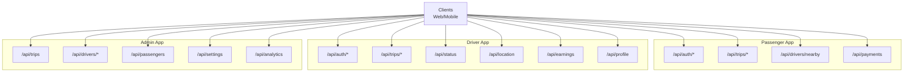
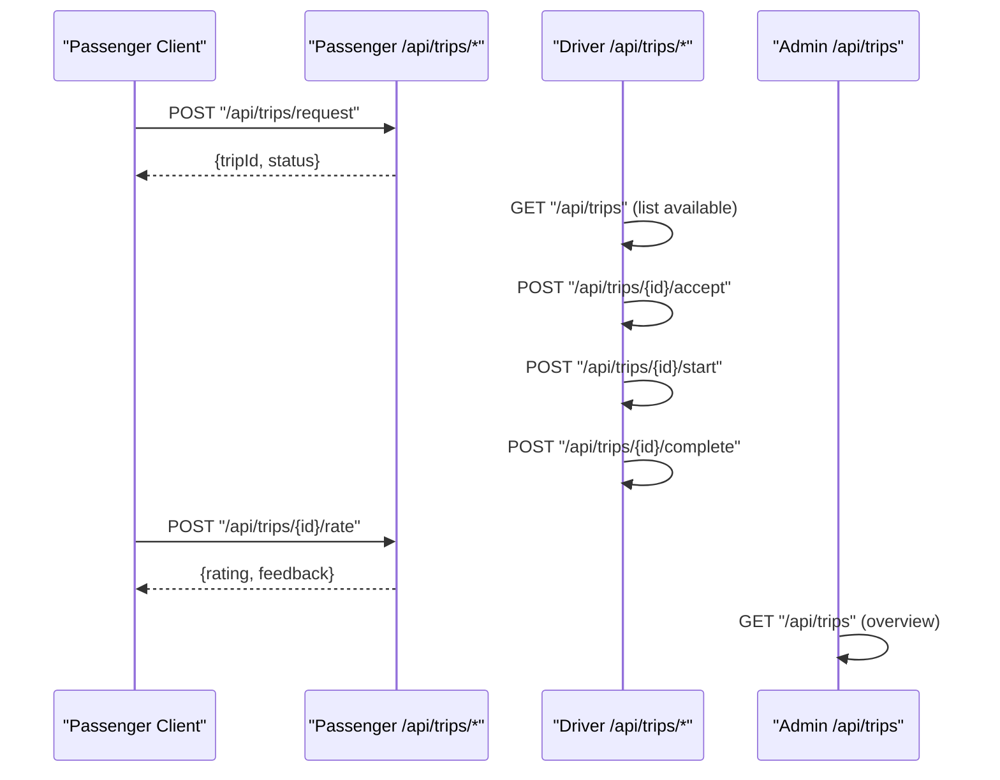
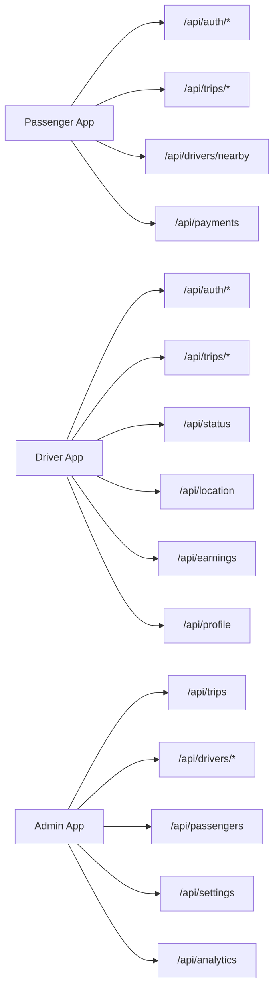

# API Reference

<cite>
**Referenced Files in This Document**
- [apps/passenger/src/app/api/auth/login/route.ts](file://apps/passenger/src/app/api/auth/login/route.ts)
- [apps/passenger/src/app/api/auth/register/route.ts](file://apps/passenger/src/app/api/auth/register/route.ts)
- [apps/driver/src/app/api/auth/login/route.ts](file://apps/driver/src/app/api/auth/login/route.ts)
- [apps/driver/src/app/api/auth/register/route.ts](file://apps/driver/src/app/api/auth/register/route.ts)
- [apps/passenger/src/app/api/trips/request/route.ts](file://apps/passenger/src/app/api/trips/request/route.ts)
- [apps/passenger/src/app/api/trips/[id]/route.ts](file://apps/passenger/src/app/api/trips/[id]/route.ts)
- [apps/passenger/src/app/api/trips/[id]/cancel/route.ts](file://apps/passenger/src/app/api/trips/[id]/cancel/route.ts)
- [apps/passenger/src/app/api/trips/[id]/rate/route.ts](file://apps/passenger/src/app/api/trips/[id]/rate/route.ts)
- [apps/passenger/src/app/api/trips/history/route.ts](file://apps/passenger/src/app/api/trips/history/route.ts)
- [apps/passenger/src/app/api/drivers/nearby/route.ts](file://apps/passenger/src/app/api/drivers/nearby/route.ts)
- [apps/passenger/src/app/api/payments/route.ts](file://apps/passenger/src/app/api/payments/route.ts)
- [apps/driver/src/app/api/trips/[id]/accept/route.ts](file://apps/driver/src/app/api/trips/[id]/accept/route.ts)
- [apps/driver/src/app/api/trips/[id]/start/route.ts](file://apps/driver/src/app/api/trips/[id]/start/route.ts)
- [apps/driver/src/app/api/trips/[id]/complete/route.ts](file://apps/driver/src/app/api/trips/[id]/complete/route.ts)
- [apps/driver/src/app/api/trips/route.ts](file://apps/driver/src/app/api/trips/route.ts)
- [apps/driver/src/app/api/trips/history/route.ts](file://apps/driver/src/app/api/trips/history/route.ts)
- [apps/driver/src/app/api/status/route.ts](file://apps/driver/src/app/api/status/route.ts)
- [apps/driver/src/app/api/location/route.ts](file://apps/driver/src/app/api/location/route.ts)
- [apps/driver/src/app/api/earnings/route.ts](file://apps/driver/src/app/api/earnings/route.ts)
- [apps/driver/src/app/api/profile/route.ts](file://apps/driver/src/app/api/profile/route.ts)
- [apps/admin/src/app/api/trips/route.ts](file://apps/admin/src/app/api/trips/route.ts)
- [apps/admin/src/app/api/drivers/route.ts](file://apps/admin/src/app/api/drivers/route.ts)
- [apps/admin/src/app/api/drivers/[id]/route.ts](file://apps/admin/src/app/api/drivers/[id]/route.ts)
- [apps/admin/src/app/api/drivers/[id]/approve/route.ts](file://apps/admin/src/app/api/drivers/[id]/approve/route.ts)
- [apps/admin/src/app/api/drivers/[id]/reject/route.ts](file://apps/admin/src/app/api/drivers/[id]/reject/route.ts)
- [apps/admin/src/app/api/drivers/[id]/block/route.ts](file://apps/admin/src/app/api/drivers/[id]/block/route.ts)
- [apps/admin/src/app/api/passengers/route.ts](file://apps/admin/src/app/api/passengers/route.ts)
- [apps/admin/src/app/api/settings/route.ts](file://apps/admin/src/app/api/settings/route.ts)
- [apps/admin/src/app/api/analytics/route.ts](file://apps/admin/src/app/api/analytics/route.ts)
</cite>

## Table of Contents
1. [Introduction](#introduction)
2. [Project Structure](#project-structure)
3. [Core Components](#core-components)
4. [Architecture Overview](#architecture-overview)
5. [Detailed Component Analysis](#detailed-component-analysis)
6. [Dependency Analysis](#dependency-analysis)
7. [Performance Considerations](#performance-considerations)
8. [Troubleshooting Guide](#troubleshooting-guide)
9. [Conclusion](#conclusion)
10. [Appendices](#appendices)

## Introduction
This document provides a comprehensive API reference for the Ubar platform, covering RESTful endpoints across passenger, driver, and admin applications. It specifies HTTP methods, URL patterns, request/response schemas, authentication requirements, error codes, rate limiting, versioning strategies, and best practices. Real-time capabilities are addressed conceptually, including WebSocket connection management and message formats.

## Project Structure
The Ubar platform is organized as a multi-app Next.js project:
- Passenger app: trip requests, history, payments, nearby drivers
- Driver app: trip lifecycle (accept/start/complete), status, location, earnings, profile
- Admin app: trips, drivers, passengers, settings, analytics

[No sources needed since this diagram shows conceptual structure]

## Core Components
- Authentication: Separate login/register routes per app to support role-based access control.
- Trip Management: Endpoints for requesting, accepting, starting, completing, canceling, rating, and listing trips.
- Payments: Payment processing endpoint for passengers.
- Driver Operations: Status updates, location reporting, earnings, and profile management.
- Admin Operations: Trips overview, driver approvals/rejections/blocks, passenger management, settings, and analytics.

**Section sources**
- [apps/passenger/src/app/api/auth/login/route.ts](file://apps/passenger/src/app/api/auth/login/route.ts)
- [apps/passenger/src/app/api/auth/register/route.ts](file://apps/passenger/src/app/api/auth/register/route.ts)
- [apps/driver/src/app/api/auth/login/route.ts](file://apps/driver/src/app/api/auth/login/route.ts)
- [apps/driver/src/app/api/auth/register/route.ts](file://apps/driver/src/app/api/auth/register/route.ts)
- [apps/passenger/src/app/api/trips/request/route.ts](file://apps/passenger/src/app/api/trips/request/route.ts)
- [apps/passenger/src/app/api/trips/[id]/route.ts](file://apps/passenger/src/app/api/trips/[id]/route.ts)
- [apps/passenger/src/app/api/trips/[id]/cancel/route.ts](file://apps/passenger/src/app/api/trips/[id]/cancel/route.ts)
- [apps/passenger/src/app/api/trips/[id]/rate/route.ts](file://apps/passenger/src/app/api/trips/[id]/rate/route.ts)
- [apps/passenger/src/app/api/trips/history/route.ts](file://apps/passenger/src/app/api/trips/history/route.ts)
- [apps/passenger/src/app/api/drivers/nearby/route.ts](file://apps/passenger/src/app/api/drivers/nearby/route.ts)
- [apps/passenger/src/app/api/payments/route.ts](file://apps/passenger/src/app/api/payments/route.ts)
- [apps/driver/src/app/api/trips/[id]/accept/route.ts](file://apps/driver/src/app/api/trips/[id]/accept/route.ts)
- [apps/driver/src/app/api/trips/[id]/start/route.ts](file://apps/driver/src/app/api/trips/[id]/start/route.ts)
- [apps/driver/src/app/api/trips/[id]/complete/route.ts](file://apps/driver/src/app/api/trips/[id]/complete/route.ts)
- [apps/driver/src/app/api/trips/route.ts](file://apps/driver/src/app/api/trips/route.ts)
- [apps/driver/src/app/api/trips/history/route.ts](file://apps/driver/src/app/api/trips/history/route.ts)
- [apps/driver/src/app/api/status/route.ts](file://apps/driver/src/app/api/status/route.ts)
- [apps/driver/src/app/api/location/route.ts](file://apps/driver/src/app/api/location/route.ts)
- [apps/driver/src/app/api/earnings/route.ts](file://apps/driver/src/app/api/earnings/route.ts)
- [apps/driver/src/app/api/profile/route.ts](file://apps/driver/src/app/api/profile/route.ts)
- [apps/admin/src/app/api/trips/route.ts](file://apps/admin/src/app/api/trips/route.ts)
- [apps/admin/src/app/api/drivers/route.ts](file://apps/admin/src/app/api/drivers/route.ts)
- [apps/admin/src/app/api/drivers/[id]/route.ts](file://apps/admin/src/app/api/drivers/[id]/route.ts)
- [apps/admin/src/app/api/drivers/[id]/approve/route.ts](file://apps/admin/src/app/api/drivers/[id]/approve/route.ts)
- [apps/admin/src/app/api/drivers/[id]/reject/route.ts](file://apps/admin/src/app/api/drivers/[id]/reject/route.ts)
- [apps/admin/src/app/api/drivers/[id]/block/route.ts](file://apps/admin/src/app/api/drivers/[id]/block/route.ts)
- [apps/admin/src/app/api/passengers/route.ts](file://apps/admin/src/app/api/passengers/route.ts)
- [apps/admin/src/app/api/settings/route.ts](file://apps/admin/src/app/api/settings/route.ts)
- [apps/admin/src/app/api/analytics/route.ts](file://apps/admin/src/app/api/analytics/route.ts)

## Architecture Overview
High-level flow for a typical ride lifecycle:
- Passenger requests a trip
- Driver accepts, starts, completes
- Passenger rates the trip
- Admin can manage drivers and view trips

**Diagram sources**
- [apps/passenger/src/app/api/trips/request/route.ts](file://apps/passenger/src/app/api/trips/request/route.ts)
- [apps/driver/src/app/api/trips/route.ts](file://apps/driver/src/app/api/trips/route.ts)
- [apps/driver/src/app/api/trips/[id]/accept/route.ts](file://apps/driver/src/app/api/trips/[id]/accept/route.ts)
- [apps/driver/src/app/api/trips/[id]/start/route.ts](file://apps/driver/src/app/api/trips/[id]/start/route.ts)
- [apps/driver/src/app/api/trips/[id]/complete/route.ts](file://apps/driver/src/app/api/trips/[id]/complete/route.ts)
- [apps/passenger/src/app/api/trips/[id]/rate/route.ts](file://apps/passenger/src/app/api/trips/[id]/rate/route.ts)
- [apps/admin/src/app/api/trips/route.ts](file://apps/admin/src/app/api/trips/route.ts)

## Detailed Component Analysis

### Authentication APIs
- Purpose: Authenticate users by role (passenger or driver). Each app exposes its own auth routes to enforce role boundaries.
- Methods and URLs:
  - Passenger:
    - POST /api/auth/login
    - POST /api/auth/register
  - Driver:
    - POST /api/auth/login
    - POST /api/auth/register
- Request Schema:
  - Login: email, password
  - Register: name, email, password, role-specific fields (e.g., phone, license info)
- Response Schema:
  - Success: token, user profile summary
  - Error: code, message, details
- Authentication: None required for login/register; subsequent calls require bearer token.
- Rate Limiting: Recommended per IP and per account.
- Versioning: Prefix with /v1 when scaling.

Example Requests and Responses:
- Login Request:
  - Body: { "email": "user@example.com", "password": "secret" }
- Login Response:
  - 200 OK: { "token": "...", "user": { "id": "...", "role": "passenger|driver" } }
- Register Request:
  - Body: { "name": "Jane Doe", "email": "jane@example.com", "password": "secret", "phone": "+1234567890" }
- Register Response:
  - 201 Created: { "token": "...", "user": { "id": "...", "role": "passenger|driver" } }
- Common Errors:
  - 400 Bad Request: validation errors
  - 401 Unauthorized: invalid credentials
  - 409 Conflict: duplicate email
  - 429 Too Many Requests: rate limit exceeded

**Section sources**
- [apps/passenger/src/app/api/auth/login/route.ts](file://apps/passenger/src/app/api/auth/login/route.ts)
- [apps/passenger/src/app/api/auth/register/route.ts](file://apps/passenger/src/app/api/auth/register/route.ts)
- [apps/driver/src/app/api/auth/login/route.ts](file://apps/driver/src/app/api/auth/login/route.ts)
- [apps/driver/src/app/api/auth/register/route.ts](file://apps/driver/src/app/api/auth/register/route.ts)

### Trip Management APIs (Passenger)
- Purpose: Create, retrieve, cancel, and rate trips; list trip history; find nearby drivers.
- Methods and URLs:
  - POST /api/trips/request
  - GET /api/trips/{id}
  - POST /api/trips/{id}/cancel
  - POST /api/trips/{id}/rate
  - GET /api/trips/history
  - GET /api/drivers/nearby
- Request Schemas:
  - Request Trip: origin, destination, requestedAt
  - Cancel Trip: reason (optional)
  - Rate Trip: rating (1–5), feedback (optional)
  - Nearby Drivers: lat, lng, radius (km)
- Response Schemas:
  - Request Trip: { tripId, status, estimatedFare }
  - Get Trip: { id, status, origin, destination, createdAt, updatedAt }
  - Cancel Trip: { success, reason }
  - Rate Trip: { rating, feedback }
  - History: array of past trips with summary fields
  - Nearby Drivers: array of { id, name, distance, rating }
- Authentication: Bearer token required.
- Rate Limiting: Strict on request creation and cancellation.
- Versioning: Use /v1 prefix.

Example Requests and Responses:
- Request Trip:
  - Body: { "origin": { "lat": 40.7128, "lng": -74.006 }, "destination": { "lat": 34.0522, "lng": -118.2437 } }
  - 201 Created: { "tripId": "t_123", "status": "pending", "estimatedFare": 45.0 }
- Cancel Trip:
  - Body: { "reason": "changed plans" }
  - 200 OK: { "success": true }
- Rate Trip:
  - Body: { "rating": 5, "feedback": "Great ride!" }
  - 200 OK: { "rating": 5, "feedback": "Great ride!" }
- Nearby Drivers:
  - Query: ?lat=40.7128&lng=-74.006&radius=10
  - 200 OK: [{ "id": "d_1", "name": "John", "distance": 0.8, "rating": 4.9 }]
- Common Errors:
  - 400 Bad Request: missing fields
  - 404 Not Found: trip not found
  - 409 Conflict: trip already canceled
  - 422 Unprocessable Entity: invalid rating range

**Section sources**
- [apps/passenger/src/app/api/trips/request/route.ts](file://apps/passenger/src/app/api/trips/request/route.ts)
- [apps/passenger/src/app/api/trips/[id]/route.ts](file://apps/passenger/src/app/api/trips/[id]/route.ts)
- [apps/passenger/src/app/api/trips/[id]/cancel/route.ts](file://apps/passenger/src/app/api/trips/[id]/cancel/route.ts)
- [apps/passenger/src/app/api/trips/[id]/rate/route.ts](file://apps/passenger/src/app/api/trips/[id]/rate/route.ts)
- [apps/passenger/src/app/api/trips/history/route.ts](file://apps/passenger/src/app/api/trips/history/route.ts)
- [apps/passenger/src/app/api/drivers/nearby/route.ts](file://apps/passenger/src/app/api/drivers/nearby/route.ts)

### Trip Management APIs (Driver)
- Purpose: Accept, start, complete trips; list current and historical trips.
- Methods and URLs:
  - GET /api/trips
  - POST /api/trips/{id}/accept
  - POST /api/trips/{id}/start
  - POST /api/trips/{id}/complete
  - GET /api/trips/history
- Request Schemas:
  - Accept/Start/Complete: no body required (path param id)
- Response Schemas:
  - List Trips: array of { id, status, passengerId, origin, destination }
  - Accept/Start/Complete: { success, tripId, newStatus }
  - History: array of completed trips with fare and rating
- Authentication: Bearer token required.
- Rate Limiting: Moderate limits on accept/start/complete.
- Versioning: Use /v1 prefix.

Example Requests and Responses:
- Accept Trip:
  - POST /api/trips/{id}/accept
  - 200 OK: { "success": true, "tripId": "t_123", "newStatus": "accepted" }
- Start Trip:
  - POST /api/trips/{id}/start
  - 200 OK: { "success": true, "tripId": "t_123", "newStatus": "in_progress" }
- Complete Trip:
  - POST /api/trips/{id}/complete
  - 200 OK: { "success": true, "tripId": "t_123", "newStatus": "completed" }
- Common Errors:
  - 400 Bad Request: invalid trip state transition
  - 404 Not Found: trip not found
  - 403 Forbidden: unauthorized driver

**Section sources**
- [apps/driver/src/app/api/trips/route.ts](file://apps/driver/src/app/api/trips/route.ts)
- [apps/driver/src/app/api/trips/[id]/accept/route.ts](file://apps/driver/src/app/api/trips/[id]/accept/route.ts)
- [apps/driver/src/app/api/trips/[id]/start/route.ts](file://apps/driver/src/app/api/trips/[id]/start/route.ts)
- [apps/driver/src/app/api/trips/[id]/complete/route.ts](file://apps/driver/src/app/api/trips/[id]/complete/route.ts)
- [apps/driver/src/app/api/trips/history/route.ts](file://apps/driver/src/app/api/trips/history/route.ts)

### Driver Operations APIs
- Purpose: Manage driver status, location, earnings, and profile.
- Methods and URLs:
  - PUT /api/status
  - POST /api/location
  - GET /api/earnings
  - GET /api/profile
  - PATCH /api/profile
- Request Schemas:
  - Update Status: { online: boolean }
  - Report Location: { lat: number, lng: number, timestamp: string }
  - Earnings Query: optional date range filters
  - Profile Update: partial fields allowed
- Response Schemas:
  - Status: { success, online }
  - Location: { success, lastUpdated }
  - Earnings: { total, breakdown: [{ date, amount }] }
  - Profile: { id, name, email, phone, licenseInfo }
- Authentication: Bearer token required.
- Rate Limiting: Strict on location reporting.
- Versioning: Use /v1 prefix.

Example Requests and Responses:
- Update Status:
  - Body: { "online": true }
  - 200 OK: { "success": true, "online": true }
- Report Location:
  - Body: { "lat": 40.7128, "lng": -74.006, "timestamp": "2024-01-01T12:00:00Z" }
  - 200 OK: { "success": true, "lastUpdated": "2024-01-01T12:00:00Z" }
- Common Errors:
  - 400 Bad Request: invalid coordinates
  - 401 Unauthorized: expired token
  - 429 Too Many Requests: too frequent location updates

**Section sources**
- [apps/driver/src/app/api/status/route.ts](file://apps/driver/src/app/api/status/route.ts)
- [apps/driver/src/app/api/location/route.ts](file://apps/driver/src/app/api/location/route.ts)
- [apps/driver/src/app/api/earnings/route.ts](file://apps/driver/src/app/api/earnings/route.ts)
- [apps/driver/src/app/api/profile/route.ts](file://apps/driver/src/app/api/profile/route.ts)

### Payment Processing API (Passenger)
- Purpose: Process payments for completed trips.
- Methods and URLs:
  - POST /api/payments
- Request Schema:
  - tripId, paymentMethod, amount, currency
- Response Schema:
  - Success: { transactionId, status, receiptUrl }
  - Error: { code, message, details }
- Authentication: Bearer token required.
- Rate Limiting: Strict to prevent double charges.
- Versioning: Use /v1 prefix.

Example Requests and Responses:
- Payment Request:
  - Body: { "tripId": "t_123", "paymentMethod": "card", "amount": 45.0, "currency": "USD" }
  - 200 OK: { "transactionId": "tx_456", "status": "paid", "receiptUrl": "https://..." }
- Common Errors:
  - 400 Bad Request: missing fields
  - 402 Payment Required: insufficient funds
  - 409 Conflict: already paid

**Section sources**
- [apps/passenger/src/app/api/payments/route.ts](file://apps/passenger/src/app/api/payments/route.ts)

### Admin APIs
- Purpose: Manage trips, drivers, passengers, settings, and analytics.
- Methods and URLs:
  - GET /api/trips
  - GET /api/drivers
  - GET /api/drivers/{id}
  - POST /api/drivers/{id}/approve
  - POST /api/drivers/{id}/reject
  - POST /api/drivers/{id}/block
  - GET /api/passengers
  - GET /api/settings
  - GET /api/analytics
- Request Schemas:
  - Approve/Reject/Block: optional reason field
- Response Schemas:
  - Approve: { success, driverId, status }
  - Reject: { success, driverId, status }
  - Block: { success, driverId, blocked }
  - Trips/Drivers/Passengers: paginated lists with metadata
  - Settings: key-value pairs
  - Analytics: aggregated metrics
- Authentication: Admin bearer token required.
- Rate Limiting: Moderate limits.
- Versioning: Use /v1 prefix.

Example Requests and Responses:
- Approve Driver:
  - POST /api/drivers/{id}/approve
  - Body: { "reason": "verified documents" }
  - 200 OK: { "success": true, "driverId": "d_1", "status": "approved" }
- Common Errors:
  - 400 Bad Request: invalid action
  - 404 Not Found: resource not found
  - 403 Forbidden: insufficient permissions

**Section sources**
- [apps/admin/src/app/api/trips/route.ts](file://apps/admin/src/app/api/trips/route.ts)
- [apps/admin/src/app/api/drivers/route.ts](file://apps/admin/src/app/api/drivers/route.ts)
- [apps/admin/src/app/api/drivers/[id]/route.ts](file://apps/admin/src/app/api/drivers/[id]/route.ts)
- [apps/admin/src/app/api/drivers/[id]/approve/route.ts](file://apps/admin/src/app/api/drivers/[id]/approve/route.ts)
- [apps/admin/src/app/api/drivers/[id]/reject/route.ts](file://apps/admin/src/app/api/drivers/[id]/reject/route.ts)
- [apps/admin/src/app/api/drivers/[id]/block/route.ts](file://apps/admin/src/app/api/drivers/[id]/block/route.ts)
- [apps/admin/src/app/api/passengers/route.ts](file://apps/admin/src/app/api/passengers/route.ts)
- [apps/admin/src/app/api/settings/route.ts](file://apps/admin/src/app/api/settings/route.ts)
- [apps/admin/src/app/api/analytics/route.ts](file://apps/admin/src/app/api/analytics/route.ts)

### Real-Time Event Handlers (Conceptual)
- Protocol: WebSocket over wss://
- Connection Management:
  - Establish connection with token in query or handshake payload
  - Handle reconnects with exponential backoff
  - Keepalive pings every N seconds
- Message Formats:
  - Server -> Client: { type: "trip_update", data: { tripId, status } }
  - Client -> Server: { type: "location_update", data: { lat, lng, ts } }
- Events:
  - trip.requested, trip.accepted, trip.started, trip.completed, trip.cancelled
  - driver.online_changed, driver.location_updated
- Error Handling:
  - Close codes: 1001 (going away), 1008 (policy violation), 4000+ application-specific
- Best Practices:
  - Deduplicate messages using sequence numbers
  - Throttle high-frequency events (e.g., location updates)
  - Validate payloads server-side

[No sources needed since this section provides conceptual guidance]

## Dependency Analysis
The API surface spans three apps with clear separation of concerns:
- Passenger app focuses on trip lifecycle initiation and payment
- Driver app manages operational aspects of trips and driver state
- Admin app provides oversight and governance

[No sources needed since this diagram shows conceptual relationships]

## Performance Considerations
- Pagination and filtering for list endpoints (trips, drivers, passengers)
- Caching for read-heavy endpoints (nearby drivers, trip history)
- Batch operations where possible (admin bulk actions)
- Efficient indexing on frequently queried fields (tripId, userId, timestamps)
- Backpressure handling for real-time streams

[No sources needed since this section provides general guidance]

## Troubleshooting Guide
Common issues and resolutions:
- Authentication failures: verify token validity and scope
- Rate limiting: implement retry with backoff and respect Retry-After headers
- Validation errors: check request schema and required fields
- State transitions: ensure correct order for accept/start/complete
- Payment errors: confirm sufficient funds and unique transaction IDs

Error Codes:
- 400 Bad Request: malformed input
- 401 Unauthorized: missing or invalid token
- 403 Forbidden: insufficient permissions
- 404 Not Found: resource does not exist
- 409 Conflict: duplicate or conflicting state
- 422 Unprocessable Entity: semantic validation failure
- 429 Too Many Requests: rate limit exceeded
- 500 Internal Server Error: unexpected server failure

**Section sources**
- [apps/passenger/src/app/api/trips/request/route.ts](file://apps/passenger/src/app/api/trips/request/route.ts)
- [apps/driver/src/app/api/trips/[id]/accept/route.ts](file://apps/driver/src/app/api/trips/[id]/accept/route.ts)
- [apps/passenger/src/app/api/payments/route.ts](file://apps/passenger/src/app/api/payments/route.ts)

## Conclusion
The Ubar platform provides a robust set of RESTful APIs for passengers, drivers, and admins. Clear separation of responsibilities, consistent authentication, and well-defined schemas enable reliable integration. Adopt recommended rate limiting, versioning, and error handling practices to ensure scalability and maintainability.

## Appendices

### API Versioning Strategy
- Use path-based versioning: /v1/...
- Maintain backward compatibility within major versions
- Deprecation notices via response headers

### Rate Limiting Guidelines
- Per-user and per-IP limits
- Different tiers for read vs write operations
- Expose headers: X-RateLimit-Limit, X-RateLimit-Remaining, Retry-After

### Authentication Best Practices
- Short-lived tokens with refresh mechanism
- Scope-based authorization for admin endpoints
- Secure storage and transmission of tokens

### Real-Time Best Practices
- Heartbeats and reconnection logic
- Idempotent event processing
- Graceful degradation when offline

[No sources needed since this section provides general guidance]