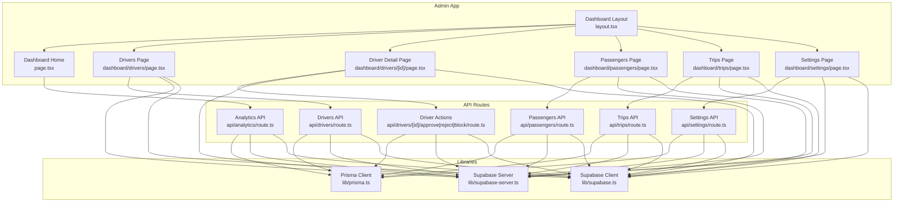
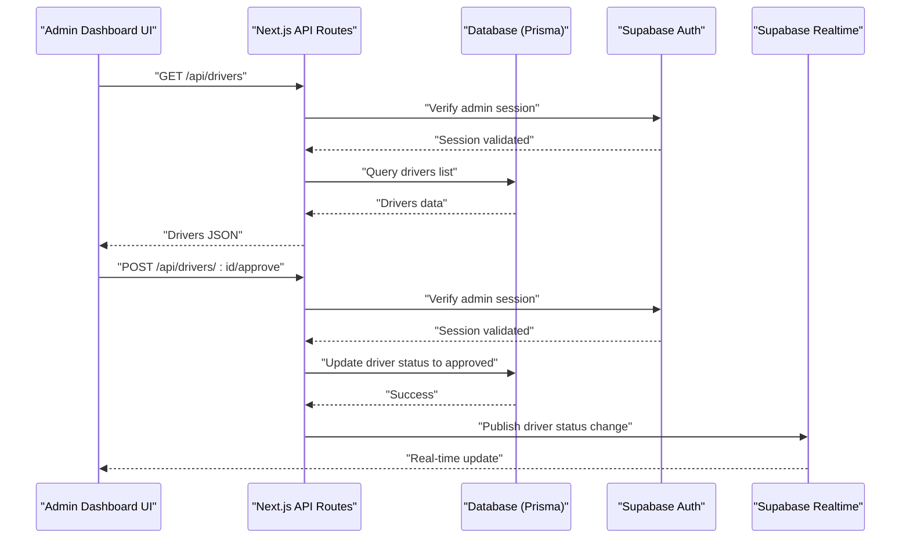
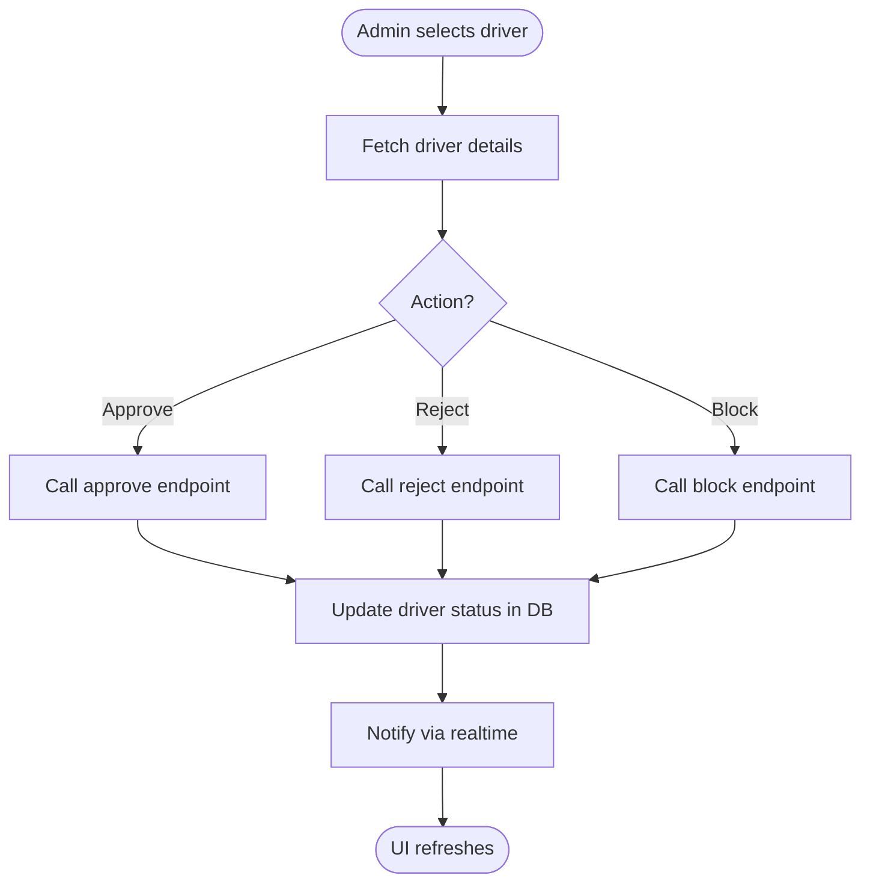
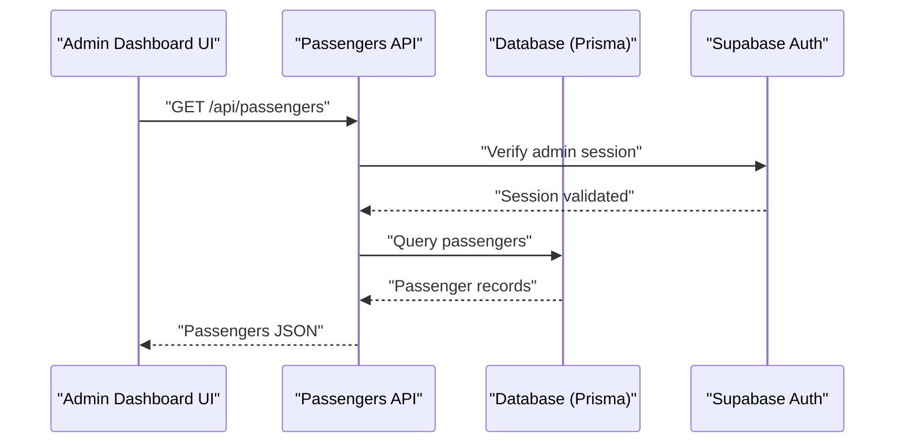
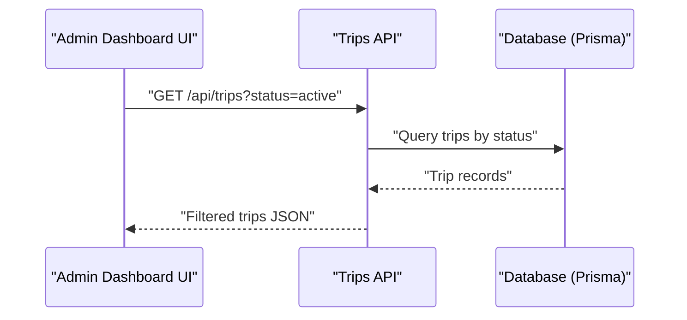
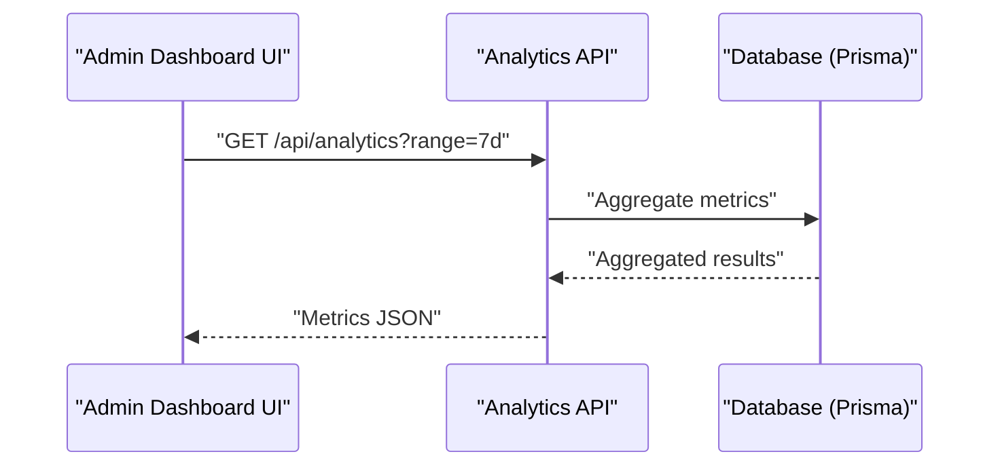
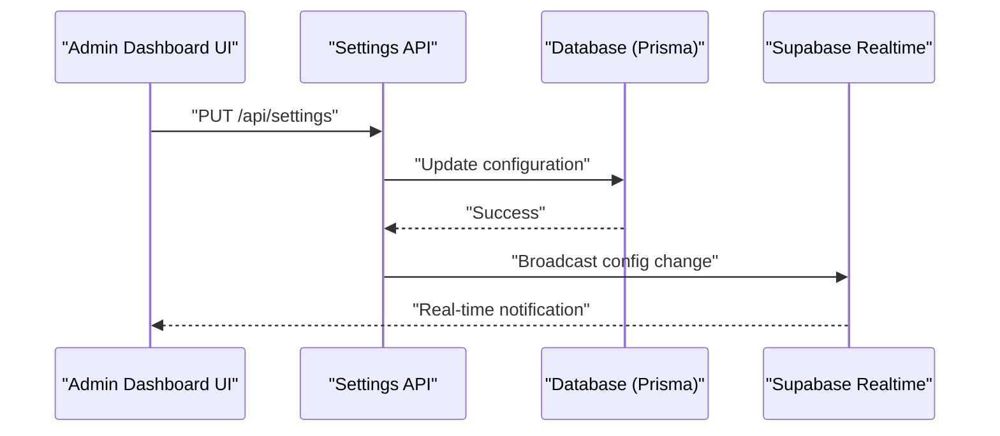
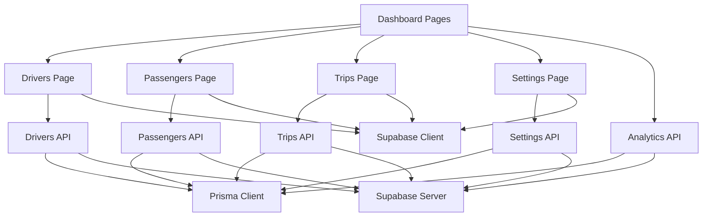

# Admin Application

<cite>
**Referenced Files in This Document**
- [apps/admin/src/app/layout.tsx](file://apps/admin/src/app/layout.tsx)
- [apps/admin/src/app/page.tsx](file://apps/admin/src/app/page.tsx)
- [apps/admin/src/app/dashboard/layout.tsx](file://apps/admin/src/app/dashboard/layout.tsx)
- [apps/admin/src/app/dashboard/page.tsx](file://apps/admin/src/app/dashboard/page.tsx)
- [apps/admin/src/app/dashboard/drivers/page.tsx](file://apps/admin/src/app/dashboard/drivers/page.tsx)
- [apps/admin/src/app/dashboard/drivers/[id]/page.tsx](file://apps/admin/src/app/dashboard/drivers/[id]/page.tsx)
- [apps/admin/src/app/dashboard/passengers/page.tsx](file://apps/admin/src/app/dashboard/passengers/page.tsx)
- [apps/admin/src/app/dashboard/trips/page.tsx](file://apps/admin/src/app/dashboard/trips/page.tsx)
- [apps/admin/src/app/dashboard/settings/page.tsx](file://apps/admin/src/app/dashboard/settings/page.tsx)
- [apps/admin/src/app/api/analytics/route.ts](file://apps/admin/src/app/api/analytics/route.ts)
- [apps/admin/src/app/api/drivers/route.ts](file://apps/admin/src/app/api/drivers/route.ts)
- [apps/admin/src/app/api/drivers/[id]/route.ts](file://apps/admin/src/app/api/drivers/[id]/route.ts)
- [apps/admin/src/app/api/drivers/[id]/approve/route.ts](file://apps/admin/src/app/api/drivers/[id]/approve/route.ts)
- [apps/admin/src/app/api/drivers/[id]/reject/route.ts](file://apps/admin/src/app/api/drivers/[id]/reject/route.ts)
- [apps/admin/src/app/api/drivers/[id]/block/route.ts](file://apps/admin/src/app/api/drivers/[id]/block/route.ts)
- [apps/admin/src/app/api/passengers/route.ts](file://apps/admin/src/app/api/passengers/route.ts)
- [apps/admin/src/app/api/trips/route.ts](file://apps/admin/src/app/api/trips/route.ts)
- [apps/admin/src/app/api/settings/route.ts](file://apps/admin/src/app/api/settings/route.ts)
- [apps/admin/src/lib/prisma.ts](file://apps/admin/src/lib/prisma.ts)
- [apps/admin/src/lib/supabase-server.ts](file://apps/admin/src/lib/supabase-server.ts)
- [apps/admin/src/lib/supabase.ts](file://apps/admin/src/lib/supabase.ts)
- [apps/admin/src/components/providers.tsx](file://apps/admin/src/components/providers.tsx)
</cite>

## Table of Contents
1. [Introduction](#introduction)
2. [Project Structure](#project-structure)
3. [Core Components](#core-components)
4. [Architecture Overview](#architecture-overview)
5. [Detailed Component Analysis](#detailed-component-analysis)
6. [Dependency Analysis](#dependency-analysis)
7. [Performance Considerations](#performance-considerations)
8. [Security and Access Control](#security-and-access-control)
9. [Troubleshooting Guide](#troubleshooting-guide)
10. [Conclusion](#conclusion)

## Introduction
This document provides comprehensive documentation for the Admin Application, an administrative dashboard used for platform oversight and management. It covers the administrative dashboard, user management systems (drivers and passengers), analytics and reporting capabilities, system configuration interfaces, driver approval workflows, real-time monitoring tools, revenue reporting features, role-based access control, content moderation tools, system settings management, performance monitoring dashboards, security considerations, audit logging, and administrative best practices.

The Admin Application is implemented as a Next.js application with server-side API routes, Prisma for data access, and Supabase client libraries for authentication and real-time capabilities. The dashboard organizes functionality into dedicated pages for drivers, passengers, trips, analytics, and settings.

## Project Structure
The Admin Application follows a feature-oriented structure within the Next.js App Router:
- Pages under apps/admin/src/app/dashboard/ represent main admin sections.
- API routes under apps/admin/src/app/api/ implement backend endpoints for each domain.
- Shared libraries under apps/admin/src/lib/ provide database and client configurations.
- Providers under apps/admin/src/components/ encapsulate global context providers.

**Diagram sources**
- [apps/admin/src/app/dashboard/layout.tsx](file://apps/admin/src/app/dashboard/layout.tsx)
- [apps/admin/src/app/dashboard/page.tsx](file://apps/admin/src/app/dashboard/page.tsx)
- [apps/admin/src/app/dashboard/drivers/page.tsx](file://apps/admin/src/app/dashboard/drivers/page.tsx)
- [apps/admin/src/app/dashboard/drivers/[id]/page.tsx](file://apps/admin/src/app/dashboard/drivers/[id]/page.tsx)
- [apps/admin/src/app/dashboard/passengers/page.tsx](file://apps/admin/src/app/dashboard/passengers/page.tsx)
- [apps/admin/src/app/dashboard/trips/page.tsx](file://apps/admin/src/app/dashboard/trips/page.tsx)
- [apps/admin/src/app/dashboard/settings/page.tsx](file://apps/admin/src/app/dashboard/settings/page.tsx)
- [apps/admin/src/app/api/analytics/route.ts](file://apps/admin/src/app/api/analytics/route.ts)
- [apps/admin/src/app/api/drivers/route.ts](file://apps/admin/src/app/api/drivers/route.ts)
- [apps/admin/src/app/api/drivers/[id]/approve/route.ts](file://apps/admin/src/app/api/drivers/[id]/approve/route.ts)
- [apps/admin/src/app/api/drivers/[id]/reject/route.ts](file://apps/admin/src/app/api/drivers/[id]/reject/route.ts)
- [apps/admin/src/app/api/drivers/[id]/block/route.ts](file://apps/admin/src/src/app/api/drivers/[id]/block/route.ts)
- [apps/admin/src/app/api/passengers/route.ts](file://apps/admin/src/app/api/passengers/route.ts)
- [apps/admin/src/app/api/trips/route.ts](file://apps/admin/src/app/api/trips/route.ts)
- [apps/admin/src/app/api/settings/route.ts](file://apps/admin/src/app/api/settings/route.ts)
- [apps/admin/src/lib/prisma.ts](file://apps/admin/src/lib/prisma.ts)
- [apps/admin/src/lib/supabase-server.ts](file://apps/admin/src/lib/supabase-server.ts)
- [apps/admin/src/lib/supabase.ts](file://apps/admin/src/lib/supabase.ts)

**Section sources**
- [apps/admin/src/app/layout.tsx](file://apps/admin/src/app/layout.tsx)
- [apps/admin/src/app/page.tsx](file://apps/admin/src/app/page.tsx)
- [apps/admin/src/app/dashboard/layout.tsx](file://apps/admin/src/app/dashboard/layout.tsx)
- [apps/admin/src/app/dashboard/page.tsx](file://apps/admin/src/app/dashboard/page.tsx)
- [apps/admin/src/app/dashboard/drivers/page.tsx](file://apps/admin/src/app/dashboard/drivers/page.tsx)
- [apps/admin/src/app/dashboard/drivers/[id]/page.tsx](file://apps/admin/src/app/dashboard/drivers/[id]/page.tsx)
- [apps/admin/src/app/dashboard/passengers/page.tsx](file://apps/admin/src/app/dashboard/passengers/page.tsx)
- [apps/admin/src/app/dashboard/trips/page.tsx](file://apps/admin/src/app/dashboard/trips/page.tsx)
- [apps/admin/src/app/dashboard/settings/page.tsx](file://apps/admin/src/app/dashboard/settings/page.tsx)
- [apps/admin/src/app/api/analytics/route.ts](file://apps/admin/src/app/api/analytics/route.ts)
- [apps/admin/src/app/api/drivers/route.ts](file://apps/admin/src/app/api/drivers/route.ts)
- [apps/admin/src/app/api/drivers/[id]/approve/route.ts](file://apps/admin/src/app/api/drivers/[id]/approve/route.ts)
- [apps/admin/src/app/api/drivers/[id]/reject/route.ts](file://apps/admin/src/app/api/drivers/[id]/reject/route.ts)
- [apps/admin/src/app/api/drivers/[id]/block/route.ts](file://apps/admin/src/app/api/drivers/[id]/block/route.ts)
- [apps/admin/src/app/api/passengers/route.ts](file://apps/admin/src/app/api/passengers/route.ts)
- [apps/admin/src/app/api/trips/route.ts](file://apps/admin/src/app/api/trips/route.ts)
- [apps/admin/src/app/api/settings/route.ts](file://apps/admin/src/app/api/settings/route.ts)
- [apps/admin/src/lib/prisma.ts](file://apps/admin/src/lib/prisma.ts)
- [apps/admin/src/lib/supabase-server.ts](file://apps/admin/src/lib/supabase-server.ts)
- [apps/admin/src/lib/supabase.ts](file://apps/admin/src/lib/supabase.ts)
- [apps/admin/src/components/providers.tsx](file://apps/admin/src/components/providers.tsx)

## Core Components
- Dashboard layout and navigation: Centralized layout component that renders navigation and page shell for all admin sections.
- Drivers management: Lists pending and active drivers, supports approve/reject/block actions via dedicated API endpoints.
- Passengers management: Provides listing and account operations for passenger accounts.
- Trips overview: Displays trip history and status for operational visibility.
- Analytics and reporting: Aggregates key metrics such as ride volume, revenue, and driver performance.
- Settings management: Allows administrators to update platform-wide configuration values.

These components are backed by API routes that interact with Prisma for persistence and Supabase for authentication and real-time subscriptions.

**Section sources**
- [apps/admin/src/app/dashboard/layout.tsx](file://apps/admin/src/app/dashboard/layout.tsx)
- [apps/admin/src/app/dashboard/drivers/page.tsx](file://apps/admin/src/app/dashboard/drivers/page.tsx)
- [apps/admin/src/app/api/drivers/route.ts](file://apps/admin/src/app/api/drivers/route.ts)
- [apps/admin/src/app/api/drivers/[id]/approve/route.ts](file://apps/admin/src/app/api/drivers/[id]/approve/route.ts)
- [apps/admin/src/app/api/drivers/[id]/reject/route.ts](file://apps/admin/src/app/api/drivers/[id]/reject/route.ts)
- [apps/admin/src/app/api/drivers/[id]/block/route.ts](file://apps/admin/src/app/api/drivers/[id]/block/route.ts)
- [apps/admin/src/app/api/passengers/route.ts](file://apps/admin/src/app/api/passengers/route.ts)
- [apps/admin/src/app/api/trips/route.ts](file://apps/admin/src/app/api/trips/route.ts)
- [apps/admin/src/app/api/analytics/route.ts](file://apps/admin/src/app/api/analytics/route.ts)
- [apps/admin/src/app/api/settings/route.ts](file://apps/admin/src/app/api/settings/route.ts)
- [apps/admin/src/lib/prisma.ts](file://apps/admin/src/lib/prisma.ts)
- [apps/admin/src/lib/supabase-server.ts](file://apps/admin/src/lib/supabase-server.ts)
- [apps/admin/src/lib/supabase.ts](file://apps/admin/src/lib/supabase.ts)

## Architecture Overview
The Admin Application uses a layered architecture:
- Presentation layer: Next.js pages render UI and orchestrate calls to API routes.
- API layer: Route handlers validate requests, enforce permissions, and perform business logic.
- Data layer: Prisma client queries the relational database; Supabase client handles auth and real-time events.

**Diagram sources**
- [apps/admin/src/app/api/drivers/route.ts](file://apps/admin/src/app/api/drivers/route.ts)
- [apps/admin/src/app/api/drivers/[id]/approve/route.ts](file://apps/admin/src/app/api/drivers/[id]/approve/route.ts)
- [apps/admin/src/lib/prisma.ts](file://apps/admin/src/lib/prisma.ts)
- [apps/admin/src/lib/supabase-server.ts](file://apps/admin/src/lib/supabase-server.ts)
- [apps/admin/src/lib/supabase.ts](file://apps/admin/src/lib/supabase.ts)

## Detailed Component Analysis

### Driver Approval Workflow
The driver approval workflow allows admins to review, approve, reject, or block drivers. The flow includes:
- Listing drivers and filtering by status.
- Approving a driver to enable them to accept rides.
- Rejecting a driver application with optional notes.
- Blocking a driver to prevent future activity.

**Diagram sources**
- [apps/admin/src/app/api/drivers/[id]/approve/route.ts](file://apps/admin/src/app/api/drivers/[id]/approve/route.ts)
- [apps/admin/src/app/api/drivers/[id]/reject/route.ts](file://apps/admin/src/app/api/drivers/[id]/reject/route.ts)
- [apps/admin/src/app/api/drivers/[id]/block/route.ts](file://apps/admin/src/app/api/drivers/[id]/block/route.ts)
- [apps/admin/src/lib/prisma.ts](file://apps/admin/src/lib/prisma.ts)
- [apps/admin/src/lib/supabase.ts](file://apps/admin/src/lib/supabase.ts)

**Section sources**
- [apps/admin/src/app/dashboard/drivers/page.tsx](file://apps/admin/src/app/dashboard/drivers/page.tsx)
- [apps/admin/src/app/api/drivers/route.ts](file://apps/admin/src/app/api/drivers/route.ts)
- [apps/admin/src/app/api/drivers/[id]/approve/route.ts](file://apps/admin/src/app/api/drivers/[id]/approve/route.ts)
- [apps/admin/src/app/api/drivers/[id]/reject/route.ts](file://apps/admin/src/app/api/drivers/[id]/reject/route.ts)
- [apps/admin/src/app/api/drivers/[id]/block/route.ts](file://apps/admin/src/app/api/drivers/[id]/block/route.ts)

### Passenger Account Management
The passenger management interface enables admins to view passenger profiles, adjust account statuses, and investigate trip histories. Operations include:
- Listing passengers with filters.
- Viewing detailed passenger information.
- Performing account actions (e.g., suspend/reactivate).

**Diagram sources**
- [apps/admin/src/app/api/passengers/route.ts](file://apps/admin/src/app/api/passengers/route.ts)
- [apps/admin/src/lib/prisma.ts](file://apps/admin/src/lib/prisma.ts)
- [apps/admin/src/lib/supabase-server.ts](file://apps/admin/src/lib/supabase-server.ts)

**Section sources**
- [apps/admin/src/app/dashboard/passengers/page.tsx](file://apps/admin/src/app/dashboard/passengers/page.tsx)
- [apps/admin/src/app/api/passengers/route.ts](file://apps/admin/src/app/api/passengers/route.ts)

### Trips Overview and Monitoring
The trips page provides operational visibility into current and historical trips, including status tracking and basic analytics. It integrates with the trips API to fetch filtered lists and details.

**Diagram sources**
- [apps/admin/src/app/api/trips/route.ts](file://apps/admin/src/app/api/trips/route.ts)
- [apps/admin/src/lib/prisma.ts](file://apps/admin/src/lib/prisma.ts)

**Section sources**
- [apps/admin/src/app/dashboard/trips/page.tsx](file://apps/admin/src/app/dashboard/trips/page.tsx)
- [apps/admin/src/app/api/trips/route.ts](file://apps/admin/src/app/api/trips/route.ts)

### Analytics and Reporting
The analytics endpoint aggregates key metrics for platform oversight, such as ride counts, revenue totals, and driver performance indicators. It can be extended to support time-range filters and export formats.

**Diagram sources**
- [apps/admin/src/app/api/analytics/route.ts](file://apps/admin/src/app/api/analytics/route.ts)
- [apps/admin/src/lib/prisma.ts](file://apps/admin/src/lib/prisma.ts)

**Section sources**
- [apps/admin/src/app/dashboard/page.tsx](file://apps/admin/src/app/dashboard/page.tsx)
- [apps/admin/src/app/api/analytics/route.ts](file://apps/admin/src/app/api/analytics/route.ts)

### System Configuration Management
The settings page allows administrators to manage platform-wide configuration values. Changes are persisted through the settings API and may trigger real-time updates across connected clients.

**Diagram sources**
- [apps/admin/src/app/api/settings/route.ts](file://apps/admin/src/app/api/settings/route.ts)
- [apps/admin/src/lib/prisma.ts](file://apps/admin/src/lib/prisma.ts)
- [apps/admin/src/lib/supabase.ts](file://apps/admin/src/lib/supabase.ts)

**Section sources**
- [apps/admin/src/app/dashboard/settings/page.tsx](file://apps/admin/src/app/dashboard/settings/page.tsx)
- [apps/admin/src/app/api/settings/route.ts](file://apps/admin/src/app/api/settings/route.ts)

## Dependency Analysis
The Admin Application’s dependencies center around Next.js routing, Prisma for data access, and Supabase for authentication and real-time features. The following diagram illustrates core module relationships:

**Diagram sources**
- [apps/admin/src/app/dashboard/drivers/page.tsx](file://apps/admin/src/app/dashboard/drivers/page.tsx)
- [apps/admin/src/app/dashboard/passengers/page.tsx](file://apps/admin/src/app/dashboard/passengers/page.tsx)
- [apps/admin/src/app/dashboard/trips/page.tsx](file://apps/admin/src/app/dashboard/trips/page.tsx)
- [apps/admin/src/app/dashboard/settings/page.tsx](file://apps/admin/src/app/dashboard/settings/page.tsx)
- [apps/admin/src/app/api/analytics/route.ts](file://apps/admin/src/app/api/analytics/route.ts)
- [apps/admin/src/app/api/drivers/route.ts](file://apps/admin/src/app/api/drivers/route.ts)
- [apps/admin/src/app/api/passengers/route.ts](file://apps/admin/src/app/api/passengers/route.ts)
- [apps/admin/src/app/api/trips/route.ts](file://apps/admin/src/app/api/trips/route.ts)
- [apps/admin/src/app/api/settings/route.ts](file://apps/admin/src/app/api/settings/route.ts)
- [apps/admin/src/lib/prisma.ts](file://apps/admin/src/lib/prisma.ts)
- [apps/admin/src/lib/supabase-server.ts](file://apps/admin/src/lib/supabase-server.ts)
- [apps/admin/src/lib/supabase.ts](file://apps/admin/src/lib/supabase.ts)

**Section sources**
- [apps/admin/src/app/dashboard/layout.tsx](file://apps/admin/src/app/dashboard/layout.tsx)
- [apps/admin/src/app/dashboard/page.tsx](file://apps/admin/src/app/dashboard/page.tsx)
- [apps/admin/src/app/api/analytics/route.ts](file://apps/admin/src/app/api/analytics/route.ts)
- [apps/admin/src/app/api/drivers/route.ts](file://apps/admin/src/app/api/drivers/route.ts)
- [apps/admin/src/app/api/passengers/route.ts](file://apps/admin/src/app/api/passengers/route.ts)
- [apps/admin/src/app/api/trips/route.ts](file://apps/admin/src/app/api/trips/route.ts)
- [apps/admin/src/app/api/settings/route.ts](file://apps/admin/src/app/api/settings/route.ts)
- [apps/admin/src/lib/prisma.ts](file://apps/admin/src/lib/prisma.ts)
- [apps/admin/src/lib/supabase-server.ts](file://apps/admin/src/lib/supabase-server.ts)
- [apps/admin/src/lib/supabase.ts](file://apps/admin/src/lib/supabase.ts)

## Performance Considerations
- Use pagination and filtering on large datasets (drivers, passengers, trips) to reduce payload sizes and improve rendering times.
- Cache frequently accessed analytics metrics at the API layer when appropriate, with invalidation on relevant mutations.
- Leverage Supabase Realtime selectively to avoid excessive re-renders; subscribe only to necessary channels.
- Optimize database queries using Prisma relations and selective field projection to minimize overhead.
- Implement request validation and error boundaries to fail fast and maintain UI responsiveness.

[No sources needed since this section provides general guidance]

## Security and Access Control
- Role-based access control: Ensure only authorized admin users can access dashboard routes and API endpoints. Validate sessions using Supabase server utilities before processing sensitive operations.
- Input validation: Sanitize and validate all inputs in API routes to prevent injection and malformed data.
- Audit logging: Record critical administrative actions (approvals, blocks, settings changes) with timestamps and actor identities for traceability.
- Least privilege: Restrict API endpoints to minimal required permissions and scope tokens appropriately.
- Secure configuration: Store secrets and environment variables securely; avoid hardcoding credentials in source files.

Best practices:
- Enforce CSRF protection where applicable.
- Rate-limit sensitive endpoints to mitigate abuse.
- Regularly rotate secrets and review access logs.

**Section sources**
- [apps/admin/src/lib/supabase-server.ts](file://apps/admin/src/lib/supabase-server.ts)
- [apps/admin/src/app/api/drivers/[id]/approve/route.ts](file://apps/admin/src/app/api/drivers/[id]/approve/route.ts)
- [apps/admin/src/app/api/drivers/[id]/block/route.ts](file://apps/admin/src/app/api/drivers/[id]/block/route.ts)
- [apps/admin/src/app/api/settings/route.ts](file://apps/admin/src/app/api/settings/route.ts)

## Troubleshooting Guide
Common issues and resolutions:
- Authentication failures: Verify Supabase session validity and ensure admin roles are correctly assigned. Check server-side session checks in API routes.
- Database connectivity errors: Confirm Prisma connection strings and environment variables; verify database availability and schema migrations.
- Realtime subscription problems: Ensure correct channel names and event types; check network policies and firewall rules.
- API route errors: Inspect request payloads and response codes; add structured logging for diagnostics.

Operational tips:
- Enable verbose logging in development for API routes.
- Use browser dev tools to inspect network requests and responses.
- Monitor Supabase dashboard for auth and realtime metrics.

**Section sources**
- [apps/admin/src/lib/supabase-server.ts](file://apps/admin/src/lib/supabase-server.ts)
- [apps/admin/src/lib/prisma.ts](file://apps/admin/src/lib/prisma.ts)
- [apps/admin/src/lib/supabase.ts](file://apps/admin/src/lib/supabase.ts)
- [apps/admin/src/app/api/drivers/route.ts](file://apps/admin/src/app/api/drivers/route.ts)
- [apps/admin/src/app/api/analytics/route.ts](file://apps/admin/src/app/api/analytics/route.ts)

## Conclusion
The Admin Application provides a robust administrative dashboard for overseeing platform operations. It offers comprehensive driver approval workflows, passenger account management, trip monitoring, analytics and reporting, and system configuration interfaces. By leveraging Next.js, Prisma, and Supabase, it delivers secure, scalable, and real-time capabilities suitable for day-to-day administration and strategic oversight. Adhering to the security and performance recommendations outlined here will help maintain reliability, safety, and efficiency in production environments.

[No sources needed since this section summarizes without analyzing specific files]