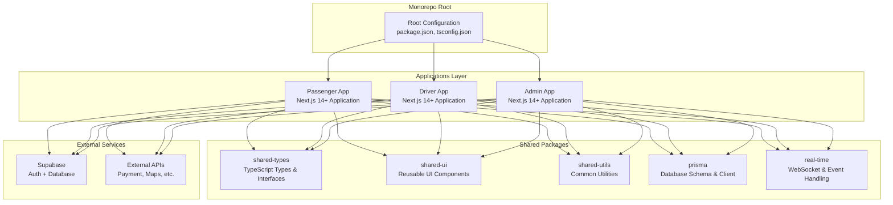
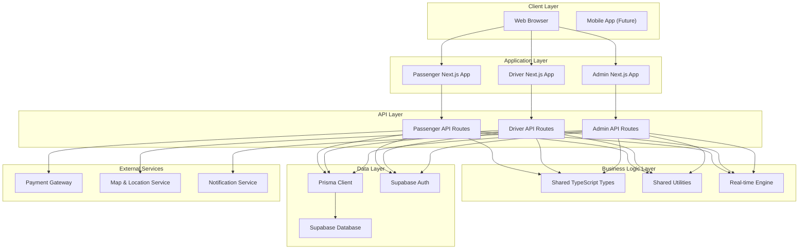
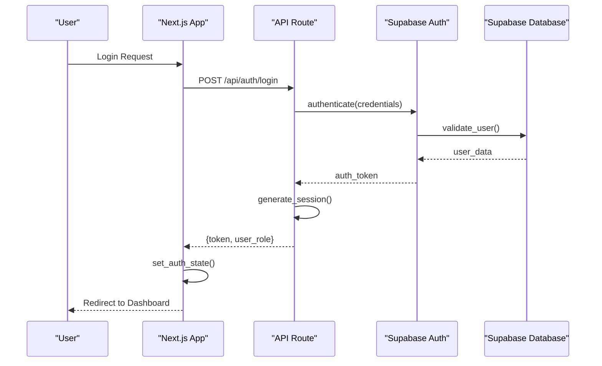
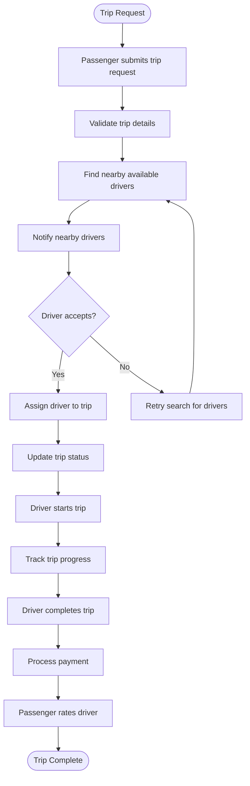
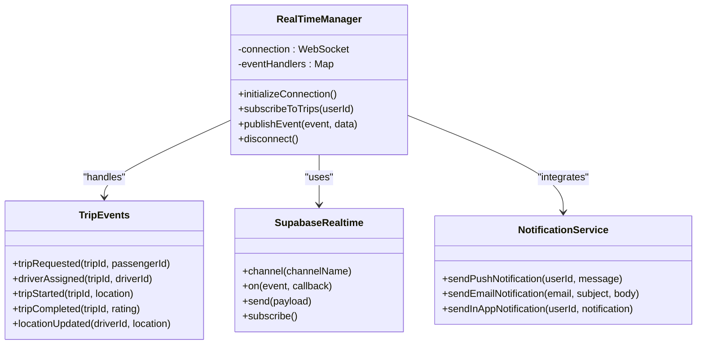
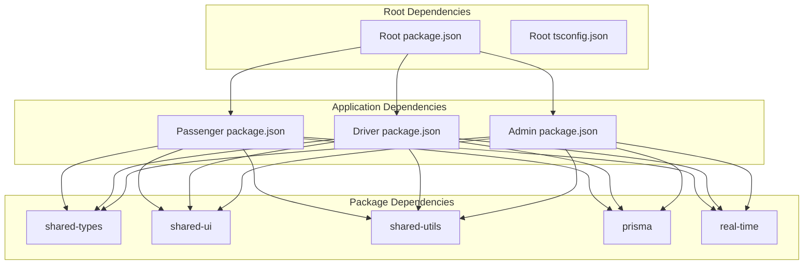

# Architecture Overview

<cite>
**Referenced Files in This Document**
- [package.json](file://package.json)
- [tsconfig.json](file://tsconfig.json)
- [apps/admin/package.json](file://apps/admin/package.json)
- [apps/driver/package.json](file://apps/driver/package.json)
- [apps/passenger/package.json](file://apps/passenger/package.json)
- [apps/admin/next.config.ts](file://apps/admin/next.config.ts)
- [apps/driver/next.config.ts](file://apps/driver/next.config.ts)
- [apps/passenger/next.config.ts](file://apps/passenger/next.config.ts)
- [apps/admin/src/app/layout.tsx](file://apps/admin/src/app/layout.tsx)
- [apps/driver/src/app/layout.tsx](file://apps/driver/src/app/layout.tsx)
- [apps/passenger/src/app/layout.tsx](file://apps/passenger/src/app/layout.tsx)
- [apps/admin/src/lib/prisma.ts](file://apps/admin/src/lib/prisma.ts)
- [apps/driver/src/lib/prisma.ts](file://apps/driver/src/lib/prisma.ts)
- [apps/passenger/src/lib/prisma.ts](file://apps/passenger/src/lib/prisma.ts)
- [apps/admin/src/lib/supabase-server.ts](file://apps/admin/src/lib/supabase-server.ts)
- [apps/driver/src/lib/supabase-server.ts](file://apps/driver/src/lib/supabase-server.ts)
- [apps/passenger/src/lib/supabase-server.ts](file://apps/passenger/src/lib/supabase-server.ts)
- [apps/admin/src/lib/supabase.ts](file://apps/admin/src/lib/supabase.ts)
- [apps/driver/src/lib/supabase.ts](file://apps/driver/src/lib/supabase.ts)
- [apps/passenger/src/lib/supabase.ts](file://apps/passenger/src/lib/supabase.ts)
- [apps/admin/src/app/api/analytics/route.ts](file://apps/admin/src/app/api/analytics/route.ts)
- [apps/admin/src/app/api/drivers/route.ts](file://apps/admin/src/app/api/drivers/route.ts)
- [apps/admin/src/app/api/passengers/route.ts](file://apps/admin/src/app/api/passengers/route.ts)
- [apps/admin/src/app/api/trips/route.ts](file://apps/admin/src/app/api/trips/route.ts)
- [apps/driver/src/app/api/auth/login/route.ts](file://apps/driver/src/app/api/auth/login/route.ts)
- [apps/driver/src/app/api/auth/register/route.ts](file://apps/driver/src/app/api/auth/register/route.ts)
- [apps/driver/src/app/api/trips/[id]/accept/route.ts](file://apps/driver/src/app/api/trips/[id]/accept/route.ts)
- [apps/driver/src/app/api/trips/[id]/start/route.ts](file://apps/driver/src/app/api/trips/[id]/start/route.ts)
- [apps/driver/src/app/api/trips/[id]/complete/route.ts](file://apps/driver/src/app/api/trips/[id]/complete/route.ts)
- [apps/passenger/src/app/api/auth/login/route.ts](file://apps/passenger/src/app/api/auth/login/route.ts)
- [apps/passenger/src/app/api/auth/register/route.ts](file://apps/passenger/src/app/api/auth/register/route.ts)
- [apps/passenger/src/app/api/trips/request/route.ts](file://apps/passenger/src/app/api/trips/request/route.ts)
- [packages/shared-types/package.json](file://packages/shared-types/package.json)
- [packages/shared-ui/package.json](file://packages/shared-ui/package.json)
- [packages/shared-utils/package.json](file://packages/shared-utils/package.json)
- [packages/prisma/package.json](file://packages/prisma/package.json)
- [packages/real-time/package.json](file://packages/real-time/package.json)
</cite>

## Table of Contents
1. [Introduction](#introduction)
2. [Project Structure](#project-structure)
3. [Core Components](#core-components)
4. [Architecture Overview](#architecture-overview)
5. [Detailed Component Analysis](#detailed-component-analysis)
6. [Dependency Analysis](#dependency-analysis)
7. [Performance Considerations](#performance-considerations)
8. [Troubleshooting Guide](#troubleshooting-guide)
9. [Conclusion](#conclusion)

## Introduction
This document describes the architecture of the Ubar monorepo system, which implements a ride-hailing platform using three separate Next.js applications: passenger, driver, and admin. The system follows modern full-stack patterns with React Server Components, Supabase for authentication and database operations, Prisma ORM for data modeling, and real-time communication capabilities. The monorepo structure enables code sharing across applications while maintaining clear separation of concerns between different user roles.

## Project Structure
The Ubar monorepo follows a feature-based organization with three distinct Next.js applications sharing common infrastructure through packages. Each application serves a specific user role and maintains its own routing, API endpoints, and business logic while leveraging shared components and utilities.

**Diagram sources**
- [package.json:1-50](file://package.json#L1-L50)
- [apps/passenger/package.json:1-30](file://apps/passenger/package.json#L1-L30)
- [apps/driver/package.json:1-30](file://apps/driver/package.json#L1-L30)
- [apps/admin/package.json:1-30](file://apps/admin/package.json#L1-L30)

**Section sources**
- [package.json:1-100](file://package.json#L1-L100)
- [tsconfig.json:1-50](file://tsconfig.json#L1-L50)

## Core Components
The Ubar system is built around several core architectural principles that ensure scalability, maintainability, and clear separation of concerns:

### Technology Stack
- **Next.js 14+**: Modern React framework with App Router and React Server Components
- **React Server Components**: Server-side rendering for improved performance and security
- **Supabase**: Backend-as-a-Service providing authentication, database, and real-time features
- **Prisma ORM**: Type-safe database access with schema-first approach
- **Real-time Communication**: WebSocket-based event handling for live updates

### Application Separation
Each application serves a distinct user role with specialized functionality:

**Passenger Application**: User-facing interface for booking rides, tracking drivers, and managing trip history
**Driver Application**: Driver management portal for accepting trips, updating status, and viewing earnings  
**Admin Application**: Administrative dashboard for monitoring users, managing drivers, and system analytics

**Section sources**
- [apps/passenger/package.json:1-50](file://apps/passenger/package.json#L1-L50)
- [apps/driver/package.json:1-50](file://apps/driver/package.json#L1-L50)
- [apps/admin/package.json:1-50](file://apps/admin/package.json#L1-L50)

## Architecture Overview
The Ubar system follows a microservices-inspired architecture within a monorepo structure, where each Next.js application operates as an independent service while sharing common infrastructure.

**Diagram sources**
- [apps/passenger/src/app/layout.tsx:1-50](file://apps/passenger/src/app/layout.tsx#L1-L50)
- [apps/driver/src/app/layout.tsx:1-50](file://apps/driver/src/app/layout.tsx#L1-L50)
- [apps/admin/src/app/layout.tsx:1-50](file://apps/admin/src/app/layout.tsx#L1-L50)

## Detailed Component Analysis

### Authentication Flow Architecture
The system implements role-based authentication using Supabase with separate login flows for each application type.

**Diagram sources**
- [apps/passenger/src/app/api/auth/login/route.ts:1-100](file://apps/passenger/src/app/api/auth/login/route.ts#L1-L100)
- [apps/driver/src/app/api/auth/login/route.ts:1-100](file://apps/driver/src/app/api/auth/login/route.ts#L1-L100)
- [apps/passenger/src/lib/supabase-server.ts:1-50](file://apps/passenger/src/lib/supabase-server.ts#L1-L50)

### Trip Management Data Flow
The trip lifecycle involves complex interactions between passengers, drivers, and the administrative system.

**Diagram sources**
- [apps/passenger/src/app/api/trips/request/route.ts:1-100](file://apps/passenger/src/app/api/trips/request/route.ts#L1-L100)
- [apps/driver/src/app/api/trips/[id]/accept/route.ts:1-100](file://apps/driver/src/app/api/trips/[id]/accept/route.ts#L1-L100)
- [apps/driver/src/app/api/trips/[id]/start/route.ts:1-100](file://apps/driver/src/app/api/trips/[id]/start/route.ts#L1-L100)
- [apps/driver/src/app/api/trips/[id]/complete/route.ts:1-100](file://apps/driver/src/app/api/trips/[id]/complete/route.ts#L1-L100)

### Real-time Communication Pattern
The system implements real-time updates for trip tracking, notifications, and status changes using WebSocket connections.

**Diagram sources**
- [packages/real-time/package.json:1-50](file://packages/real-time/package.json#L1-L50)
- [apps/passenger/src/lib/supabase.ts:1-50](file://apps/passenger/src/lib/supabase.ts#L1-L50)
- [apps/driver/src/lib/supabase.ts:1-50](file://apps/driver/src/lib/supabase.ts#L1-L50)

**Section sources**
- [apps/passenger/src/app/api/trips/request/route.ts:1-100](file://apps/passenger/src/app/api/trips/request/route.ts#L1-L100)
- [apps/driver/src/app/api/trips/[id]/accept/route.ts:1-100](file://apps/driver/src/app/api/trips/[id]/accept/route.ts#L1-L100)
- [packages/real-time/package.json:1-50](file://packages/real-time/package.json#L1-L50)

## Dependency Analysis
The monorepo structure creates a clear dependency hierarchy where applications depend on shared packages but not on each other, promoting loose coupling and independent deployment.

**Diagram sources**
- [package.json:1-100](file://package.json#L1-L100)
- [apps/passenger/package.json:1-100](file://apps/passenger/package.json#L1-L100)
- [apps/driver/package.json:1-100](file://apps/driver/package.json#L1-L100)
- [apps/admin/package.json:1-100](file://apps/admin/package.json#L1-L100)

**Section sources**
- [package.json:1-150](file://package.json#L1-L150)
- [apps/passenger/package.json:1-100](file://apps/passenger/package.json#L1-L100)
- [apps/driver/package.json:1-100](file://apps/driver/package.json#L1-L100)
- [apps/admin/package.json:1-100](file://apps/admin/package.json#L1-L100)

## Performance Considerations
The architecture incorporates several performance optimization strategies:

### Server-Side Rendering
- React Server Components reduce client-side JavaScript bundle size
- Server-side data fetching eliminates unnecessary client-server round trips
- Incremental Static Regeneration for frequently accessed pages

### Database Optimization
- Prisma query optimization with proper indexing strategies
- Connection pooling for efficient database access
- Caching strategies for frequently accessed data

### Real-time Efficiency
- Efficient WebSocket connection management
- Event-driven architecture to minimize unnecessary updates
- Batch processing for high-frequency events

## Troubleshooting Guide

### Common Authentication Issues
- Verify Supabase configuration in environment variables
- Check session token validation in API routes
- Ensure proper role-based access control implementation

### Database Connection Problems
- Validate Prisma schema alignment with database structure
- Check connection string configuration
- Monitor database connection pool limits

### Real-time Communication Issues
- Verify WebSocket connection establishment
- Check event subscription and unsubscription patterns
- Monitor network connectivity and firewall settings

**Section sources**
- [apps/passenger/src/lib/supabase-server.ts:1-100](file://apps/passenger/src/lib/supabase-server.ts#L1-L100)
- [apps/driver/src/lib/supabase-server.ts:1-100](file://apps/driver/src/lib/supabase-server.ts#L1-L100)
- [apps/admin/src/lib/supabase-server.ts:1-100](file://apps/admin/src/lib/supabase-server.ts#L1-L100)

## Conclusion
The Ubar monorepo architecture successfully implements a scalable, maintainable ride-hailing platform using modern web technologies. The separation of concerns between passenger, driver, and admin applications, combined with shared infrastructure packages, provides a solid foundation for future growth and feature development. The use of React Server Components, Supabase, and Prisma ensures optimal performance while maintaining developer productivity through type safety and code sharing.