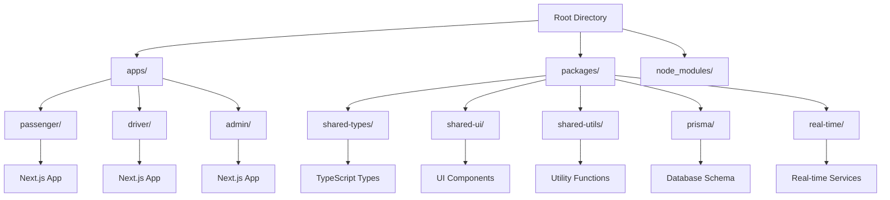
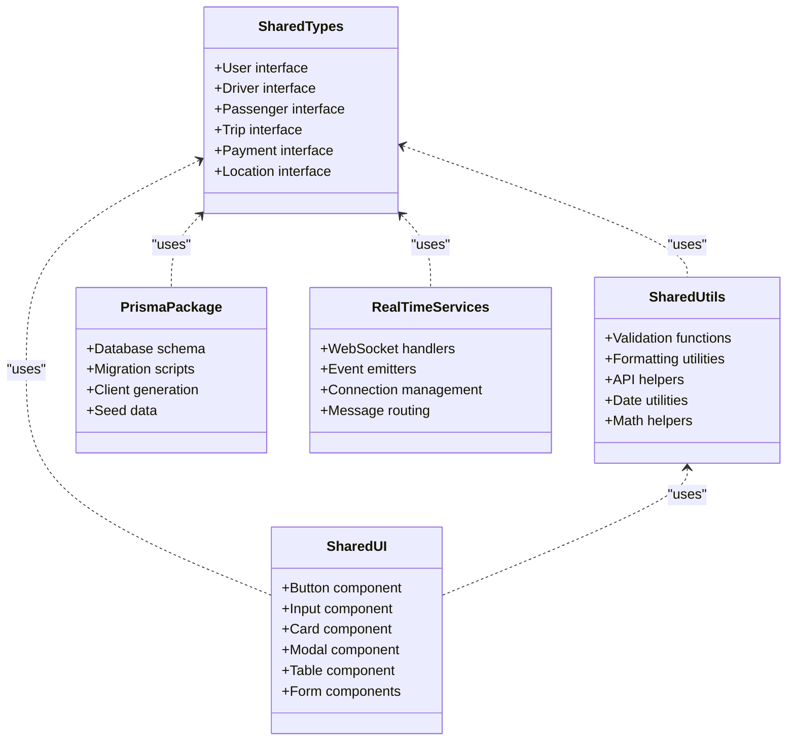
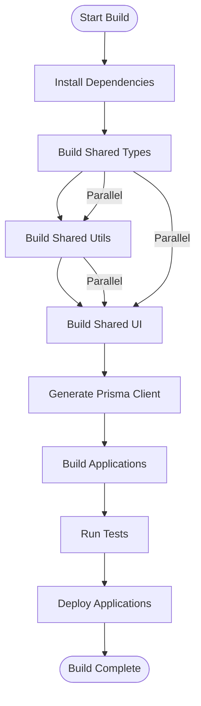

# Monorepo Structure

<cite>
**Referenced Files in This Document**
- [package.json](file://package.json)
- [tsconfig.json](file://tsconfig.json)
- [apps/passenger/package.json](file://apps/passenger/package.json)
- [apps/driver/package.json](file://apps/driver/package.json)
- [apps/admin/package.json](file://apps/admin/package.json)
- [packages/shared-types/package.json](file://packages/shared-types/package.json)
- [packages/shared-ui/package.json](file://packages/shared-ui/package.json)
- [packages/shared-utils/package.json](file://packages/shared-utils/package.json)
- [packages/prisma/package.json](file://packages/prisma/package.json)
- [packages/real-time/package.json](file://packages/real-time/package.json)
</cite>

## Table of Contents
1. [Introduction](#introduction)
2. [Project Structure Overview](#project-structure-overview)
3. [Workspace Architecture](#workspace-architecture)
4. [Shared Packages Strategy](#shared-packages-strategy)
5. [Dependency Management](#dependency-management)
6. [TypeScript Configuration Sharing](#typescript-configuration-sharing)
7. [Build Orchestration](#build-orchestration)
8. [Practical Examples](#practical-examples)
9. [Benefits and Best Practices](#benefits-and-best-practices)
10. [Troubleshooting Guide](#troubleshooting-guide)
11. [Conclusion](#conclusion)

## Introduction

Ubar is a comprehensive ride-sharing platform built as a monorepo containing three separate Next.js applications: passenger, driver, and admin interfaces. This architecture leverages npm workspaces to manage multiple applications and shared packages within a single repository, enabling code reuse, type safety, and streamlined development workflows across all user-facing applications.

The monorepo structure follows modern best practices for large-scale JavaScript projects, providing a unified development experience while maintaining clear separation between different application concerns and shared functionality.

## Project Structure Overview

The Ubar monorepo follows a standard workspace layout with clear separation between applications and shared packages:



**Diagram sources**
- [package.json:1-50](file://package.json#L1-L50)
- [tsconfig.json:1-30](file://tsconfig.json#L1-L30)

Each application maintains its own independent build pipeline while sharing common dependencies and configurations through the workspace system.

**Section sources**
- [package.json:1-50](file://package.json#L1-L50)
- [tsconfig.json:1-30](file://tsconfig.json#L1-L30)

## Workspace Architecture

The monorepo uses npm workspaces to orchestrate multiple packages and applications. The root `package.json` defines the workspace configuration that enables dependency hoisting and cross-package references.

### Root Configuration

The root package.json serves as the central configuration point for the entire monorepo:

- **Workspaces Definition**: Declares which directories contain packages
- **Shared Scripts**: Provides common commands for building, testing, and developing
- **Global Dependencies**: Manages tooling dependencies used across all packages
- **Version Pinning**: Ensures consistent dependency versions across the workspace

### Application Isolation

Each Next.js application (passenger, driver, admin) operates as an independent workspace with:

- **Independent Build Pipelines**: Each app can be built and deployed separately
- **Application-Specific Dependencies**: Apps can have unique dependencies without affecting others
- **Separate Development Servers**: Each app runs independently during development
- **Individual Deployment Targets**: Applications can be deployed to different environments

**Section sources**
- [package.json:1-50](file://package.json#L1-L50)
- [apps/passenger/package.json:1-30](file://apps/passenger/package.json#L1-L30)
- [apps/driver/package.json:1-30](file://apps/driver/package.json#L1-L30)
- [apps/admin/package.json:1-30](file://apps/admin/package.json#L1-L30)

## Shared Packages Strategy

The `packages/` directory contains reusable modules that provide shared functionality across all applications. This strategy promotes code reuse, consistency, and maintainability.

### Package Organization



**Diagram sources**
- [packages/shared-types/package.json:1-30](file://packages/shared-types/package.json#L1-L30)
- [packages/shared-ui/package.json:1-30](file://packages/shared-ui/package.json#L1-L30)
- [packages/shared-utils/package.json:1-30](file://packages/shared-utils/package.json#L1-L30)
- [packages/prisma/package.json:1-30](file://packages/prisma/package.json#L1-L30)
- [packages/real-time/package.json:1-30](file://packages/real-time/package.json#L1-L30)

### Core Shared Packages

#### Shared Types (`shared-types`)
Contains TypeScript interfaces and type definitions used across all applications:
- User authentication types
- Trip and booking models
- Payment and pricing structures
- Location and mapping data
- API request/response formats

#### Shared UI (`shared-ui`)
Reusable React components and styling:
- Consistent design system implementation
- Form components with validation
- Data visualization components
- Layout and navigation elements
- Theme and styling utilities

#### Shared Utils (`shared-utils`)
Common utility functions and helpers:
- Data validation and sanitization
- Date and time formatting
- Mathematical calculations
- API request helpers
- Error handling utilities

#### Prisma Package (`prisma`)
Database schema and migration management:
- Centralized database schema definition
- Migration scripts and versioning
- Database client configuration
- Seed data and fixtures
- Query builders and helpers

#### Real-time Services (`real-time`)
WebSocket and event-driven communication:
- Connection management
- Event broadcasting
- Message routing
- Presence tracking
- Real-time data synchronization

**Section sources**
- [packages/shared-types/package.json:1-30](file://packages/shared-types/package.json#L1-L30)
- [packages/shared-ui/package.json:1-30](file://packages/shared-ui/package.json#L1-L30)
- [packages/shared-utils/package.json:1-30](file://packages/shared-utils/package.json#L1-L30)
- [packages/prisma/package.json:1-30](file://packages/prisma/package.json#L1-L30)
- [packages/real-time/package.json:1-30](file://packages/real-time/package.json#L1-L30)

## Dependency Management

The monorepo implements sophisticated dependency management using npm workspaces to ensure consistency and efficiency across all packages.

### Dependency Hoisting

npm workspaces automatically hoists common dependencies to the root `node_modules`, reducing disk space usage and installation times:

- **Shared Dependencies**: Common packages are installed once at the root level
- **Version Resolution**: Conflicts are resolved using npm's intelligent resolution algorithm
- **Symlink Creation**: Packages reference shared dependencies through symlinks
- **Isolation**: Each package maintains its own dependency tree when needed

### Cross-Package References

Applications and packages reference each other using workspace protocol syntax:

```json
{
  "dependencies": {
    "@ubar/shared-types": "workspace:*",
    "@ubar/shared-ui": "workspace:*",
    "@ubar/shared-utils": "workspace:*"
  }
}
```

### Version Management

The workspace system supports both internal and external dependency management:

- **Internal Packages**: Use `workspace:*` protocol for development
- **External Dependencies**: Managed through standard npm versioning
- **Lock File**: `package-lock.json` ensures consistent installations
- **Peer Dependencies**: Properly configured for shared libraries

**Section sources**
- [package.json:1-50](file://package.json#L1-L50)
- [apps/passenger/package.json:1-30](file://apps/passenger/package.json#L1-L30)
- [apps/driver/package.json:1-30](file://apps/driver/package.json#L1-L30)
- [apps/admin/package.json:1-30](file://apps/admin/package.json#L1-L30)

## TypeScript Configuration Sharing

The monorepo implements a hierarchical TypeScript configuration strategy that balances consistency with flexibility.

### Base Configuration

The root `tsconfig.json` provides base settings inherited by all packages:

- **Compiler Options**: Strict mode, target ES version, module resolution
- **Path Mapping**: Alias configuration for clean imports
- **Include/Exclude Patterns**: File filtering for compilation
- **Plugin Configuration**: ESLint, Prettier, and other tool integrations

### Package-Specific Overrides

Each package can extend the base configuration with specific requirements:

- **Application Configs**: Next.js-specific settings for each app
- **Library Configs**: Optimized settings for shared packages
- **Environment-Specific Settings**: Development vs production builds

### Path Aliases

Centralized path aliases enable clean import statements across the workspace:

```json
{
  "paths": {
    "@ubar/*": ["./packages/*"],
    "@/components": ["./packages/shared-ui/src/components"],
    "@/types": ["./packages/shared-types/src"]
  }
}
```

**Section sources**
- [tsconfig.json:1-30](file://tsconfig.json#L1-L30)
- [apps/passenger/tsconfig.json:1-30](file://apps/passenger/tsconfig.json#L1-L30)
- [apps/driver/tsconfig.json:1-30](file://apps/driver/tsconfig.json#L1-L30)
- [apps/admin/tsconfig.json:1-30](file://apps/admin/tsconfig.json#L1-L30)

## Build Orchestration

The monorepo implements a sophisticated build system that coordinates compilation across all packages and applications.

### Build Pipeline Architecture



**Diagram sources**
- [package.json:1-50](file://package.json#L1-L50)

### Parallel Build Execution

The build system executes independent tasks in parallel to maximize performance:

- **Type Checking**: All packages checked simultaneously
- **Compilation**: Independent packages compiled concurrently
- **Asset Processing**: Static assets processed in parallel
- **Testing**: Unit tests run across all packages concurrently

### Incremental Builds

Build caching and incremental compilation reduce build times:

- **TypeScript Cache**: `.tsbuildinfo` files store compilation state
- **Dependency Tracking**: Only changed packages rebuild
- **Artifacts Caching**: Build artifacts cached between runs
- **Selective Rebuilding**: Minimal rebuilds on small changes

**Section sources**
- [package.json:1-50](file://package.json#L1-L50)

## Practical Examples

### Adding a New Shared Package

To add a new shared package to the monorepo:

1. **Create Package Directory**: Add new folder under `packages/`
2. **Initialize Package**: Create `package.json` with workspace configuration
3. **Configure TypeScript**: Set up tsconfig extending base configuration
4. **Add to Workspaces**: Update root package.json if needed
5. **Reference in Applications**: Import using workspace protocol

### Managing Cross-Package Dependencies

When adding dependencies between packages:

1. **Define Internal Dependency**: Use `workspace:*` protocol
2. **Update Lock File**: Run `npm install` to update lock file
3. **Verify Type Safety**: Ensure TypeScript can resolve imports
4. **Test Integration**: Verify build and runtime behavior

### Maintaining Consistency Across Applications

Best practices for keeping applications consistent:

1. **Shared Configuration**: Use base configs from root
2. **Common Dependencies**: Move shared deps to workspace level
3. **Unified Tooling**: Configure ESLint, Prettier centrally
4. **Standardized Structure**: Follow consistent file organization patterns

### Development Workflow

Efficient development workflow using the monorepo:

1. **Workspace Commands**: Use `npm run dev --workspace=app-name`
2. **Hot Reloading**: Changes propagate across dependent packages
3. **Parallel Development**: Work on multiple packages simultaneously
4. **Integrated Testing**: Test changes across package boundaries

**Section sources**
- [package.json:1-50](file://package.json#L1-L50)
- [apps/passenger/package.json:1-30](file://apps/passenger/package.json#L1-L30)
- [apps/driver/package.json:1-30](file://apps/driver/package.json#L1-L30)
- [apps/admin/package.json:1-30](file://apps/admin/package.json#L1-L30)

## Benefits and Best Practices

### Code Reuse Benefits

The monorepo structure provides significant advantages for code reuse:

- **Eliminates Duplication**: Shared logic exists in one place
- **Consistent Behavior**: All applications use identical implementations
- **Centralized Updates**: Changes propagate to all consumers automatically
- **Reduced Maintenance**: Single source of truth for shared functionality

### Type Safety Advantages

TypeScript integration across the workspace ensures robust type safety:

- **Cross-Package Types**: Shared interfaces prevent type mismatches
- **Compile-Time Validation**: Errors caught before runtime
- **IntelliSense Support**: IDE features work across package boundaries
- **Refactoring Confidence**: Safe to modify shared code with confidence

### Development Workflow Improvements

The monorepo enhances developer productivity:

- **Single Repository**: All code in one location simplifies collaboration
- **Atomic Changes**: Related changes across packages committed together
- **Integrated Testing**: Test suites cover cross-package interactions
- **Streamlined CI/CD**: Unified build and deployment pipelines

### Scalability Considerations

The architecture scales effectively with team growth:

- **Team Ownership**: Different teams can own different packages
- **Independent Releases**: Packages can be versioned and released separately
- **Performance Optimization**: Targeted builds reduce development overhead
- **Clear Boundaries**: Well-defined package interfaces improve maintainability

## Troubleshooting Guide

### Common Issues and Solutions

#### Dependency Resolution Problems

**Issue**: Circular dependencies between packages
**Solution**: Refactor to break circular imports or use lazy loading

**Issue**: Version conflicts in shared dependencies
**Solution**: Use workspace protocol and let npm resolve versions

#### Build Failures

**Issue**: TypeScript errors in shared packages
**Solution**: Check type definitions and ensure proper exports

**Issue**: Missing dependencies in workspace
**Solution**: Run `npm install` at root to sync dependencies

#### Development Server Issues

**Issue**: Hot reload not working across packages
**Solution**: Ensure proper symlink creation and watch paths

**Issue**: Port conflicts between applications
**Solution**: Configure different ports for each development server

### Performance Optimization

- **Incremental Builds**: Enable TypeScript incremental compilation
- **Dependency Hoisting**: Keep shared dependencies at workspace level
- **Selective Building**: Use workspace commands to build only affected packages
- **Caching**: Leverage build caches and artifact storage

**Section sources**
- [package.json:1-50](file://package.json#L1-L50)

## Conclusion

Ubar's monorepo architecture demonstrates a mature approach to managing complex multi-application projects. By leveraging npm workspaces, shared packages, and centralized configuration, the team has created a scalable foundation that promotes code reuse, type safety, and efficient development workflows.

The separation of concerns between applications and shared packages enables independent development while maintaining consistency across the platform. This architecture supports team growth, facilitates feature development, and ensures long-term maintainability of the codebase.

The benefits of this approach include reduced duplication, improved type safety, streamlined development processes, and enhanced collaboration capabilities. As the platform continues to evolve, this monorepo structure provides the flexibility and scalability needed to support future growth and complexity.