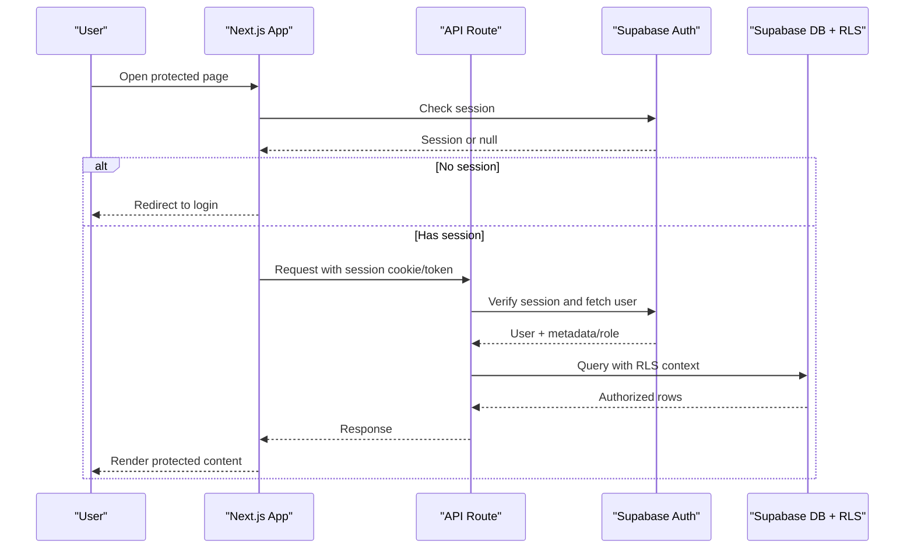
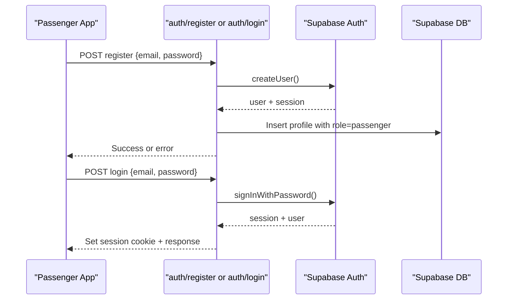
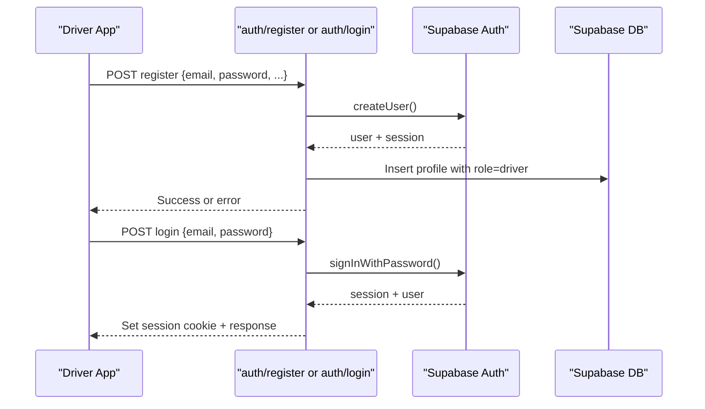
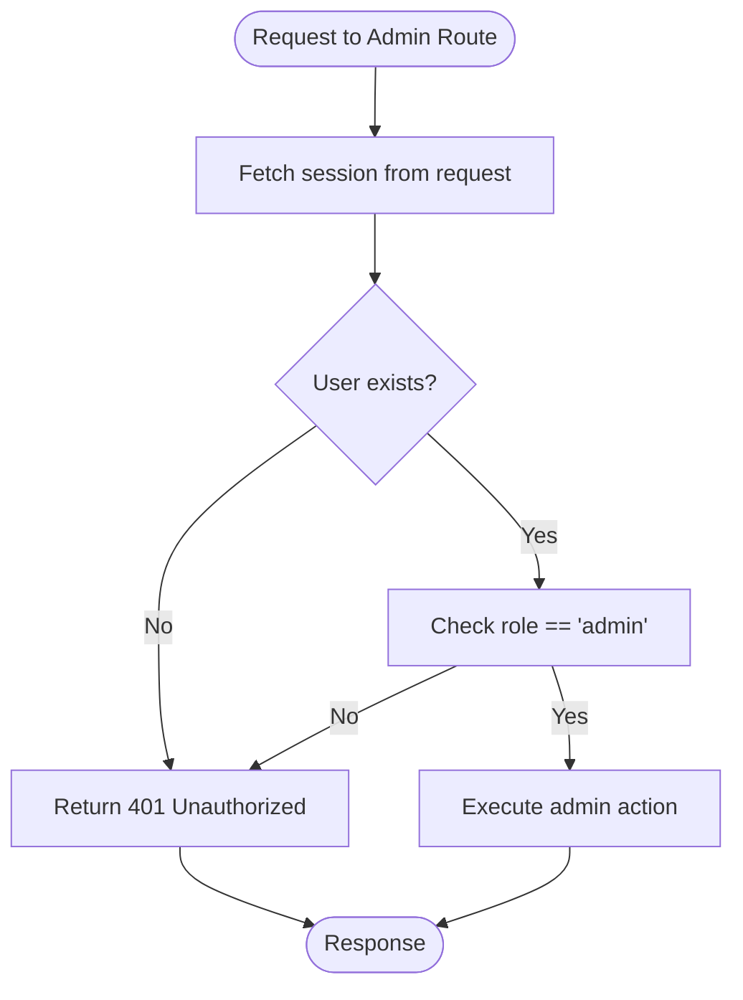
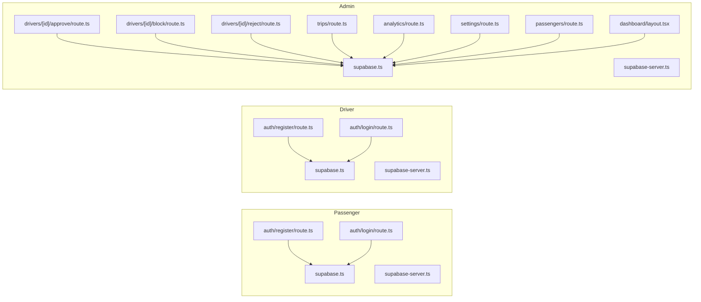

# Authentication & Authorization

<cite>
**Referenced Files in This Document**
- [apps/passenger/src/lib/supabase.ts](file://apps/passenger/src/lib/supabase.ts)
- [apps/passenger/src/lib/supabase-server.ts](file://apps/passenger/src/lib/supabase-server.ts)
- [apps/passenger/src/app/api/auth/register/route.ts](file://apps/passenger/src/app/api/auth/register/route.ts)
- [apps/passenger/src/app/api/auth/login/route.ts](file://apps/passenger/src/app/api/auth/login/route.ts)
- [apps/driver/src/lib/supabase.ts](file://apps/driver/src/lib/supabase.ts)
- [apps/driver/src/lib/supabase-server.ts](file://apps/driver/src/lib/supabase-server.ts)
- [apps/driver/src/app/api/auth/register/route.ts](file://apps/driver/src/app/api/auth/register/route.ts)
- [apps/driver/src/app/api/auth/login/route.ts](file://apps/driver/src/app/api/auth/login/route.ts)
- [apps/admin/src/lib/supabase.ts](file://apps/admin/src/lib/supabase.ts)
- [apps/admin/src/lib/supabase-server.ts](file://apps/admin/src/lib/supabase-server.ts)
- [apps/admin/src/app/dashboard/layout.tsx](file://apps/admin/src/app/dashboard/layout.tsx)
- [apps/admin/src/app/api/drivers/[id]/approve/route.ts](file://apps/admin/src/app/api/drivers/[id]/approve/route.ts)
- [apps/admin/src/app/api/drivers/[id]/block/route.ts](file://apps/admin/src/app/api/drivers/[id]/block/route.ts)
- [apps/admin/src/app/api/drivers/[id]/reject/route.ts](file://apps/admin/src/app/api/drivers/[id]/reject/route.ts)
- [apps/admin/src/app/api/trips/route.ts](file://apps/admin/src/app/api/trips/route.ts)
- [apps/admin/src/app/api/analytics/route.ts](file://apps/admin/src/app/api/analytics/route.ts)
- [apps/admin/src/app/api/settings/route.ts](file://apps/admin/src/app/api/settings/route.ts)
- [apps/admin/src/app/api/passengers/route.ts](file://apps/admin/src/app/api/passengers/route.ts)
</cite>

## Table of Contents
1. [Introduction](#introduction)
2. [Project Structure](#project-structure)
3. [Core Components](#core-components)
4. [Architecture Overview](#architecture-overview)
5. [Detailed Component Analysis](#detailed-component-analysis)
6. [Dependency Analysis](#dependency-analysis)
7. [Performance Considerations](#performance-considerations)
8. [Troubleshooting Guide](#troubleshooting-guide)
9. [Conclusion](#conclusion)
10. [Appendices](#appendices)

## Introduction
This document explains the authentication and authorization system built on Supabase across three Next.js applications: Passenger, Driver, and Admin. It covers role-based access control (RBAC), session management, security patterns, middleware implementations, route protection, permission checks, token management, session persistence, cross-application authentication sharing, and compliance considerations. The goal is to provide a comprehensive understanding for both technical and non-technical readers.

## Project Structure
The repository implements a multi-app architecture with shared Supabase client/server utilities per app and API routes that enforce RBAC. Each app provides its own auth endpoints and UI flows while relying on a common Supabase backend for identity and session handling.

```mermaid
graph TB
subgraph "Passenger App"
P_Supabase["supabase.ts"]
P_Server["supabase-server.ts"]
P_Reg["api/auth/register/route.ts"]
P_Login["api/auth/login/route.ts"]
end
subgraph "Driver App"
D_Supabase["supabase.ts"]
D_Server["supabase-server.ts"]
D_Reg["api/auth/register/route.ts"]
D_Login["api/auth/login/route.ts"]
end
subgraph "Admin App"
A_Supabase["supabase.ts"]
A_Server["supabase-server.ts"]
A_DashLayout["dashboard/layout.tsx"]
A_Approve["api/drivers/[id]/approve/route.ts"]
A_Block["api/drivers/[id]/block/route.ts"]
A_Reject["api/drivers/[id]/reject/route.ts"]
A_Trips["api/trips/route.ts"]
A_Analytics["api/analytics/route.ts"]
A_Settings["api/settings/route.ts"]
A_Passengers["api/passengers/route.ts"]
end
subgraph "Supabase Backend"
SB_Auth["Auth Service"]
SB_RLS["Row-Level Security"]
SB_DB[(Database)]
end
P_Supabase --> SB_Auth
P_Server --> SB_Auth
D_Supabase --> SB_Auth
D_Server --> SB_Auth
A_Supabase --> SB_Auth
A_Server --> SB_Auth
P_Reg --> SB_Auth
P_Login --> SB_Auth
D_Reg --> SB_Auth
D_Login --> SB_Auth
A_Approve --> SB_RLS
A_Block --> SB_RLS
A_Reject --> SB_RLS
A_Trips --> SB_RLS
A_Analytics --> SB_RLS
A_Settings --> SB_RLS
A_Passengers --> SB_RLS
SB_RLS --> SB_DB
```

**Diagram sources**
- [apps/passenger/src/lib/supabase.ts](file://apps/passenger/src/lib/supabase.ts)
- [apps/passenger/src/lib/supabase-server.ts](file://apps/passenger/src/lib/supabase-server.ts)
- [apps/passenger/src/app/api/auth/register/route.ts](file://apps/passenger/src/app/api/auth/register/route.ts)
- [apps/passenger/src/app/api/auth/login/route.ts](file://apps/passenger/src/app/api/auth/login/route.ts)
- [apps/driver/src/lib/supabase.ts](file://apps/driver/src/lib/supabase.ts)
- [apps/driver/src/lib/supabase-server.ts](file://apps/driver/src/lib/supabase-server.ts)
- [apps/driver/src/app/api/auth/register/route.ts](file://apps/driver/src/app/api/auth/register/route.ts)
- [apps/driver/src/app/api/auth/login/route.ts](file://apps/driver/src/app/api/auth/login/route.ts)
- [apps/admin/src/lib/supabase.ts](file://apps/admin/src/lib/supabase.ts)
- [apps/admin/src/lib/supabase-server.ts](file://apps/admin/src/lib/supabase-server.ts)
- [apps/admin/src/app/dashboard/layout.tsx](file://apps/admin/src/app/dashboard/layout.tsx)
- [apps/admin/src/app/api/drivers/[id]/approve/route.ts](file://apps/admin/src/app/api/drivers/[id]/approve/route.ts)
- [apps/admin/src/app/api/drivers/[id]/block/route.ts](file://apps/admin/src/app/api/drivers/[id]/block/route.ts)
- [apps/admin/src/app/api/drivers/[id]/reject/route.ts](file://apps/admin/src/app/api/drivers/[id]/reject/route.ts)
- [apps/admin/src/app/api/trips/route.ts](file://apps/admin/src/app/api/trips/route.ts)
- [apps/admin/src/app/api/analytics/route.ts](file://apps/admin/src/app/api/analytics/route.ts)
- [apps/admin/src/app/api/settings/route.ts](file://apps/admin/src/app/api/settings/route.ts)
- [apps/admin/src/app/api/passengers/route.ts](file://apps/admin/src/app/api/passengers/route.ts)

**Section sources**
- [apps/passenger/src/lib/supabase.ts](file://apps/passenger/src/lib/supabase.ts)
- [apps/passenger/src/lib/supabase-server.ts](file://apps/passenger/src/lib/supabase-server.ts)
- [apps/driver/src/lib/supabase.ts](file://apps/driver/src/lib/supabase.ts)
- [apps/driver/src/lib/supabase-server.ts](file://apps/driver/src/lib/supabase-server.ts)
- [apps/admin/src/lib/supabase.ts](file://apps/admin/src/lib/supabase.ts)
- [apps/admin/src/lib/supabase-server.ts](file://apps/admin/src/lib/supabase-server.ts)

## Core Components
- Supabase Client Utilities:
  - Browser-side client initialization and configuration for each app.
  - Server-side client initialization for API routes and server components.
- Auth Endpoints:
  - Registration and login handlers for passenger and driver apps.
- Admin Middleware and Route Protection:
  - Layout-level guards for admin dashboard.
  - API route handlers enforcing admin-only operations.

Key responsibilities:
- Initialize Supabase clients securely in browser and server contexts.
- Authenticate users via email/password or provider flows.
- Enforce RBAC at API boundaries using roles stored in user metadata or profiles.
- Protect sensitive admin routes and data through server-side checks and database RLS policies.

**Section sources**
- [apps/passenger/src/lib/supabase.ts](file://apps/passenger/src/lib/supabase.ts)
- [apps/passenger/src/lib/supabase-server.ts](file://apps/passenger/src/lib/supabase-server.ts)
- [apps/driver/src/lib/supabase.ts](file://apps/driver/src/lib/supabase.ts)
- [apps/driver/src/lib/supabase-server.ts](file://apps/driver/src/lib/supabase-server.ts)
- [apps/admin/src/lib/supabase.ts](file://apps/admin/src/lib/supabase.ts)
- [apps/admin/src/lib/supabase-server.ts](file://apps/admin/src/lib/supabase-server.ts)
- [apps/admin/src/app/dashboard/layout.tsx](file://apps/admin/src/app/dashboard/layout.tsx)

## Architecture Overview
The system uses Supabase as the central identity provider and enforces RBAC at multiple layers:
- Application layer: UI guards and layout-level redirects.
- API layer: Server-side role checks before performing actions.
- Database layer: Row-Level Security policies to restrict row access by role.

**Diagram sources**
- [apps/admin/src/app/dashboard/layout.tsx](file://apps/admin/src/app/dashboard/layout.tsx)
- [apps/admin/src/app/api/drivers/[id]/approve/route.ts](file://apps/admin/src/app/api/drivers/[id]/approve/route.ts)
- [apps/admin/src/app/api/drivers/[id]/block/route.ts](file://apps/admin/src/app/api/drivers/[id]/block/route.ts)
- [apps/admin/src/app/api/drivers/[id]/reject/route.ts](file://apps/admin/src/app/api/drivers/[id]/reject/route.ts)
- [apps/admin/src/app/api/trips/route.ts](file://apps/admin/src/app/api/trips/route.ts)
- [apps/admin/src/app/api/analytics/route.ts](file://apps/admin/src/app/api/analytics/route.ts)
- [apps/admin/src/app/api/settings/route.ts](file://apps/admin/src/app/api/settings/route.ts)
- [apps/admin/src/app/api/passengers/route.ts](file://apps/admin/src/app/api/passengers/route.ts)

## Detailed Component Analysis

### Supabase Client Initialization
- Browser client:
  - Initializes Supabase with environment variables and sets up auth state listeners.
  - Used by UI components to manage sign-in/sign-out and read current session.
- Server client:
  - Initializes Supabase in API routes and server components using request cookies or headers.
  - Ensures server-side verification of sessions and retrieval of authenticated user context.

Security notes:
- Never expose secret keys to the browser; use separate anon/public keys for client and service-role keys for server when necessary.
- Validate and sanitize inputs in API routes before calling Supabase.

**Section sources**
- [apps/passenger/src/lib/supabase.ts](file://apps/passenger/src/lib/supabase.ts)
- [apps/passenger/src/lib/supabase-server.ts](file://apps/passenger/src/lib/supabase-server.ts)
- [apps/driver/src/lib/supabase.ts](file://apps/driver/src/lib/supabase.ts)
- [apps/driver/src/lib/supabase-server.ts](file://apps/driver/src/lib/supabase-server.ts)
- [apps/admin/src/lib/supabase.ts](file://apps/admin/src/lib/supabase.ts)
- [apps/admin/src/lib/supabase-server.ts](file://apps/admin/src/lib/supabase-server.ts)

### Passenger Authentication Flows
- Registration:
  - Endpoint creates a new user account and associates it with the passenger role.
  - Returns appropriate success/error responses and may trigger email verification.
- Login:
  - Endpoint authenticates credentials and establishes a session.
  - Sets secure cookies and returns minimal user info needed by the client.

**Diagram sources**
- [apps/passenger/src/app/api/auth/register/route.ts](file://apps/passenger/src/app/api/auth/register/route.ts)
- [apps/passenger/src/app/api/auth/login/route.ts](file://apps/passenger/src/app/api/auth/login/route.ts)

**Section sources**
- [apps/passenger/src/app/api/auth/register/route.ts](file://apps/passenger/src/app/api/auth/register/route.ts)
- [apps/passenger/src/app/api/auth/login/route.ts](file://apps/passenger/src/app/api/auth/login/route.ts)

### Driver Authentication Flows
- Registration:
  - Endpoint creates a driver account and assigns role=driver.
  - May require additional fields (e.g., license info) depending on business rules.
- Login:
  - Authenticates credentials and establishes a session.

**Diagram sources**
- [apps/driver/src/app/api/auth/register/route.ts](file://apps/driver/src/app/api/auth/register/route.ts)
- [apps/driver/src/app/api/auth/login/route.ts](file://apps/driver/src/app/api/auth/login/route.ts)

**Section sources**
- [apps/driver/src/app/api/auth/register/route.ts](file://apps/driver/src/app/api/auth/register/route.ts)
- [apps/driver/src/app/api/auth/login/route.ts](file://apps/driver/src/app/api/auth/login/route.ts)

### Admin Role-Based Access Control
- Dashboard Layout Guard:
  - Checks if the current user has an admin role before rendering dashboard pages.
  - Redirects unauthorized users to login or an access-denied page.
- Admin API Routes:
  - Approve/Block/Reject drivers: Require admin role; perform updates only if authorized.
  - Trips, Analytics, Settings, Passengers endpoints: Restricted to admin role.

**Diagram sources**
- [apps/admin/src/app/dashboard/layout.tsx](file://apps/admin/src/app/dashboard/layout.tsx)
- [apps/admin/src/app/api/drivers/[id]/approve/route.ts](file://apps/admin/src/app/api/drivers/[id]/approve/route.ts)
- [apps/admin/src/app/api/drivers/[id]/block/route.ts](file://apps/admin/src/app/api/drivers/[id]/block/route.ts)
- [apps/admin/src/app/api/drivers/[id]/reject/route.ts](file://apps/admin/src/app/api/drivers/[id]/reject/route.ts)
- [apps/admin/src/app/api/trips/route.ts](file://apps/admin/src/app/api/trips/route.ts)
- [apps/admin/src/app/api/analytics/route.ts](file://apps/admin/src/app/api/analytics/route.ts)
- [apps/admin/src/app/api/settings/route.ts](file://apps/admin/src/app/api/settings/route.ts)
- [apps/admin/src/app/api/passengers/route.ts](file://apps/admin/src/app/api/passengers/route.ts)

**Section sources**
- [apps/admin/src/app/dashboard/layout.tsx](file://apps/admin/src/app/dashboard/layout.tsx)
- [apps/admin/src/app/api/drivers/[id]/approve/route.ts](file://apps/admin/src/app/api/drivers/[id]/approve/route.ts)
- [apps/admin/src/app/api/drivers/[id]/block/route.ts](file://apps/admin/src/app/api/drivers/[id]/block/route.ts)
- [apps/admin/src/app/api/drivers/[id]/reject/route.ts](file://apps/admin/src/app/api/drivers/[id]/reject/route.ts)
- [apps/admin/src/app/api/trips/route.ts](file://apps/admin/src/app/api/trips/route.ts)
- [apps/admin/src/app/api/analytics/route.ts](file://apps/admin/src/app/api/analytics/route.ts)
- [apps/admin/src/app/api/settings/route.ts](file://apps/admin/src/app/api/settings/route.ts)
- [apps/admin/src/app/api/passengers/route.ts](file://apps/admin/src/app/api/passengers/route.ts)

### Cross-Application Authentication Sharing
- Shared Identity:
  - All apps authenticate against the same Supabase instance, enabling consistent user identities across apps.
- Session Persistence:
  - Sessions are maintained via secure cookies set by Supabase Auth; ensure SameSite and Secure flags are configured appropriately.
- Token Management:
  - Prefer short-lived access tokens and refresh tokens managed by Supabase; avoid storing long-lived secrets in client code.
- Best Practices:
  - Use domain-scoped cookies and HTTPS-only settings.
  - Implement logout endpoints to clear sessions across apps.

[No sources needed since this section provides general guidance]

### Security Patterns and Best Practices
- Input Validation:
  - Validate all inputs in API routes before interacting with Supabase.
- Least Privilege:
  - Use anon keys in browsers; reserve service-role keys for server-side privileged operations.
- RBAC Enforcement:
  - Enforce roles at API boundaries and rely on database RLS for row-level protection.
- Error Handling:
  - Return generic error messages to clients; log detailed errors server-side.
- Auditability:
  - Log admin actions (approve/block/reject) with timestamps and actor IDs.

[No sources needed since this section provides general guidance]

## Dependency Analysis
The following diagram shows how each app depends on its Supabase client/server modules and how admin routes depend on role checks.

**Diagram sources**
- [apps/passenger/src/lib/supabase.ts](file://apps/passenger/src/lib/supabase.ts)
- [apps/passenger/src/lib/supabase-server.ts](file://apps/passenger/src/lib/supabase-server.ts)
- [apps/passenger/src/app/api/auth/register/route.ts](file://apps/passenger/src/app/api/auth/register/route.ts)
- [apps/passenger/src/app/api/auth/login/route.ts](file://apps/passenger/src/app/api/auth/login/route.ts)
- [apps/driver/src/lib/supabase.ts](file://apps/driver/src/lib/supabase.ts)
- [apps/driver/src/lib/supabase-server.ts](file://apps/driver/src/lib/supabase-server.ts)
- [apps/driver/src/app/api/auth/register/route.ts](file://apps/driver/src/app/api/auth/register/route.ts)
- [apps/driver/src/app/api/auth/login/route.ts](file://apps/driver/src/app/api/auth/login/route.ts)
- [apps/admin/src/lib/supabase.ts](file://apps/admin/src/lib/supabase.ts)
- [apps/admin/src/lib/supabase-server.ts](file://apps/admin/src/lib/supabase-server.ts)
- [apps/admin/src/app/dashboard/layout.tsx](file://apps/admin/src/app/dashboard/layout.tsx)
- [apps/admin/src/app/api/drivers/[id]/approve/route.ts](file://apps/admin/src/app/api/drivers/[id]/approve/route.ts)
- [apps/admin/src/app/api/drivers/[id]/block/route.ts](file://apps/admin/src/app/api/drivers/[id]/block/route.ts)
- [apps/admin/src/app/api/drivers/[id]/reject/route.ts](file://apps/admin/src/app/api/drivers/[id]/reject/route.ts)
- [apps/admin/src/app/api/trips/route.ts](file://apps/admin/src/app/api/trips/route.ts)
- [apps/admin/src/app/api/analytics/route.ts](file://apps/admin/src/app/api/analytics/route.ts)
- [apps/admin/src/app/api/settings/route.ts](file://apps/admin/src/app/api/settings/route.ts)
- [apps/admin/src/app/api/passengers/route.ts](file://apps/admin/src/app/api/passengers/route.ts)

**Section sources**
- [apps/passenger/src/lib/supabase.ts](file://apps/passenger/src/lib/supabase.ts)
- [apps/passenger/src/lib/supabase-server.ts](file://apps/passenger/src/lib/supabase-server.ts)
- [apps/driver/src/lib/supabase.ts](file://apps/driver/src/lib/supabase.ts)
- [apps/driver/src/lib/supabase-server.ts](file://apps/driver/src/lib/supabase-server.ts)
- [apps/admin/src/lib/supabase.ts](file://apps/admin/src/lib/supabase.ts)
- [apps/admin/src/lib/supabase-server.ts](file://apps/admin/src/lib/supabase-server.ts)
- [apps/admin/src/app/dashboard/layout.tsx](file://apps/admin/src/app/dashboard/layout.tsx)
- [apps/admin/src/app/api/drivers/[id]/approve/route.ts](file://apps/admin/src/app/api/drivers/[id]/approve/route.ts)
- [apps/admin/src/app/api/drivers/[id]/block/route.ts](file://apps/admin/src/app/api/drivers/[id]/block/route.ts)
- [apps/admin/src/app/api/drivers/[id]/reject/route.ts](file://apps/admin/src/app/api/drivers/[id]/reject/route.ts)
- [apps/admin/src/app/api/trips/route.ts](file://apps/admin/src/app/api/trips/route.ts)
- [apps/admin/src/app/api/analytics/route.ts](file://apps/admin/src/app/api/analytics/route.ts)
- [apps/admin/src/app/api/settings/route.ts](file://apps/admin/src/app/api/settings/route.ts)
- [apps/admin/src/app/api/passengers/route.ts](file://apps/admin/src/app/api/passengers/route.ts)

## Performance Considerations
- Minimize round-trips by batching Supabase queries where possible.
- Cache read-heavy admin data (e.g., analytics) with appropriate invalidation strategies.
- Use pagination for large datasets (e.g., trips, passengers).
- Avoid heavy computations in API routes; offload to background jobs if needed.

[No sources needed since this section provides general guidance]

## Troubleshooting Guide
Common issues and resolutions:
- Session not recognized:
  - Ensure cookies are enabled and correctly scoped; verify HTTPS and SameSite settings.
- Unauthorized access:
  - Confirm user role is set correctly in metadata/profile; check API route role checks.
- Email verification failures:
  - Review Supabase email templates and SMTP configuration.
- Rate limiting:
  - Monitor Supabase rate limits and implement client-side retry/backoff.

[No sources needed since this section provides general guidance]

## Conclusion
The authentication and authorization system leverages Supabase for identity and session management, with RBAC enforced at application, API, and database layers. Consistent client/server initialization, robust route protection, and strict role checks ensure secure access across Passenger, Driver, and Admin apps. Adhering to the recommended security practices and performance optimizations will maintain a resilient and compliant system.

[No sources needed since this section summarizes without analyzing specific files]

## Appendices

### Compliance Requirements
- Data Protection:
  - Encrypt sensitive data at rest and in transit; limit data retention.
- Audit Logging:
  - Record admin actions and authentication events for traceability.
- Consent and Privacy:
  - Provide privacy notices and consent mechanisms for user data processing.

[No sources needed since this section provides general guidance]