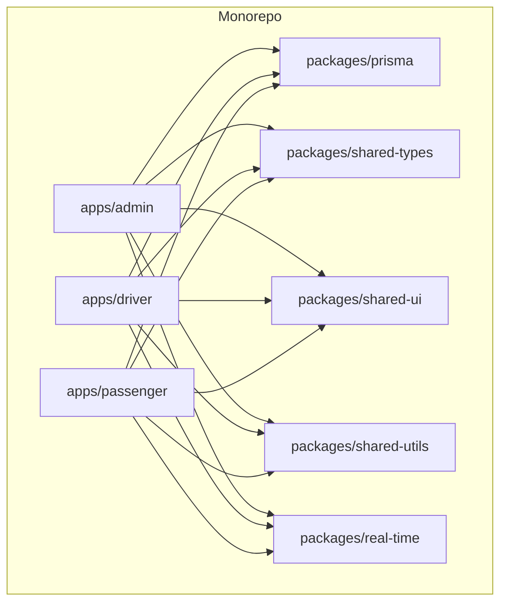
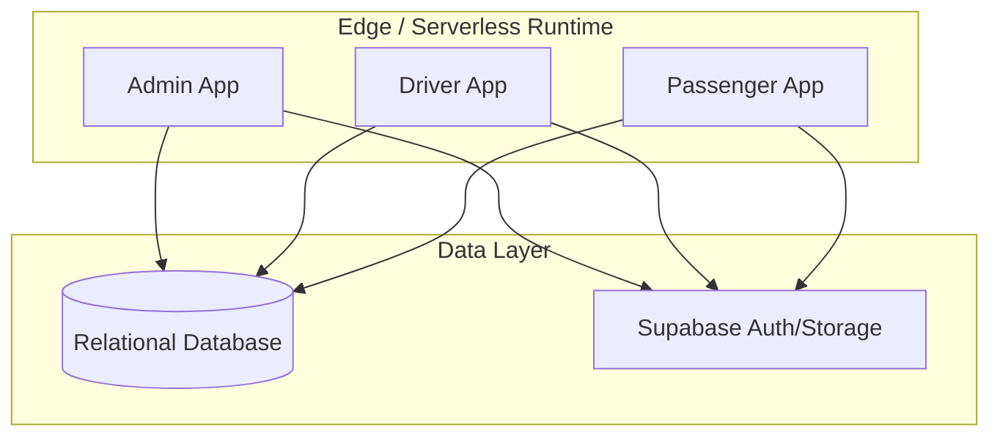
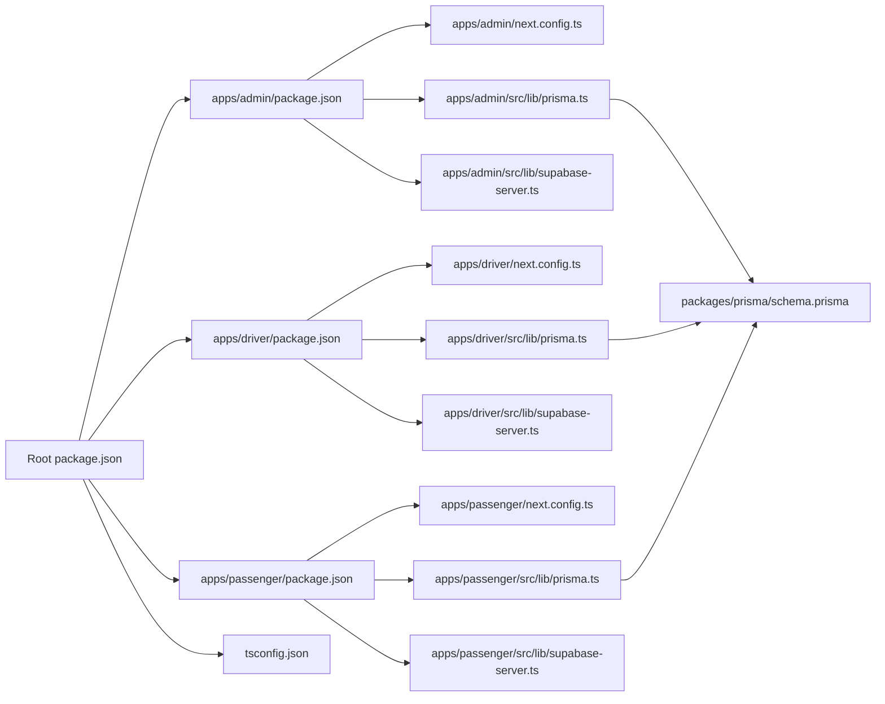
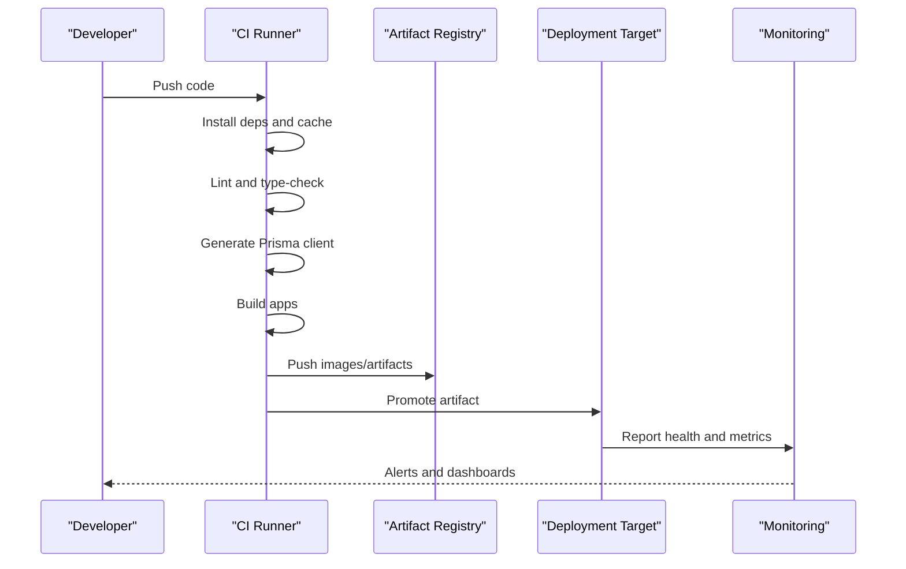

# Deployment & DevOps

<cite>
**Referenced Files in This Document**
- [package.json](file://package.json)
- [tsconfig.json](file://tsconfig.json)
- [apps/admin/package.json](file://apps/admin/package.json)
- [apps/admin/next.config.ts](file://apps/admin/next.config.ts)
- [apps/driver/package.json](file://apps/driver/package.json)
- [apps/driver/next.config.ts](file://apps/driver/next.config.ts)
- [apps/passenger/package.json](file://apps/passenger/package.json)
- [apps/passenger/next.config.ts](file://apps/passenger/next.config.ts)
- [apps/admin/src/lib/prisma.ts](file://apps/admin/src/lib/prisma.ts)
- [apps/driver/src/lib/prisma.ts](file://apps/driver/src/lib/prisma.ts)
- [apps/passenger/src/lib/prisma.ts](file://apps/passenger/src/lib/prisma.ts)
- [apps/admin/src/lib/supabase-server.ts](file://apps/admin/src/lib/supabase-server.ts)
- [apps/driver/src/lib/supabase-server.ts](file://apps/driver/src/lib/supabase-server.ts)
- [apps/passenger/src/lib/supabase-server.ts](file://apps/passenger/src/lib/supabase-server.ts)
- [packages/prisma/schema.prisma](file://packages/prisma/schema.prisma)
</cite>

## Table of Contents
1. [Introduction](#introduction)
2. [Project Structure](#project-structure)
3. [Core Components](#core-components)
4. [Architecture Overview](#architecture-overview)
5. [Detailed Component Analysis](#detailed-component-analysis)
6. [Dependency Analysis](#dependency-analysis)
7. [Performance Considerations](#performance-considerations)
8. [Troubleshooting Guide](#troubleshooting-guide)
9. [Conclusion](#conclusion)
10. [Appendices](#appendices)

## Introduction
This document provides comprehensive deployment and DevOps guidance for the Ubar platform. It covers build pipelines, environment configuration, containerization strategies, CI/CD workflows, deployment targets, scaling considerations, monitoring and logging, secrets management, performance optimization, caching, CDN configuration, database deployment procedures, rollback procedures, disaster recovery, and maintenance windows. The content is tailored to a Next.js-based monorepo with multiple applications (admin, driver, passenger) and shared packages.

## Project Structure
Ubar is organized as a monorepo with three Next.js applications under apps and several shared packages under packages. Each application is independently deployable and typically runs on a serverless or edge-capable runtime. Shared Prisma schema and types are centralized for consistency across services.

**Diagram sources**
- [package.json](file://package.json)
- [tsconfig.json](file://tsconfig.json)
- [apps/admin/package.json](file://apps/admin/package.json)
- [apps/driver/package.json](file://apps/driver/package.json)
- [apps/passenger/package.json](file://apps/passenger/package.json)
- [packages/prisma/schema.prisma](file://packages/prisma/schema.prisma)

**Section sources**
- [package.json](file://package.json)
- [tsconfig.json](file://tsconfig.json)
- [apps/admin/package.json](file://apps/admin/package.json)
- [apps/driver/package.json](file://apps/driver/package.json)
- [apps/passenger/package.json](file://apps/passenger/package.json)
- [packages/prisma/schema.prisma](file://packages/prisma/schema.prisma)

## Core Components
- Applications: admin, driver, passenger — each a Next.js app with its own package manifest and Next config.
- Shared packages: prisma schema, shared types, UI components, utilities, real-time module.
- Database access: Prisma client initialization per app; Supabase client/server helpers per app.

Key responsibilities:
- Build and run commands defined per app via package manifests.
- Next.js runtime configuration per app.
- Centralized data model via Prisma schema.
- Environment-driven configuration through environment variables.

**Section sources**
- [apps/admin/package.json](file://apps/admin/package.json)
- [apps/driver/package.json](file://apps/driver/package.json)
- [apps/passenger/package.json](file://apps/passenger/package.json)
- [apps/admin/next.config.ts](file://apps/admin/next.config.ts)
- [apps/driver/next.config.ts](file://apps/driver/next.config.ts)
- [apps/passenger/next.config.ts](file://apps/passenger/next.config.ts)
- [packages/prisma/schema.prisma](file://packages/prisma/schema.prisma)
- [apps/admin/src/lib/prisma.ts](file://apps/admin/src/lib/prisma.ts)
- [apps/driver/src/lib/prisma.ts](file://apps/driver/src/lib/prisma.ts)
- [apps/passenger/src/lib/prisma.ts](file://apps/passenger/src/lib/prisma.ts)
- [apps/admin/src/lib/supabase-server.ts](file://apps/admin/src/lib/supabase-server.ts)
- [apps/driver/src/lib/supabase-server.ts](file://apps/driver/src/lib/supabase-server.ts)
- [apps/passenger/src/lib/supabase-server.ts](file://apps/passenger/src/lib/supabase-server.ts)

## Architecture Overview
High-level architecture for deployment:
- Three Next.js apps serve SSR/SSG pages and API routes.
- Data layer uses a managed relational database accessed via Prisma.
- Authentication and optional storage handled by Supabase.
- Real-time features may be provided by a dedicated service or managed provider.

[No sources needed since this diagram shows conceptual architecture]

## Detailed Component Analysis

### Build Pipelines and CI/CD Workflows
Recommended pipeline stages:
- Install dependencies using a lockfile-aware strategy.
- Lint and type-check across the monorepo.
- Generate Prisma client from the central schema.
- Build each Next.js app with environment-specific variables.
- Run tests per app if present.
- Publish artifacts or images.

Suggested CI steps:
- Cache node_modules and Prisma engine binaries.
- Use incremental builds where supported.
- Parallelize app builds.
- Fail fast on lint/type errors.
- Upload build artifacts for promotion.

Environment matrix:
- Development: local dev servers.
- Staging: preview deployments per branch.
- Production: immutable releases with versioned tags.

**Section sources**
- [package.json](file://package.json)
- [apps/admin/package.json](file://apps/admin/package.json)
- [apps/driver/package.json](file://apps/driver/package.json)
- [apps/passenger/package.json](file://apps/passenger/package.json)

### Environment Configuration and Secrets Management
Environment variables:
- Per-app runtime variables for Next.js.
- Database connection strings and credentials.
- Supabase project URL and keys.
- Feature flags and regional endpoints.

Secrets handling:
- Store secrets in a secure vault or platform secret store.
- Inject secrets at runtime into the deployment target.
- Avoid committing secrets to source control.
- Rotate secrets regularly and audit access.

Configuration best practices:
- Separate non-secret configs from secrets.
- Validate required variables at startup.
- Provide sensible defaults for non-sensitive settings.
- Use typed configuration objects where possible.

**Section sources**
- [apps/admin/next.config.ts](file://apps/admin/next.config.ts)
- [apps/driver/next.config.ts](file://apps/driver/next.config.ts)
- [apps/passenger/next.config.ts](file://apps/passenger/next.config.ts)
- [apps/admin/src/lib/supabase-server.ts](file://apps/admin/src/lib/supabase-server.ts)
- [apps/driver/src/lib/supabase-server.ts](file://apps/driver/src/lib/supabase-server.ts)
- [apps/passenger/src/lib/supabase-server.ts](file://apps/passenger/src/lib/supabase-server.ts)

### Containerization Strategies
Container image design:
- Multi-stage Dockerfiles to minimize image size.
- Stage 1: install dependencies and generate Prisma client.
- Stage 2: copy only production artifacts and run the Next.js server.
- Use a minimal base image suitable for Node.js.
- Pin Node.js version and OS layers for reproducibility.

Runtime considerations:
- Set appropriate memory and CPU limits.
- Enable health checks and readiness probes.
- Prefer stateless containers; externalize sessions and caches.
- Use read-only root filesystem where possible.

Example structure:
- One image per app or a single multi-app image with process managers.
- Tag images with semantic versions and commit SHAs.

[No sources needed since this section provides general guidance]

### Deployment Targets and Scaling
Targets:
- Managed serverless platforms for Next.js apps.
- Kubernetes clusters with horizontal pod autoscaling.
- Edge networks for low-latency global delivery.

Scaling considerations:
- Horizontal scaling based on request rate and latency SLOs.
- Connection pooling for database access.
- Rate limiting and circuit breakers for downstream services.
- Graceful shutdown and zero-downtime deployments.

Rolling updates:
- Canary releases to validate changes.
- Blue/green deployments for critical services.
- Automated rollback on error thresholds.

[No sources needed since this section provides general guidance]

### Monitoring Setup and Logging Strategies
Monitoring:
- Application metrics (request rate, latency, error rates).
- Resource utilization (CPU, memory, disk I/O).
- Dependency health (database, cache, third-party APIs).
- Distributed tracing for cross-service calls.

Logging:
- Structured JSON logs with correlation IDs.
- Centralized log aggregation and retention policies.
- Log sampling for high-volume endpoints.
- PII redaction and compliance controls.

Alerting:
- Error budget burn alerts.
- Latency percentile breaches.
- Dependency failure detection.

[No sources needed since this section provides general guidance]

### Performance Optimization and Caching
Optimization techniques:
- Static asset optimization and code splitting.
- Incremental static regeneration for frequently updated pages.
- Database query optimization and indexing.
- Connection pooling and query batching.

Caching strategies:
- HTTP caching headers for public assets.
- In-memory caches for hot data within app instances.
- Global CDN caching for static resources.
- Database query result caching where safe.

CDN configuration:
- Cache rules for static files and API responses.
- Edge-side includes for personalized fragments.
- Purge mechanisms for invalidation.

[No sources needed since this section provides general guidance]

### Database Deployment Procedures
Prisma workflow:
- Maintain a single source of truth in the central schema.
- Generate client in CI before building apps.
- Apply migrations in a controlled order during deployment.
- Backward-compatible migration strategy to avoid downtime.

Database provisioning:
- Use infrastructure-as-code for databases.
- Manage backups and point-in-time recovery.
- Configure read replicas for read-heavy workloads.

Migration safety:
- Test migrations in staging with production-like data.
- Use feature flags to toggle new fields gradually.
- Rollback plan for failed migrations.

**Section sources**
- [packages/prisma/schema.prisma](file://packages/prisma/schema.prisma)
- [apps/admin/src/lib/prisma.ts](file://apps/admin/src/lib/prisma.ts)
- [apps/driver/src/lib/prisma.ts](file://apps/driver/src/lib/prisma.ts)
- [apps/passenger/src/lib/prisma.ts](file://apps/passenger/src/lib/prisma.ts)

### Rollback Procedures and Disaster Recovery
Rollback procedures:
- Keep previous release artifacts available.
- Re-deploy previous image/tag with same configuration.
- Verify health checks and traffic routing post-rollback.
- Monitor error rates and latency after rollback.

Disaster recovery:
- Regular backups and tested restore procedures.
- Cross-region replication for critical data.
- Runbooks for common failure scenarios.
- Post-incident reviews and improvements.

Maintenance windows:
- Schedule migrations during low-traffic periods.
- Communicate expected impact to stakeholders.
- Prepare quick rollback paths.

[No sources needed since this section provides general guidance]

## Dependency Analysis
The monorepo’s dependency graph centers around shared packages and per-app configurations.

**Diagram sources**
- [package.json](file://package.json)
- [tsconfig.json](file://tsconfig.json)
- [apps/admin/package.json](file://apps/admin/package.json)
- [apps/driver/package.json](file://apps/driver/package.json)
- [apps/passenger/package.json](file://apps/passenger/package.json)
- [apps/admin/next.config.ts](file://apps/admin/next.config.ts)
- [apps/driver/next.config.ts](file://apps/driver/next.config.ts)
- [apps/passenger/next.config.ts](file://apps/passenger/next.config.ts)
- [apps/admin/src/lib/prisma.ts](file://apps/admin/src/lib/prisma.ts)
- [apps/driver/src/lib/prisma.ts](file://apps/driver/src/lib/prisma.ts)
- [apps/passenger/src/lib/prisma.ts](file://apps/passenger/src/lib/prisma.ts)
- [apps/admin/src/lib/supabase-server.ts](file://apps/admin/src/lib/supabase-server.ts)
- [apps/driver/src/lib/supabase-server.ts](file://apps/driver/src/lib/supabase-server.ts)
- [apps/passenger/src/lib/supabase-server.ts](file://apps/passenger/src/lib/supabase-server.ts)
- [packages/prisma/schema.prisma](file://packages/prisma/schema.prisma)

**Section sources**
- [package.json](file://package.json)
- [tsconfig.json](file://tsconfig.json)
- [apps/admin/package.json](file://apps/admin/package.json)
- [apps/driver/package.json](file://apps/driver/package.json)
- [apps/passenger/package.json](file://apps/passenger/package.json)
- [apps/admin/next.config.ts](file://apps/admin/next.config.ts)
- [apps/driver/next.config.ts](file://apps/driver/next.config.ts)
- [apps/passenger/next.config.ts](file://apps/passenger/next.config.ts)
- [apps/admin/src/lib/prisma.ts](file://apps/admin/src/lib/prisma.ts)
- [apps/driver/src/lib/prisma.ts](file://apps/driver/src/lib/prisma.ts)
- [apps/passenger/src/lib/prisma.ts](file://apps/passenger/src/lib/prisma.ts)
- [apps/admin/src/lib/supabase-server.ts](file://apps/admin/src/lib/supabase-server.ts)
- [apps/driver/src/lib/supabase-server.ts](file://apps/driver/src/lib/supabase-server.ts)
- [apps/passenger/src/lib/supabase-server.ts](file://apps/passenger/src/lib/supabase-server.ts)
- [packages/prisma/schema.prisma](file://packages/prisma/schema.prisma)

## Performance Considerations
- Optimize bundle sizes and enable compression.
- Use edge caching and CDN for static assets.
- Tune database connections and indexes.
- Implement graceful degradation for upstream failures.
- Profile cold starts and consider provisioned concurrency where applicable.

[No sources needed since this section provides general guidance]

## Troubleshooting Guide
Common issues and resolutions:
- Missing environment variables: validate required variables at startup and surface clear errors.
- Database connectivity failures: check connection strings, network policies, and firewall rules.
- Migration conflicts: ensure backward-compatible migrations and test in staging.
- High error rates: review structured logs and traces; correlate with recent deployments.
- Slow queries: analyze execution plans and add indexes.

Operational checks:
- Health endpoints and readiness probes.
- Dependency status dashboards.
- Alerting on key SLO breaches.

[No sources needed since this section provides general guidance]

## Conclusion
This guide outlines robust deployment and DevOps practices for the Ubar platform. By standardizing build pipelines, managing environments and secrets securely, containerizing consistently, and implementing strong monitoring and logging, teams can deliver reliable, scalable releases. Following the recommended database procedures, rollback strategies, and disaster recovery plans ensures operational resilience and rapid recovery.

[No sources needed since this section summarizes without analyzing specific files]

## Appendices

### Appendix A: Environment Variables Checklist
- Database connection string and credentials.
- Supabase project URL and keys.
- Feature flags and regional endpoints.
- Logging and monitoring integration tokens.
- CDN and cache purge tokens.

[No sources needed since this section provides general guidance]

### Appendix B: Example CI/CD Sequence

[No sources needed since this diagram shows conceptual workflow]