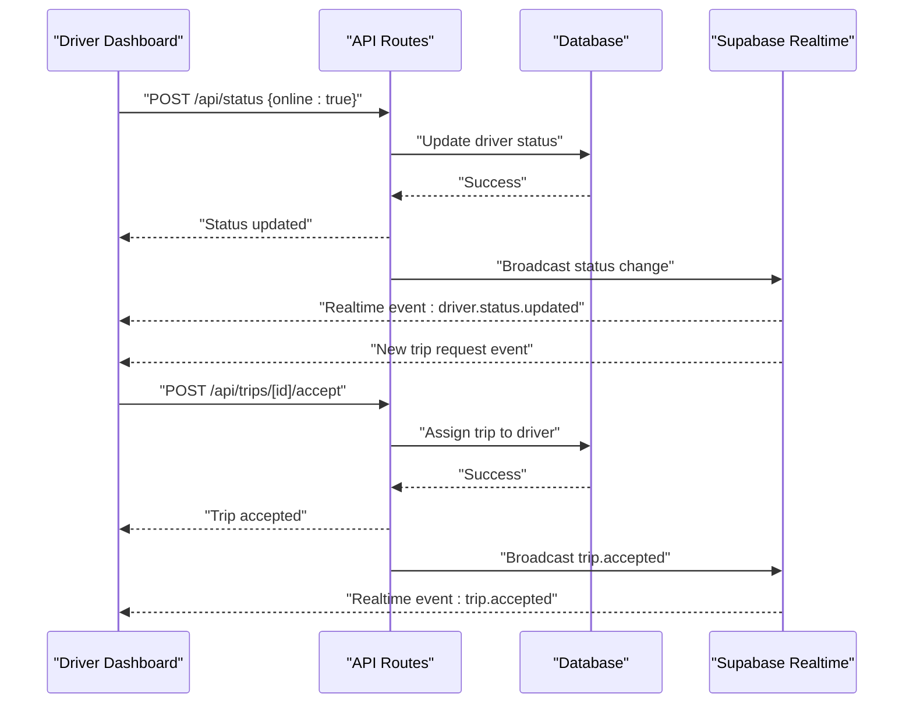
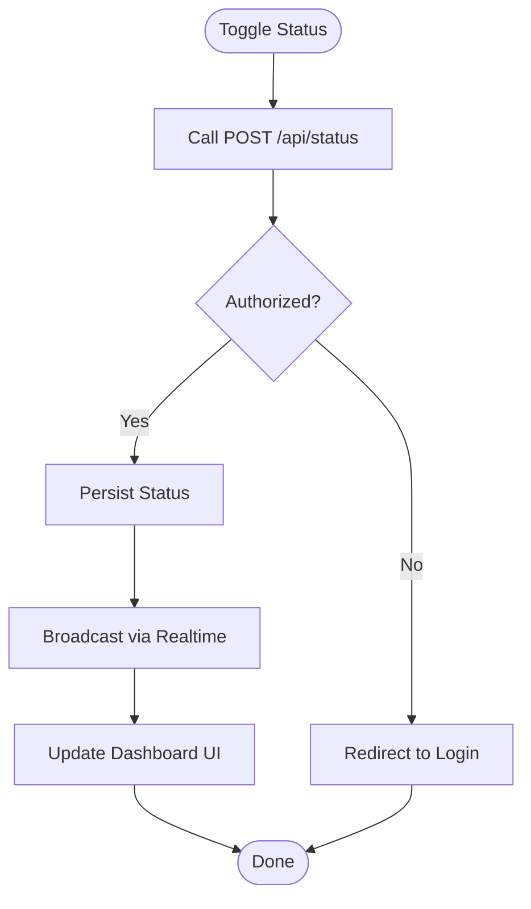
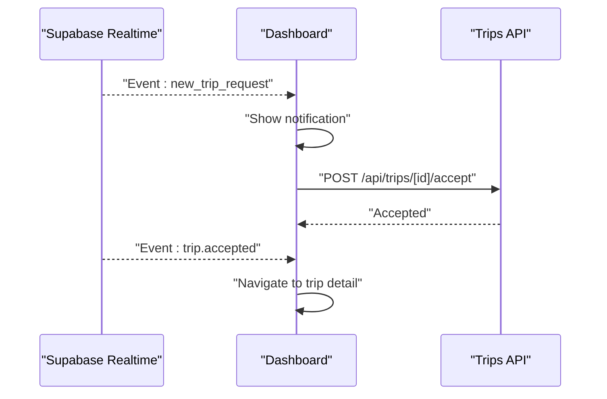
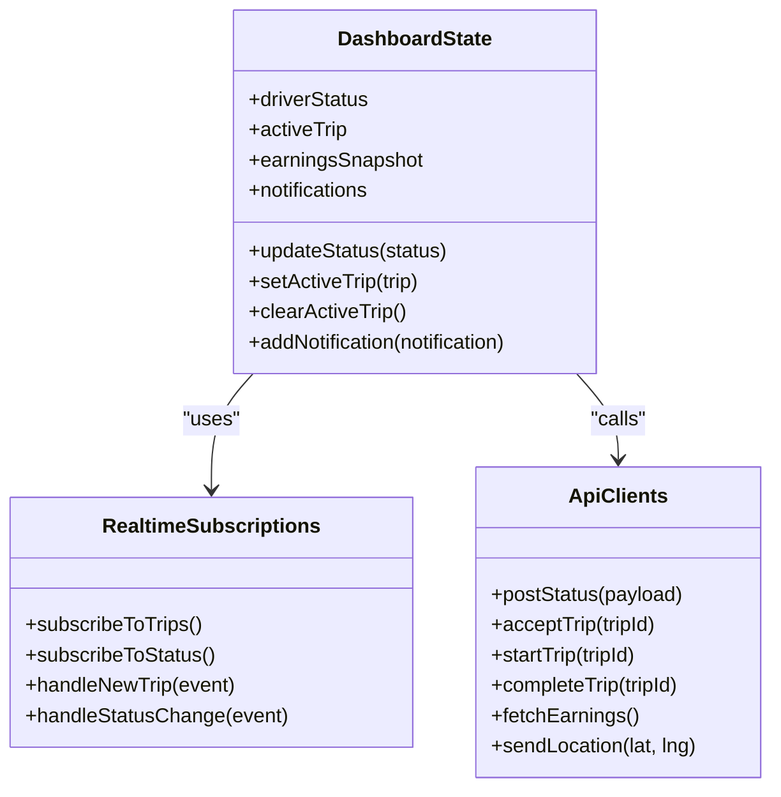
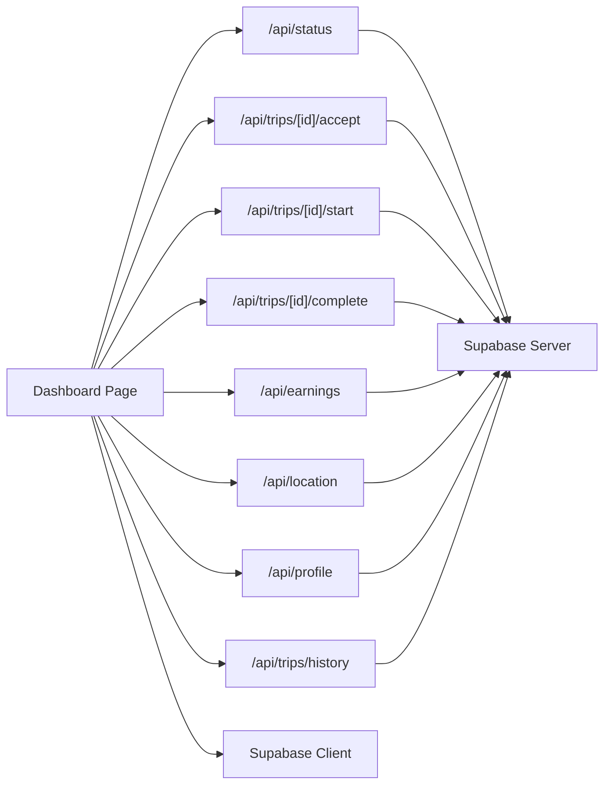

# Driver Dashboard & Management

<cite>
**Referenced Files in This Document**
- [page.tsx](file://apps/driver/src/app/dashboard/page.tsx)
- [loading.tsx](file://apps/driver/src/app/dashboard/loading.tsx)
- [layout.tsx](file://apps/driver/src/app/layout.tsx)
- [status/route.ts](file://apps/driver/src/app/api/status/route.ts)
- [trips/[id]/accept/route.ts](file://apps/driver/src/app/api/trips/[id]/accept/route.ts)
- [trips/[id]/start/route.ts](file://apps/driver/src/app/api/trips/[id]/start/route.ts)
- [trips/[id]/complete/route.ts](file://apps/driver/src/app/api/trips/[id]/complete/route.ts)
- [earnings/route.ts](file://apps/driver/src/app/api/earnings/route.ts)
- [location/route.ts](file://apps/driver/src/app/api/location/route.ts)
- [profile/route.ts](file://apps/driver/src/app/api/profile/route.ts)
- [history/route.ts](file://apps/driver/src/app/api/trips/history/route.ts)
- [providers.tsx](file://apps/driver/src/components/providers.tsx)
- [supabase.ts](file://apps/driver/src/lib/supabase.ts)
- [supabase-server.ts](file://apps/driver/src/lib/supabase-server.ts)
</cite>

## Table of Contents
1. [Introduction](#introduction)
2. [Project Structure](#project-structure)
3. [Core Components](#core-components)
4. [Architecture Overview](#architecture-overview)
5. [Detailed Component Analysis](#detailed-component-analysis)
6. [Dependency Analysis](#dependency-analysis)
7. [Performance Considerations](#performance-considerations)
8. [Troubleshooting Guide](#troubleshooting-guide)
9. [Conclusion](#conclusion)

## Introduction
This document explains the Driver Dashboard and management system, focusing on:
- Main dashboard interface and layout
- Driver status management (online/offline)
- Real-time trip notifications and updates
- Performance metrics display
- Quick action buttons for common tasks
- Responsive design patterns and mobile-first considerations
- Loading states handling and real-time data updates
- Implementation details for status broadcasting, notification systems, and dashboard state management
- Battery optimization for background operation and UX best practices for drivers

The driver application is a Next.js app with API routes for backend operations and client components for the dashboard UI. It integrates with Supabase for authentication and real-time capabilities.

## Project Structure
The driver app follows a feature-based structure under apps/driver/src:
- app/: Next.js App Router pages and API routes
  - dashboard/: main dashboard page and loading fallback
  - api/: server-side endpoints for status, trips, earnings, location, profile, history
  - auth/: login/register flows
  - earnings/, history/, profile/, trip/[id]/: supporting pages
- components/: shared UI components and providers
- lib/: Supabase client configuration and helpers

```mermaid
graph TB
subgraph "Driver App"
DPage["Dashboard Page<br/>apps/driver/src/app/dashboard/page.tsx"]
DLoading["Dashboard Loading<br/>apps/driver/src/app/dashboard/loading.tsx"]
Layout["App Layout<br/>apps/driver/src/app/layout.tsx"]
Providers["Providers<br/>apps/driver/src/components/providers.tsx"]
end
subgraph "API Routes"
StatusAPI["Status API<br/>apps/driver/src/app/api/status/route.ts"]
AcceptTrip["Accept Trip<br/>apps/driver/src/app/api/trips/[id]/accept/route.ts"]
StartTrip["Start Trip<br/>apps/driver/src/app/api/trips/[id]/start/route.ts"]
CompleteTrip["Complete Trip<br/>apps/driver/src/app/api/trips/[id]/complete/route.ts"]
EarningsAPI["Earnings API<br/>apps/driver/src/app/api/earnings/route.ts"]
LocationAPI["Location API<br/>apps/driver/src/app/api/location/route.ts"]
ProfileAPI["Profile API<br/>apps/driver/src/app/api/profile/route.ts"]
HistoryAPI["History API<br/>apps/driver/src/app/api/trips/history/route.ts"]
end
subgraph "Lib"
SBClient["Supabase Client<br/>apps/driver/src/lib/supabase.ts"]
SBSrv["Supabase Server<br/>apps/driver/src/lib/supabase-server.ts"]
end
DPage --> StatusAPI
DPage --> AcceptTrip
DPage --> StartTrip
DPage --> CompleteTrip
DPage --> EarningsAPI
DPage --> LocationAPI
DPage --> ProfileAPI
DPage --> HistoryAPI
DPage --> Providers
DPage --> SBClient
DLoading --> DPage
Layout --> Providers
Providers --> SBClient
StatusAPI --> SBSrv
AcceptTrip --> SBSrv
StartTrip --> SBSrv
CompleteTrip --> SBSrv
EarningsAPI --> SBSrv
LocationAPI --> SBSrv
ProfileAPI --> SBSrv
HistoryAPI --> SBSrv
```

**Diagram sources**
- [page.tsx](file://apps/driver/src/app/dashboard/page.tsx)
- [loading.tsx](file://apps/driver/src/app/dashboard/loading.tsx)
- [layout.tsx](file://apps/driver/src/app/layout.tsx)
- [providers.tsx](file://apps/driver/src/components/providers.tsx)
- [status/route.ts](file://apps/driver/src/app/api/status/route.ts)
- [trips/[id]/accept/route.ts](file://apps/driver/src/app/api/trips/[id]/accept/route.ts)
- [trips/[id]/start/route.ts](file://apps/driver/src/app/api/trips/[id]/start/route.ts)
- [trips/[id]/complete/route.ts](file://apps/driver/src/app/api/trips/[id]/complete/route.ts)
- [earnings/route.ts](file://apps/driver/src/app/api/earnings/route.ts)
- [location/route.ts](file://apps/driver/src/app/api/location/route.ts)
- [profile/route.ts](file://apps/driver/src/app/api/profile/route.ts)
- [history/route.ts](file://apps/driver/src/app/api/trips/history/route.ts)
- [supabase.ts](file://apps/driver/src/lib/supabase.ts)
- [supabase-server.ts](file://apps/driver/src/lib/supabase-server.ts)

**Section sources**
- [page.tsx](file://apps/driver/src/app/dashboard/page.tsx)
- [loading.tsx](file://apps/driver/src/app/dashboard/loading.tsx)
- [layout.tsx](file://apps/driver/src/app/layout.tsx)
- [providers.tsx](file://apps/driver/src/components/providers.tsx)
- [status/route.ts](file://apps/driver/src/app/api/status/route.ts)
- [trips/[id]/accept/route.ts](file://apps/driver/src/app/api/trips/[id]/accept/route.ts)
- [trips/[id]/start/route.ts](file://apps/driver/src/app/api/trips/[id]/start/route.ts)
- [trips/[id]/complete/route.ts](file://apps/driver/src/app/api/trips/[id]/complete/route.ts)
- [earnings/route.ts](file://apps/driver/src/app/api/earnings/route.ts)
- [location/route.ts](file://apps/driver/src/app/api/location/route.ts)
- [profile/route.ts](file://apps/driver/src/app/api/profile/route.ts)
- [history/route.ts](file://apps/driver/src/app/api/trips/history/route.ts)
- [supabase.ts](file://apps/driver/src/lib/supabase.ts)
- [supabase-server.ts](file://apps/driver/src/lib/supabase-server.ts)

## Core Components
- Dashboard Page: Orchestrates driver status, active trip actions, earnings snapshot, and quick actions. Subscribes to real-time events and manages local state for online/offline and trip lifecycle.
- Dashboard Loading: Provides a lightweight skeleton while initial data loads.
- API Routes:
  - Status: Toggle driver availability (online/offline).
  - Trips: Accept, start, complete trips; fetch trip history.
  - Earnings: Retrieve current period earnings summary.
  - Location: Persist last known location for dispatch matching.
  - Profile: Read/update driver profile metadata.
- Providers: Wrap the app with context providers (e.g., session/auth, real-time subscriptions).
- Supabase Clients:
  - Client: Browser-side instance for real-time channels and queries.
  - Server: Node-side instance used by API routes for secure DB access.

Key responsibilities:
- State management: driver status, active trip, earnings, notifications.
- Real-time updates: new trip requests, status changes, earnings updates.
- Mobile-first UI: large touch targets, minimal scrolling, clear feedback.
- Error handling: graceful degradation when network or service unavailable.

**Section sources**
- [page.tsx](file://apps/driver/src/app/dashboard/page.tsx)
- [loading.tsx](file://apps/driver/src/app/dashboard/loading.tsx)
- [providers.tsx](file://apps/driver/src/components/providers.tsx)
- [supabase.ts](file://apps/driver/src/lib/supabase.ts)
- [supabase-server.ts](file://apps/driver/src/lib/supabase-server.ts)
- [status/route.ts](file://apps/driver/src/app/api/status/route.ts)
- [trips/[id]/accept/route.ts](file://apps/driver/src/app/api/trips/[id]/accept/route.ts)
- [trips/[id]/start/route.ts](file://apps/driver/src/app/api/trips/[id]/start/route.ts)
- [trips/[id]/complete/route.ts](file://apps/driver/src/app/api/trips/[id]/complete/route.ts)
- [earnings/route.ts](file://apps/driver/src/app/api/earnings/route.ts)
- [location/route.ts](file://apps/driver/src/app/api/location/route.ts)
- [profile/route.ts](file://apps/driver/src/app/api/profile/route.ts)
- [history/route.ts](file://apps/driver/src/app/api/trips/history/route.ts)

## Architecture Overview
The dashboard uses a client-server model with real-time channels:
- Client subscribes to real-time events (new trips, status broadcasts).
- API routes enforce authorization and persist state changes.
- Supabase provides both database persistence and real-time pub/sub.

**Diagram sources**
- [status/route.ts](file://apps/driver/src/app/api/status/route.ts)
- [trips/[id]/accept/route.ts](file://apps/driver/src/app/api/trips/[id]/accept/route.ts)
- [supabase.ts](file://apps/driver/src/lib/supabase.ts)
- [supabase-server.ts](file://apps/driver/src/lib/supabase-server.ts)

## Detailed Component Analysis

### Dashboard Interface and Layout
- Layout: Full-screen container optimized for mobile, sticky header with status toggle, scrollable content area with cards for metrics and actions.
- Status Toggle: Large switch/button to go online/offline with immediate feedback and confirmation.
- Metrics Cards: Today’s earnings, completed trips, average rating, acceptance rate.
- Quick Actions: Accept trip, start trip, complete trip, view history, update profile.
- Notifications Panel: Toasts and banners for new trip requests and status changes.

Responsive design patterns:
- Single-column layout on small screens, multi-column grid on larger screens.
- Touch-friendly controls with minimum hit areas.
- Reduced motion option for accessibility.

Loading states:
- Skeleton loaders for metrics and lists.
- Optimistic UI for status toggle with rollback on failure.

Real-time updates:
- Subscribe to channels for trip events and driver status broadcasts.
- Debounced re-renders to avoid excessive UI churn.

**Section sources**
- [page.tsx](file://apps/driver/src/app/dashboard/page.tsx)
- [loading.tsx](file://apps/driver/src/app/dashboard/loading.tsx)
- [layout.tsx](file://apps/driver/src/app/layout.tsx)

### Driver Status Management (Online/Offline)
Implementation flow:
- User toggles status.
- Client calls POST /api/status with desired state.
- Server validates session, persists status, emits real-time broadcast.
- Dashboard receives event and updates UI immediately.

Error handling:
- Network errors show retry prompt.
- Unauthorized redirects to login.

**Diagram sources**
- [status/route.ts](file://apps/driver/src/app/api/status/route.ts)
- [supabase-server.ts](file://apps/driver/src/lib/supabase-server.ts)
- [supabase.ts](file://apps/driver/src/lib/supabase.ts)

**Section sources**
- [status/route.ts](file://apps/driver/src/app/api/status/route.ts)
- [supabase-server.ts](file://apps/driver/src/lib/supabase-server.ts)
- [supabase.ts](file://apps/driver/src/lib/supabase.ts)

### Real-Time Trip Notifications
- New trip requests are pushed via realtime channel.
- Dashboard listens for events and shows an actionable notification.
- Accepting a trip transitions state and triggers subsequent steps.

**Diagram sources**
- [trips/[id]/accept/route.ts](file://apps/driver/src/app/api/trips/[id]/accept/route.ts)
- [supabase.ts](file://apps/driver/src/lib/supabase.ts)

**Section sources**
- [trips/[id]/accept/route.ts](file://apps/driver/src/app/api/trips/[id]/accept/route.ts)
- [supabase.ts](file://apps/driver/src/lib/supabase.ts)

### Performance Metrics Display
- Earnings endpoint returns aggregated totals for today/week/month.
- Dashboard renders cards with formatted currency and trend indicators.
- Data refreshes on route focus and via periodic polling or realtime updates if available.

Best practices:
- Cache recent results locally to reduce network usage.
- Show partial data while fetching to improve perceived performance.

**Section sources**
- [earnings/route.ts](file://apps/driver/src/app/api/earnings/route.ts)
- [page.tsx](file://apps/driver/src/app/dashboard/page.tsx)

### Quick Action Buttons
- Accept trip: initiates accept flow and navigates to trip detail.
- Start trip: marks trip as started and begins duration tracking.
- Complete trip: finalizes trip, updates earnings, and clears active trip.
- View history: opens trip history page.
- Update profile: opens profile edit page.

Each action includes:
- Immediate visual feedback.
- Confirmation dialogs for destructive actions.
- Error toasts with retry options.

**Section sources**
- [trips/[id]/start/route.ts](file://apps/driver/src/app/api/trips/[id]/start/route.ts)
- [trips/[id]/complete/route.ts](file://apps/driver/src/app/api/trips/[id]/complete/route.ts)
- [history/route.ts](file://apps/driver/src/app/api/trips/history/route.ts)
- [profile/route.ts](file://apps/driver/src/app/api/profile/route.ts)
- [page.tsx](file://apps/driver/src/app/dashboard/page.tsx)

### Dashboard State Management
- Local state tracks: driver status, active trip, earnings snapshot, notifications.
- Context provider centralizes state and subscriptions.
- Optimistic updates for status toggle and trip actions with rollback on error.
- Debounce and throttle for frequent updates (e.g., location pings).

**Diagram sources**
- [providers.tsx](file://apps/driver/src/components/providers.tsx)
- [status/route.ts](file://apps/driver/src/app/api/status/route.ts)
- [trips/[id]/accept/route.ts](file://apps/driver/src/app/api/trips/[id]/accept/route.ts)
- [trips/[id]/start/route.ts](file://apps/driver/src/app/api/trips/[id]/start/route.ts)
- [trips/[id]/complete/route.ts](file://apps/driver/src/app/api/trips/[id]/complete/route.ts)
- [earnings/route.ts](file://apps/driver/src/app/api/earnings/route.ts)
- [location/route.ts](file://apps/driver/src/app/api/location/route.ts)

**Section sources**
- [providers.tsx](file://apps/driver/src/components/providers.tsx)
- [page.tsx](file://apps/driver/src/app/dashboard/page.tsx)

### Notification System
- Centralized notification store with types: info, success, warning, error.
- Auto-dismiss for non-critical messages; persistent for critical alerts.
- Integration with realtime events to surface timely updates.

UX guidelines:
- Keep messages concise and actionable.
- Provide “Undo” or “Retry” where appropriate.
- Avoid overlapping notifications; queue them.

**Section sources**
- [providers.tsx](file://apps/driver/src/components/providers.tsx)
- [page.tsx](file://apps/driver/src/app/dashboard/page.tsx)

### Mobile-First Design and Battery Optimization
- Mobile-first layout ensures clarity and usability on small screens.
- Large tap targets and high contrast for outdoor visibility.
- Background operation considerations:
  - Throttle location updates to conserve battery.
  - Use efficient polling intervals or rely on realtime channels.
  - Pause heavy operations when app is backgrounded.
- Accessibility:
  - Support reduced motion.
  - Ensure keyboard navigation and screen reader labels.

**Section sources**
- [page.tsx](file://apps/driver/src/app/dashboard/page.tsx)
- [layout.tsx](file://apps/driver/src/app/layout.tsx)

## Dependency Analysis
The dashboard depends on API routes for all mutations and reads, and on Supabase clients for real-time and persistence.

**Diagram sources**
- [page.tsx](file://apps/driver/src/app/dashboard/page.tsx)
- [status/route.ts](file://apps/driver/src/app/api/status/route.ts)
- [trips/[id]/accept/route.ts](file://apps/driver/src/app/api/trips/[id]/accept/route.ts)
- [trips/[id]/start/route.ts](file://apps/driver/src/app/api/trips/[id]/start/route.ts)
- [trips/[id]/complete/route.ts](file://apps/driver/src/app/api/trips/[id]/complete/route.ts)
- [earnings/route.ts](file://apps/driver/src/app/api/earnings/route.ts)
- [location/route.ts](file://apps/driver/src/app/api/location/route.ts)
- [profile/route.ts](file://apps/driver/src/app/api/profile/route.ts)
- [history/route.ts](file://apps/driver/src/app/api/trips/history/route.ts)
- [supabase.ts](file://apps/driver/src/lib/supabase.ts)
- [supabase-server.ts](file://apps/driver/src/lib/supabase-server.ts)

**Section sources**
- [page.tsx](file://apps/driver/src/app/dashboard/page.tsx)
- [supabase.ts](file://apps/driver/src/lib/supabase.ts)
- [supabase-server.ts](file://apps/driver/src/lib/supabase-server.ts)

## Performance Considerations
- Minimize re-renders by memoizing derived values and batching updates.
- Use optimistic UI for fast interactions like status toggle.
- Debounce location pings and limit frequency based on device capability.
- Cache earnings and profile data with short TTLs to reduce API calls.
- Prefer realtime channels over polling where possible to save bandwidth and battery.

[No sources needed since this section provides general guidance]

## Troubleshooting Guide
Common issues and resolutions:
- Status not updating:
  - Check network connectivity and session validity.
  - Verify API route responses and logs.
  - Ensure realtime channel subscription is active.
- Missing trip notifications:
  - Confirm realtime channel name and filters.
  - Inspect browser console for subscription errors.
- Slow metrics load:
  - Review caching strategy and query complexity.
  - Add pagination or incremental updates if needed.
- High battery drain:
  - Reduce location update frequency.
  - Pause background work when app is inactive.

**Section sources**
- [status/route.ts](file://apps/driver/src/app/api/status/route.ts)
- [supabase.ts](file://apps/driver/src/lib/supabase.ts)
- [earnings/route.ts](file://apps/driver/src/app/api/earnings/route.ts)
- [location/route.ts](file://apps/driver/src/app/api/location/route.ts)

## Conclusion
The Driver Dashboard provides a mobile-first, responsive interface for managing driver status, handling trip workflows, and viewing performance metrics. It leverages Supabase for persistence and real-time updates, with well-defined API routes ensuring secure and consistent state changes. By adopting optimistic UI, efficient caching, and careful background operations, the system delivers a smooth and reliable experience for drivers.

[No sources needed since this section summarizes without analyzing specific files]