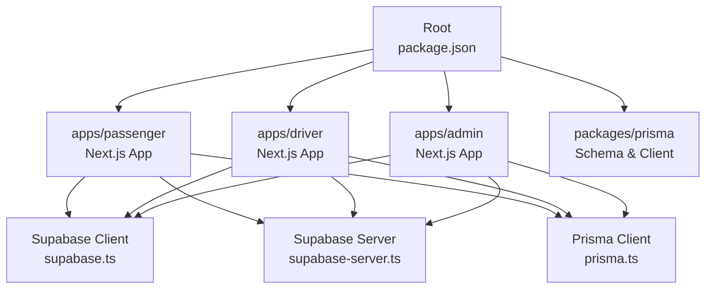
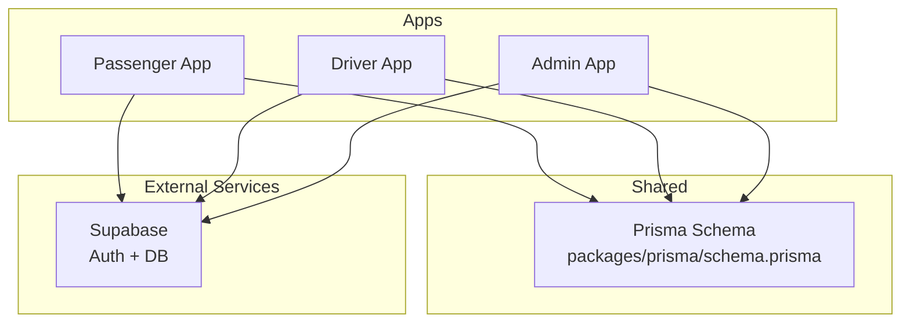
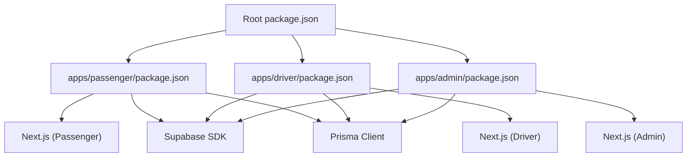

# Getting Started

<cite>
**Referenced Files in This Document**
- [package.json](file://package.json)
- [tsconfig.json](file://tsconfig.json)
- [apps/passenger/package.json](file://apps/passenger/package.json)
- [apps/driver/package.json](file://apps/driver/package.json)
- [apps/admin/package.json](file://apps/admin/package.json)
- [apps/passenger/src/lib/prisma.ts](file://apps/passenger/src/lib/prisma.ts)
- [apps/driver/src/lib/prisma.ts](file://apps/driver/src/lib/prisma.ts)
- [apps/admin/src/lib/prisma.ts](file://apps/admin/src/lib/prisma.ts)
- [apps/passenger/src/lib/supabase.ts](file://apps/passenger/src/lib/supabase.ts)
- [apps/driver/src/lib/supabase.ts](file://apps/driver/src/lib/supabase.ts)
- [apps/admin/src/lib/supabase.ts](file://apps/admin/src/lib/supabase.ts)
- [apps/passenger/src/lib/supabase-server.ts](file://apps/passenger/src/lib/supabase-server.ts)
- [apps/driver/src/lib/supabase-server.ts](file://apps/driver/src/lib/supabase-server.ts)
- [apps/admin/src/lib/supabase-server.ts](file://apps/admin/src/lib/supabase-server.ts)
- [apps/passenger/next.config.ts](file://apps/passenger/next.config.ts)
- [apps/driver/next.config.ts](file://apps/driver/next.config.ts)
- [apps/admin/next.config.ts](file://apps/admin/next.config.ts)
- [packages/prisma/schema.prisma](file://packages/prisma/schema.prisma)
</cite>

## Table of Contents
1. [Introduction](#introduction)
2. [Project Structure](#project-structure)
3. [Core Components](#core-components)
4. [Architecture Overview](#architecture-overview)
5. [Detailed Component Analysis](#detailed-component-analysis)
6. [Dependency Analysis](#dependency-analysis)
7. [Performance Considerations](#performance-considerations)
8. [Troubleshooting Guide](#troubleshooting-guide)
9. [Conclusion](#conclusion)
10. [Appendices](#appendices)

## Introduction
This guide helps you set up and run the Ubar ride-sharing platform monorepo locally. You will learn:
- What the project is and how it is organized
- How to install dependencies and configure your environment
- How to connect Supabase for authentication and database access
- How to initialize the database with Prisma
- How to run the three applications (passenger, driver, admin)
- Basic testing steps and common troubleshooting tips

The monorepo contains three Next.js applications and shared packages. Each app integrates with Supabase for auth and data, and uses Prisma for type-safe database access.

## Project Structure
At a high level:
- apps/passenger: Passenger-facing Next.js application
- apps/driver: Driver-facing Next.js application
- apps/admin: Admin dashboard Next.js application
- packages/prisma: Shared Prisma schema and client configuration
- Root package.json: Workspace orchestration and scripts

**Diagram sources**
- [package.json](file://package.json)
- [apps/passenger/package.json](file://apps/passenger/package.json)
- [apps/driver/package.json](file://apps/driver/package.json)
- [apps/admin/package.json](file://apps/admin/package.json)
- [apps/passenger/src/lib/prisma.ts](file://apps/passenger/src/lib/prisma.ts)
- [apps/driver/src/lib/prisma.ts](file://apps/driver/src/lib/prisma.ts)
- [apps/admin/src/lib/prisma.ts](file://apps/admin/src/lib/prisma.ts)
- [apps/passenger/src/lib/supabase.ts](file://apps/passenger/src/lib/supabase.ts)
- [apps/driver/src/lib/supabase.ts](file://apps/driver/src/lib/supabase.ts)
- [apps/admin/src/lib/supabase.ts](file://apps/admin/src/lib/supabase.ts)
- [apps/passenger/src/lib/supabase-server.ts](file://apps/passenger/src/lib/supabase-server.ts)
- [apps/driver/src/lib/supabase-server.ts](file://apps/driver/src/lib/supabase-server.ts)
- [apps/admin/src/lib/supabase-server.ts](file://apps/admin/src/lib/supabase-server.ts)

**Section sources**
- [package.json](file://package.json)
- [tsconfig.json](file://tsconfig.json)

## Core Components
- Passenger app: Provides user registration/login, trip requests, history, and profile management.
- Driver app: Provides driver registration/login, trip acceptance, earnings, location updates, and profile management.
- Admin app: Provides dashboards for drivers, passengers, trips, analytics, and settings.
- Shared packages:
  - packages/prisma: Centralized Prisma schema and client setup used by all apps.
  - Other shared packages exist but are not required for initial setup.

Each app includes:
- Supabase client modules for browser and server contexts
- Prisma client initialization
- Next.js configuration files

**Section sources**
- [apps/passenger/package.json](file://apps/passenger/package.json)
- [apps/driver/package.json](file://apps/driver/package.json)
- [apps/admin/package.json](file://apps/admin/package.json)
- [apps/passenger/src/lib/prisma.ts](file://apps/passenger/src/lib/prisma.ts)
- [apps/driver/src/lib/prisma.ts](file://apps/driver/src/lib/prisma.ts)
- [apps/admin/src/lib/prisma.ts](file://apps/admin/src/lib/prisma.ts)
- [apps/passenger/src/lib/supabase.ts](file://apps/passenger/src/lib/supabase.ts)
- [apps/driver/src/lib/supabase.ts](file://apps/driver/src/lib/supabase.ts)
- [apps/admin/src/lib/supabase.ts](file://apps/admin/src/lib/supabase.ts)
- [apps/passenger/src/lib/supabase-server.ts](file://apps/passenger/src/lib/supabase-server.ts)
- [apps/driver/src/lib/supabase-server.ts](file://apps/driver/src/lib/supabase-server.ts)
- [apps/admin/src/lib/supabase-server.ts](file://apps/admin/src/lib/supabase-server.ts)

## Architecture Overview
Ubar follows a multi-app monorepo architecture:
- Three independent Next.js apps share a common Prisma schema and can reuse shared packages.
- Authentication and real-time features rely on Supabase.
- Database access is handled via Prisma clients initialized per app.

**Diagram sources**
- [apps/passenger/package.json](file://apps/passenger/package.json)
- [apps/driver/package.json](file://apps/driver/package.json)
- [apps/admin/package.json](file://apps/admin/package.json)
- [packages/prisma/schema.prisma](file://packages/prisma/schema.prisma)

## Detailed Component Analysis

### Environment Configuration
- Create a .env file at the repository root or within each app directory as needed.
- Required variables typically include:
  - Supabase URL and anon key for each app
  - Database connection string for Prisma (if using local Postgres)
- Ensure that each app’s Next.js config references environment variables consistently.

Key files to review for environment usage:
- Supabase client initialization
- Supabase server helper
- Prisma client initialization
- Next.js app configs

**Section sources**
- [apps/passenger/src/lib/supabase.ts](file://apps/passenger/src/lib/supabase.ts)
- [apps/driver/src/lib/supabase.ts](file://apps/driver/src/lib/supabase.ts)
- [apps/admin/src/lib/supabase.ts](file://apps/admin/src/lib/supabase.ts)
- [apps/passenger/src/lib/supabase-server.ts](file://apps/passenger/src/lib/supabase-server.ts)
- [apps/driver/src/lib/supabase-server.ts](file://apps/driver/src/lib/supabase-server.ts)
- [apps/admin/src/lib/supabase-server.ts](file://apps/admin/src/lib/supabase-server.ts)
- [apps/passenger/src/lib/prisma.ts](file://apps/passenger/src/lib/prisma.ts)
- [apps/driver/src/lib/prisma.ts](file://apps/driver/src/lib/prisma.ts)
- [apps/admin/src/lib/prisma.ts](file://apps/admin/src/lib/prisma.ts)
- [apps/passenger/next.config.ts](file://apps/passenger/next.config.ts)
- [apps/driver/next.config.ts](file://apps/driver/next.config.ts)
- [apps/admin/next.config.ts](file://apps/admin/next.config.ts)

### Database Setup with Supabase and Prisma
- Use Supabase as the managed Postgres backend.
- The Prisma schema is centralized under packages/prisma/schema.prisma.
- Generate Prisma client and apply migrations before running apps.

Steps:
1. Initialize Prisma client generation
2. Apply database migrations
3. Verify connectivity from each app

**Section sources**
- [packages/prisma/schema.prisma](file://packages/prisma/schema.prisma)
- [apps/passenger/src/lib/prisma.ts](file://apps/passenger/src/lib/prisma.ts)
- [apps/driver/src/lib/prisma.ts](file://apps/driver/src/lib/prisma.ts)
- [apps/admin/src/lib/prisma.ts](file://apps/admin/src/lib/prisma.ts)

### Authentication with Supabase
- Each app initializes a Supabase client for browser-side operations.
- Server-side helpers provide secure session handling for API routes.
- Configure Supabase Auth in the Supabase dashboard and ensure environment variables match.

**Section sources**
- [apps/passenger/src/lib/supabase.ts](file://apps/passenger/src/lib/supabase.ts)
- [apps/driver/src/lib/supabase.ts](file://apps/driver/src/lib/supabase.ts)
- [apps/admin/src/lib/supabase.ts](file://apps/admin/src/lib/supabase.ts)
- [apps/passenger/src/lib/supabase-server.ts](file://apps/passenger/src/lib/supabase-server.ts)
- [apps/driver/src/lib/supabase-server.ts](file://apps/driver/src/lib/supabase-server.ts)
- [apps/admin/src/lib/supabase-server.ts](file://apps/admin/src/lib/supabase-server.ts)

### Running the Applications
- Start each app independently using its development server.
- Typical commands:
  - Passenger app
  - Driver app
  - Admin app
- Access each app at its local port after starting.

**Section sources**
- [apps/passenger/package.json](file://apps/passenger/package.json)
- [apps/driver/package.json](file://apps/driver/package.json)
- [apps/admin/package.json](file://apps/admin/package.json)

### Initial Configuration Steps
- Set up Supabase project and obtain credentials.
- Add environment variables to each app or root as appropriate.
- Run Prisma generate and migrate commands.
- Seed data if provided by the project.

**Section sources**
- [apps/passenger/src/lib/supabase.ts](file://apps/passenger/src/lib/supabase.ts)
- [apps/driver/src/lib/supabase.ts](file://apps/driver/src/lib/supabase.ts)
- [apps/admin/src/lib/supabase.ts](file://apps/admin/src/lib/supabase.ts)
- [packages/prisma/schema.prisma](file://packages/prisma/schema.prisma)

### Basic Testing Procedures
- Run tests for each app using their respective test scripts.
- If no test scripts are defined, add minimal unit/integration tests for critical flows such as:
  - Authentication endpoints
  - Trip request and acceptance flows
  - Admin CRUD operations

**Section sources**
- [apps/passenger/package.json](file://apps/passenger/package.json)
- [apps/driver/package.json](file://apps/driver/package.json)
- [apps/admin/package.json](file://apps/admin/package.json)

## Dependency Analysis
The monorepo uses a root workspace configuration to manage shared dependencies and scripts across apps. Each app declares its own dependencies and devDependencies.

**Diagram sources**
- [package.json](file://package.json)
- [apps/passenger/package.json](file://apps/passenger/package.json)
- [apps/driver/package.json](file://apps/driver/package.json)
- [apps/admin/package.json](file://apps/admin/package.json)

**Section sources**
- [package.json](file://package.json)
- [tsconfig.json](file://tsconfig.json)

## Performance Considerations
- Keep environment variables cached efficiently; avoid unnecessary reinitialization of Supabase clients.
- Use Prisma query optimization and proper indexing in Supabase.
- Enable Next.js caching strategies where applicable.
- Monitor network latency between apps and Supabase.

[No sources needed since this section provides general guidance]

## Troubleshooting Guide
Common issues and resolutions:
- Missing environment variables: Ensure Supabase URL and anon key are set for each app.
- Prisma client not generated: Run Prisma generate and migrate before starting apps.
- Database connection errors: Validate the database connection string and network access.
- Port conflicts: Change ports in app configurations if necessary.
- TypeScript errors: Confirm Node.js version compatibility and reinstall dependencies if needed.

**Section sources**
- [apps/passenger/src/lib/supabase.ts](file://apps/passenger/src/lib/supabase.ts)
- [apps/driver/src/lib/supabase.ts](file://apps/driver/src/lib/supabase.ts)
- [apps/admin/src/lib/supabase.ts](file://apps/admin/src/lib/supabase.ts)
- [apps/passenger/src/lib/prisma.ts](file://apps/passenger/src/lib/prisma.ts)
- [apps/driver/src/lib/prisma.ts](file://apps/driver/src/lib/prisma.ts)
- [apps/admin/src/lib/prisma.ts](file://apps/admin/src/lib/prisma.ts)

## Conclusion
You now have the essentials to set up and run the Ubar monorepo locally. Focus on correct environment configuration, Prisma setup, and Supabase integration. Once running, explore each app’s features and extend functionality using the shared packages.

[No sources needed since this section summarizes without analyzing specific files]

## Appendices

### Installation Requirements
- Node.js: Use a recent LTS version compatible with Next.js and Prisma.
- Package manager: npm or yarn (as configured in the root package.json).
- Supabase account and project created.
- Local Postgres optional if using Prisma directly against a local database.

**Section sources**
- [package.json](file://package.json)

### Step-by-Step Setup
1. Clone the repository
2. Install dependencies at the root
3. Configure environment variables for Supabase and Prisma
4. Generate Prisma client and apply migrations
5. Start the passenger, driver, and admin apps

**Section sources**
- [apps/passenger/package.json](file://apps/passenger/package.json)
- [apps/driver/package.json](file://apps/driver/package.json)
- [apps/admin/package.json](file://apps/admin/package.json)
- [packages/prisma/schema.prisma](file://packages/prisma/schema.prisma)