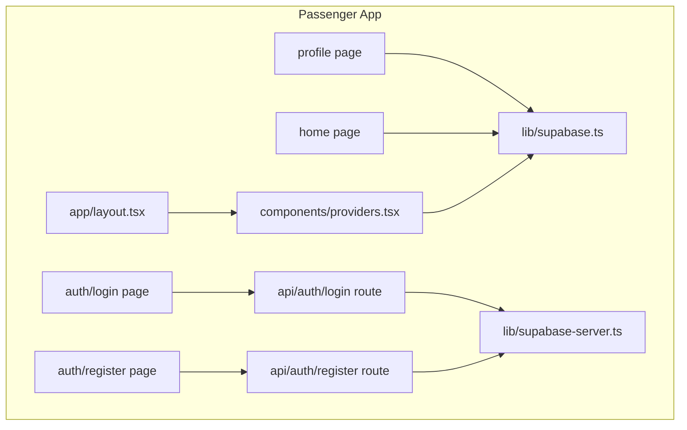
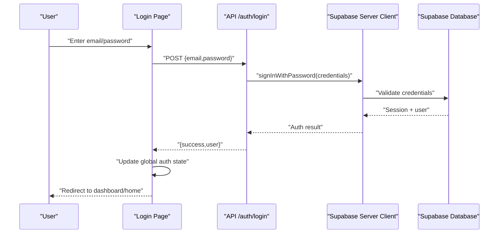
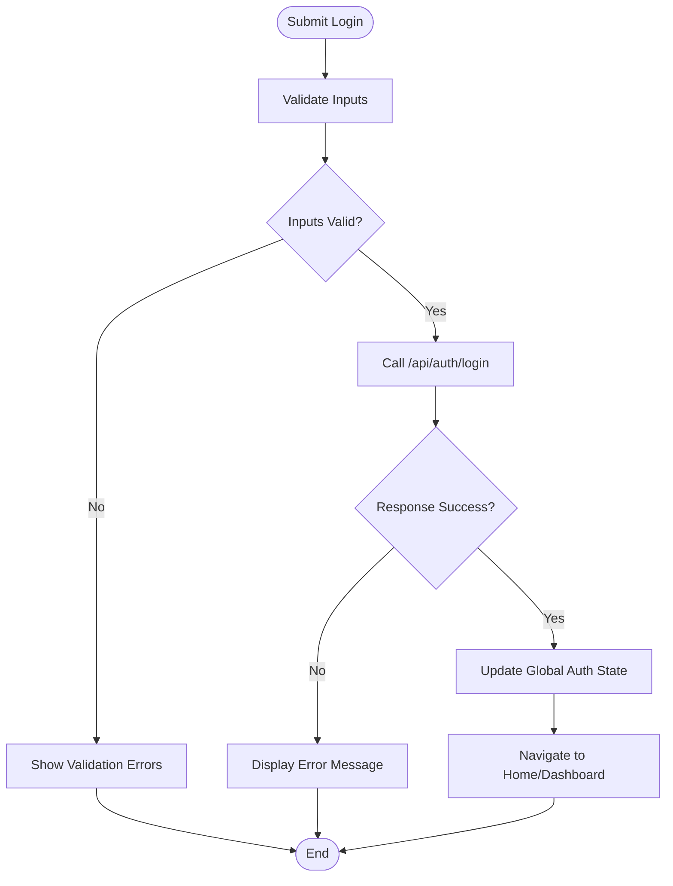
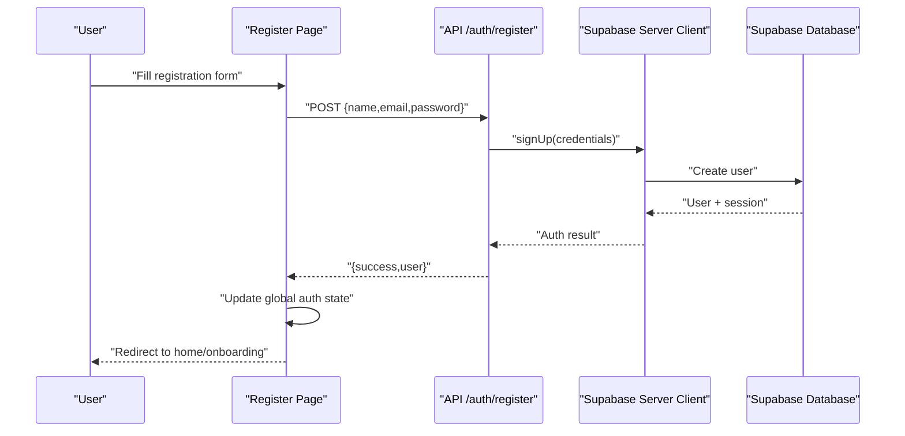
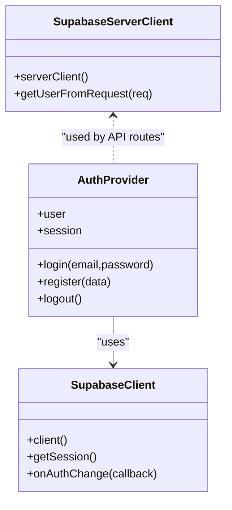
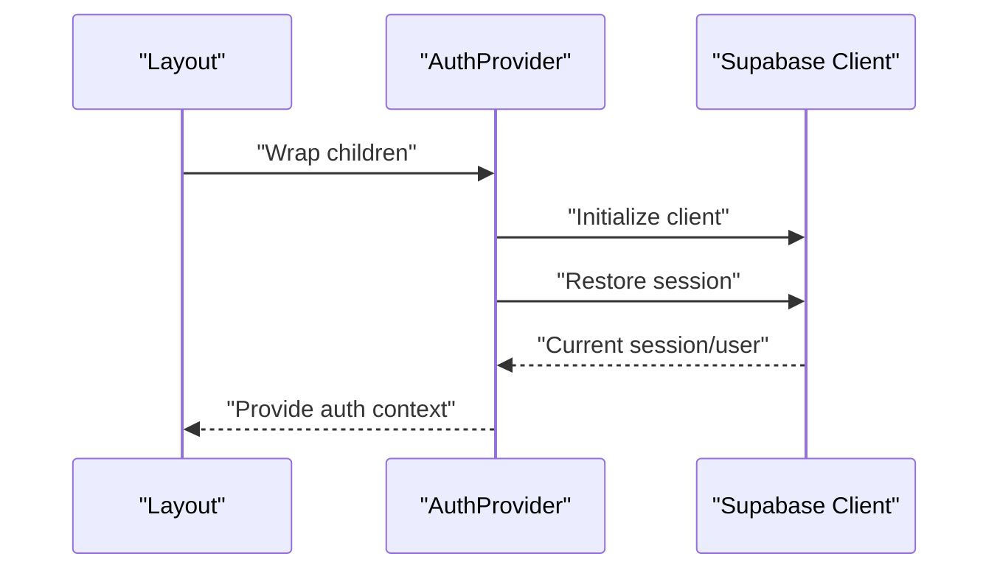
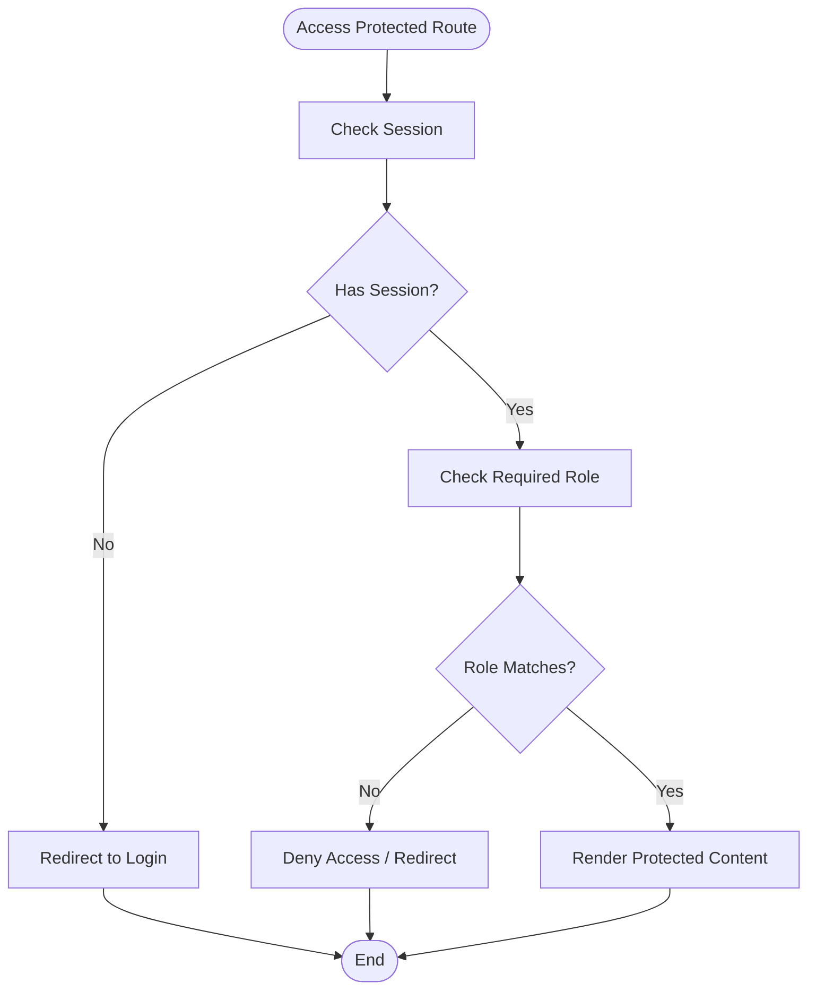
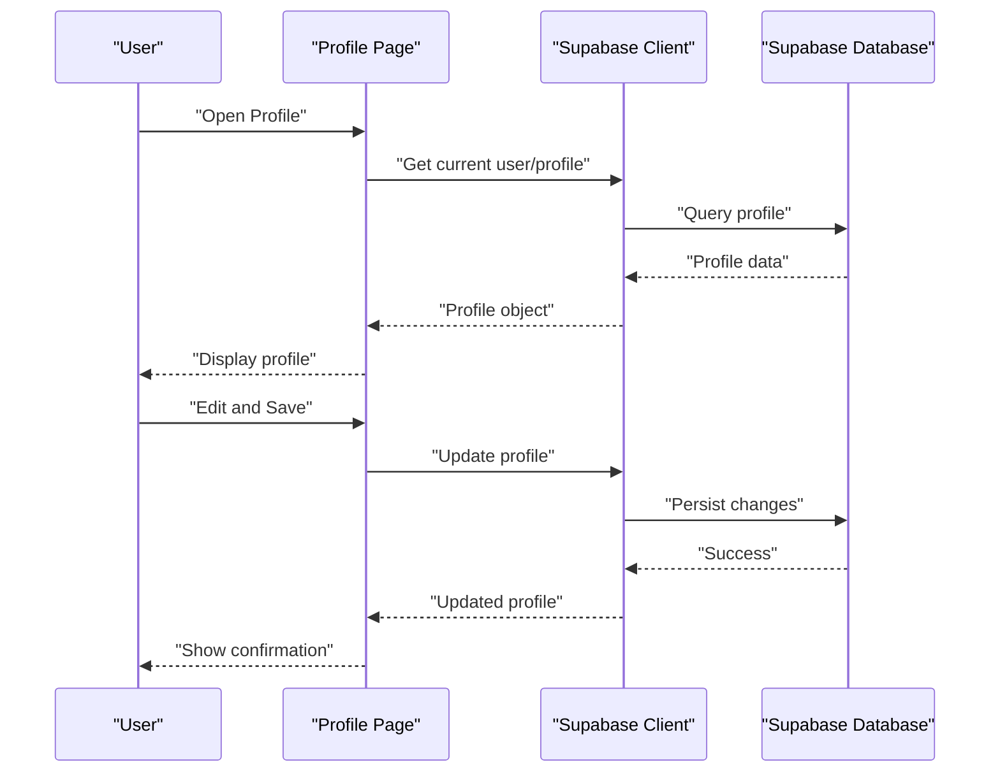
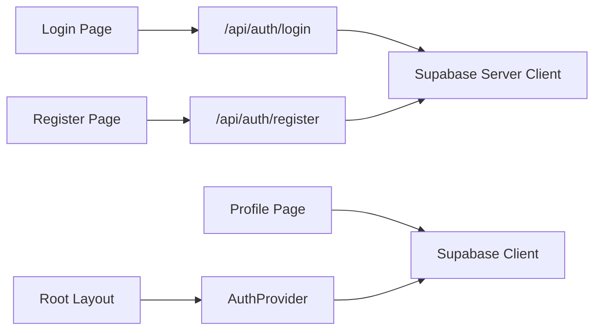

# Authentication & User Management

<cite>
**Referenced Files in This Document**
- [passenger/src/app/auth/login/page.tsx](file://apps/passenger/src/app/auth/login/page.tsx)
- [passenger/src/app/auth/register/page.tsx](file://apps/passenger/src/app/auth/register/page.tsx)
- [passenger/src/app/api/auth/login/route.ts](file://apps/passenger/src/app/api/auth/login/route.ts)
- [passenger/src/app/api/auth/register/route.ts](file://apps/passenger/src/app/api/auth/register/route.ts)
- [passenger/src/lib/supabase.ts](file://apps/passenger/src/lib/supabase.ts)
- [passenger/src/lib/supabase-server.ts](file://apps/passenger/src/lib/supabase-server.ts)
- [passenger/src/components/providers.tsx](file://apps/passenger/src/components/providers.tsx)
- [passenger/src/app/layout.tsx](file://apps/passenger/src/app/layout.tsx)
</cite>

## Table of Contents
1. [Introduction](#introduction)
2. [Project Structure](#project-structure)
3. [Core Components](#core-components)
4. [Architecture Overview](#architecture-overview)
5. [Detailed Component Analysis](#detailed-component-analysis)
6. [Dependency Analysis](#dependency-analysis)
7. [Performance Considerations](#performance-considerations)
8. [Troubleshooting Guide](#troubleshooting-guide)
9. [Conclusion](#conclusion)

## Introduction
This document explains the Passenger Application authentication system, focusing on login and registration workflows, Supabase integration patterns, session management, and role-based access control (RBAC). It covers the end-to-end flow from user interface to database validation, including form handling, error states, security measures, provider setup for global authentication state, protected route implementation, and user profile management. Where applicable, code examples are referenced by file paths rather than included inline.

## Project Structure
The Passenger app is a Next.js application with:
- App Router pages for authentication and protected routes
- API route handlers for server-side auth operations
- Supabase client libraries for client and server contexts
- A providers component for global auth state
- Layout configuration for applying providers and middleware behavior

**Diagram sources**
- [passenger/src/app/auth/login/page.tsx](file://apps/passenger/src/app/auth/login/page.tsx)
- [passenger/src/app/auth/register/page.tsx](file://apps/passenger/src/app/auth/register/page.tsx)
- [passenger/src/app/api/auth/login/route.ts](file://apps/passenger/src/app/api/auth/login/route.ts)
- [passenger/src/app/api/auth/register/route.ts](file://apps/passenger/src/app/api/auth/register/route.ts)
- [passenger/src/lib/supabase.ts](file://apps/passenger/src/lib/supabase.ts)
- [passenger/src/lib/supabase-server.ts](file://apps/passenger/src/lib/supabase-server.ts)
- [passenger/src/components/providers.tsx](file://apps/passenger/src/components/providers.tsx)
- [passenger/src/app/layout.tsx](file://apps/passenger/src/app/layout.tsx)

**Section sources**
- [passenger/src/app/auth/login/page.tsx](file://apps/passenger/src/app/auth/login/page.tsx)
- [passenger/src/app/auth/register/page.tsx](file://apps/passenger/src/app/auth/register/page.tsx)
- [passenger/src/app/api/auth/login/route.ts](file://apps/passenger/src/app/api/auth/login/route.ts)
- [passenger/src/app/api/auth/register/route.ts](file://apps/passenger/src/app/api/auth/register/route.ts)
- [passenger/src/lib/supabase.ts](file://apps/passenger/src/lib/supabase.ts)
- [passenger/src/lib/supabase-server.ts](file://apps/passenger/src/lib/supabase-server.ts)
- [passenger/src/components/providers.tsx](file://apps/passenger/src/components/providers.tsx)
- [passenger/src/app/layout.tsx](file://apps/passenger/src/app/layout.tsx)

## Core Components
- Authentication Pages
  - Login page handles email/password submission, shows loading and error states, and redirects upon success.
  - Register page collects new user details, validates inputs, submits to the register endpoint, and navigates after successful creation.
- API Route Handlers
  - Login route authenticates credentials via Supabase and returns a standardized response.
  - Register route creates a new user account through Supabase and returns a standardized response.
- Supabase Clients
  - Client-side Supabase instance for browser sessions and real-time features.
  - Server-side Supabase instance for secure API operations using environment variables.
- Global Auth Provider
  - Provides authenticated state and helpers to components and pages.
- Layout
  - Wraps the app with providers and applies consistent layout behavior.

**Section sources**
- [passenger/src/app/auth/login/page.tsx](file://apps/passenger/src/app/auth/login/page.tsx)
- [passenger/src/app/auth/register/page.tsx](file://apps/passenger/src/app/auth/register/page.tsx)
- [passenger/src/app/api/auth/login/route.ts](file://apps/passenger/src/app/api/auth/login/route.ts)
- [passenger/src/app/api/auth/register/route.ts](file://apps/passenger/src/app/api/auth/register/route.ts)
- [passenger/src/lib/supabase.ts](file://apps/passenger/src/lib/supabase.ts)
- [passenger/src/lib/supabase-server.ts](file://apps/passenger/src/lib/supabase-server.ts)
- [passenger/src/components/providers.tsx](file://apps/passenger/src/components/providers.tsx)
- [passenger/src/app/layout.tsx](file://apps/passenger/src/app/layout.tsx)

## Architecture Overview
The authentication architecture follows a clear separation between client and server responsibilities:
- Client-side pages manage forms, local state, and navigation.
- API routes perform credential checks and account creation using the server-side Supabase client.
- The global provider exposes auth state to the UI.
- Protected routes rely on session validity and optionally roles.

**Diagram sources**
- [passenger/src/app/auth/login/page.tsx](file://apps/passenger/src/app/auth/login/page.tsx)
- [passenger/src/app/api/auth/login/route.ts](file://apps/passenger/src/app/api/auth/login/route.ts)
- [passenger/src/lib/supabase-server.ts](file://apps/passenger/src/lib/supabase-server.ts)

## Detailed Component Analysis

### Login Workflow
- Form Handling
  - Captures email and password, manages loading and error states, and calls the login API route.
- API Handler
  - Validates input, invokes Supabase sign-in, and returns a structured response.
- Session Management
  - On success, updates global auth state and navigates to the appropriate route.
- Error States
  - Displays user-friendly messages for invalid credentials or network errors.

**Diagram sources**
- [passenger/src/app/auth/login/page.tsx](file://apps/passenger/src/app/auth/login/page.tsx)
- [passenger/src/app/api/auth/login/route.ts](file://apps/passenger/src/app/api/auth/login/route.ts)

**Section sources**
- [passenger/src/app/auth/login/page.tsx](file://apps/passenger/src/app/auth/login/page.tsx)
- [passenger/src/app/api/auth/login/route.ts](file://apps/passenger/src/app/api/auth/login/route.ts)

### Registration Workflow
- Form Handling
  - Collects required fields (e.g., name, email, password), performs client-side validation, and submits to the register API route.
- API Handler
  - Creates a new user via Supabase and returns a standardized response.
- Post-Registration Behavior
  - Updates global auth state and navigates to the home or onboarding page.
- Security Measures
  - Enforces password strength and email format; avoids exposing internal errors to clients.

**Diagram sources**
- [passenger/src/app/auth/register/page.tsx](file://apps/passenger/src/app/auth/register/page.tsx)
- [passenger/src/app/api/auth/register/route.ts](file://apps/passenger/src/app/api/auth/register/route.ts)
- [passenger/src/lib/supabase-server.ts](file://apps/passenger/src/lib/supabase-server.ts)

**Section sources**
- [passenger/src/app/auth/register/page.tsx](file://apps/passenger/src/app/auth/register/page.tsx)
- [passenger/src/app/api/auth/register/route.ts](file://apps/passenger/src/app/api/auth/register/route.ts)

### Supabase Integration Patterns
- Client-Side Usage
  - Browser-based sessions, real-time subscriptions, and direct queries from the UI.
- Server-Side Usage
  - Secure API operations using environment variables and server-only client initialization.
- Best Practices
  - Keep secrets out of the client bundle.
  - Use typed responses and centralized error mapping.

**Diagram sources**
- [passenger/src/lib/supabase.ts](file://apps/passenger/src/lib/supabase.ts)
- [passenger/src/lib/supabase-server.ts](file://apps/passenger/src/lib/supabase-server.ts)
- [passenger/src/components/providers.tsx](file://apps/passenger/src/components/providers.tsx)

**Section sources**
- [passenger/src/lib/supabase.ts](file://apps/passenger/src/lib/supabase.ts)
- [passenger/src/lib/supabase-server.ts](file://apps/passenger/src/lib/supabase-server.ts)
- [passenger/src/components/providers.tsx](file://apps/passenger/src/components/providers.tsx)

### Global Authentication Provider
- Responsibilities
  - Initialize and expose user/session state.
  - Provide login, register, and logout methods.
  - Persist session across refreshes.
- Integration
  - Wrapped by the root layout to make auth available app-wide.

**Diagram sources**
- [passenger/src/components/providers.tsx](file://apps/passenger/src/components/providers.tsx)
- [passenger/src/app/layout.tsx](file://apps/passenger/src/app/layout.tsx)
- [passenger/src/lib/supabase.ts](file://apps/passenger/src/lib/supabase.ts)

**Section sources**
- [passenger/src/components/providers.tsx](file://apps/passenger/src/components/providers.tsx)
- [passenger/src/app/layout.tsx](file://apps/passenger/src/app/layout.tsx)

### Protected Routes and Role-Based Access Control (RBAC)
- Protection Strategy
  - Guard routes by checking session existence and redirecting unauthenticated users.
- RBAC Implementation
  - Read user role from session metadata or user profile.
  - Deny access if the current role does not match the required role.
- Example Scenarios
  - Passenger-only routes: require passenger role.
  - Admin-only routes: require admin role.

[No sources needed since this diagram shows conceptual workflow, not actual code structure]

### User Profile Management
- Reading Profile
  - Fetch user profile data from Supabase using the authenticated session.
- Updating Profile
  - Submit changes via API or direct Supabase update, ensuring proper validation and error handling.
- Displaying Profile
  - Render user info and allow editing within protected routes.

**Diagram sources**
- [passenger/src/app/profile/page.tsx](file://apps/passenger/src/app/profile/page.tsx)
- [passenger/src/lib/supabase.ts](file://apps/passenger/src/lib/supabase.ts)

**Section sources**
- [passenger/src/app/profile/page.tsx](file://apps/passenger/src/app/profile/page.tsx)
- [passenger/src/lib/supabase.ts](file://apps/passenger/src/lib/supabase.ts)

## Dependency Analysis
The authentication subsystem depends on:
- UI layers for user interaction
- API routes for secure operations
- Supabase clients for session and data access
- Providers for global state distribution

**Diagram sources**
- [passenger/src/app/auth/login/page.tsx](file://apps/passenger/src/app/auth/login/page.tsx)
- [passenger/src/app/auth/register/page.tsx](file://apps/passenger/src/app/auth/register/page.tsx)
- [passenger/src/app/api/auth/login/route.ts](file://apps/passenger/src/app/api/auth/login/route.ts)
- [passenger/src/app/api/auth/register/route.ts](file://apps/passenger/src/app/api/auth/register/route.ts)
- [passenger/src/lib/supabase.ts](file://apps/passenger/src/lib/supabase.ts)
- [passenger/src/lib/supabase-server.ts](file://apps/passenger/src/lib/supabase-server.ts)
- [passenger/src/components/providers.tsx](file://apps/passenger/src/components/providers.tsx)
- [passenger/src/app/layout.tsx](file://apps/passenger/src/app/layout.tsx)

**Section sources**
- [passenger/src/app/auth/login/page.tsx](file://apps/passenger/src/app/auth/login/page.tsx)
- [passenger/src/app/auth/register/page.tsx](file://apps/passenger/src/app/auth/register/page.tsx)
- [passenger/src/app/api/auth/login/route.ts](file://apps/passenger/src/app/api/auth/login/route.ts)
- [passenger/src/app/api/auth/register/route.ts](file://apps/passenger/src/app/api/auth/register/route.ts)
- [passenger/src/lib/supabase.ts](file://apps/passenger/src/lib/supabase.ts)
- [passenger/src/lib/supabase-server.ts](file://apps/passenger/src/lib/supabase-server.ts)
- [passenger/src/components/providers.tsx](file://apps/passenger/src/components/providers.tsx)
- [passenger/src/app/layout.tsx](file://apps/passenger/src/app/layout.tsx)

## Performance Considerations
- Minimize re-renders by memoizing auth state and avoiding unnecessary reinitialization of Supabase clients.
- Batch profile updates and debounce rapid edits.
- Use server-side validation to reduce round trips and improve security.
- Cache frequently accessed profile data where appropriate.

[No sources needed since this section provides general guidance]

## Troubleshooting Guide
Common issues and resolutions:
- Invalid Credentials
  - Ensure correct email/password and check API error responses.
- Network Errors
  - Verify environment variables and network connectivity.
- Session Not Persisted
  - Confirm provider initialization and that the client is used correctly in the browser.
- Unauthorized Access
  - Review RBAC checks and ensure roles are set and validated.

**Section sources**
- [passenger/src/app/auth/login/page.tsx](file://apps/passenger/src/app/auth/login/page.tsx)
- [passenger/src/app/auth/register/page.tsx](file://apps/passenger/src/app/auth/register/page.tsx)
- [passenger/src/app/api/auth/login/route.ts](file://apps/passenger/src/app/api/auth/login/route.ts)
- [passenger/src/app/api/auth/register/route.ts](file://apps/passenger/src/app/api/auth/register/route.ts)
- [passenger/src/components/providers.tsx](file://apps/passenger/src/components/providers.tsx)

## Conclusion
The Passenger Application’s authentication system integrates Supabase securely across client and server contexts, providing robust login and registration flows, session management, and RBAC. By centralizing auth state in a provider and enforcing protection at both route and API levels, the system ensures a secure and maintainable user experience.