# Passenger Application

<cite>
**Referenced Files in This Document**
- [layout.tsx](file://apps/passenger/src/app/layout.tsx)
- [page.tsx](file://apps/passenger/src/app/page.tsx)
- [error.tsx](file://apps/passenger/src/app/error.tsx)
- [providers.tsx](file://apps/passenger/src/components/providers.tsx)
- [landing-toolbar.tsx](file://apps/passenger/src/components/landing-toolbar.tsx)
- [animations.tsx](file://apps/passenger/src/components/animations.tsx)
- [home/page.tsx](file://apps/passenger/src/app/home/page.tsx)
- [home/loading.tsx](file://apps/passenger/src/app/home/loading.tsx)
- [trip/[id]/page.tsx](file://apps/passenger/src/app/trip/[id]/page.tsx)
- [trip/[id]/loading.tsx](file://apps/passenger/src/app/trip/[id]/loading.tsx)
- [trip/[id]/rate/page.tsx](file://apps/passenger/src/app/trip/[id]/rate/page.tsx)
- [history/page.tsx](file://apps/passenger/src/app/history/page.tsx)
- [profile/page.tsx](file://apps/passenger/src/app/profile/page.tsx)
- [auth/login/page.tsx](file://apps/passenger/src/app/auth/login/page.tsx)
- [auth/register/page.tsx](file://apps/passenger/src/app/auth/register/page.tsx)
- [api/auth/login/route.ts](file://apps/passenger/src/app/api/auth/login/route.ts)
- [api/auth/register/route.ts](file://apps/passenger/src/app/api/auth/register/route.ts)
- [api/drivers/nearby/route.ts](file://apps/passenger/src/app/api/drivers/nearby/route.ts)
- [api/trips/request/route.ts](file://apps/passenger/src/app/api/trips/request/route.ts)
- [api/trips/[id]/route.ts](file://apps/passenger/src/app/api/trips/[id]/route.ts)
- [api/trips/[id]/cancel/route.ts](file://apps/passenger/src/app/api/trips/[id]/cancel/route.ts)
- [api/trips/[id]/rate/route.ts](file://apps/passenger/src/app/api/trips/[id]/rate/route.ts)
- [api/trips/history/route.ts](file://apps/passenger/src/app/api/trips/history/route.ts)
- [api/payments/route.ts](file://apps/passenger/src/app/api/payments/route.ts)
- [lib/supabase.ts](file://apps/passenger/src/lib/supabase.ts)
- [lib/supabase-server.ts](file://apps/passenger/src/lib/supabase-server.ts)
- [lib/prisma.ts](file://apps/passenger/src/lib/prisma.ts)
</cite>

## Table of Contents
1. [Introduction](#introduction)
2. [Project Structure](#project-structure)
3. [Core Components](#core-components)
4. [Architecture Overview](#architecture-overview)
5. [Detailed Component Analysis](#detailed-component-analysis)
6. [Dependency Analysis](#dependency-analysis)
7. [Performance Considerations](#performance-considerations)
8. [Troubleshooting Guide](#troubleshooting-guide)
9. [Conclusion](#conclusion)

## Introduction
This document provides comprehensive documentation for the Passenger Application, the primary booking interface for ride-sharing passengers. It covers user interface components, trip booking workflow, real-time tracking implementation, payment processing integration, and driver discovery system. It also explains authentication flow, route protection, state management patterns, API integrations, home page functionality, trip request handling, nearby driver search algorithms, live location tracking, rating system, and payment gateway integration. Responsive design considerations, performance optimization, and error handling strategies are addressed throughout.

## Project Structure
The Passenger Application is a Next.js app with:
- App Router pages under src/app for routes such as auth, home, trip details, history, profile, and API endpoints under src/app/api.
- Shared UI and providers under src/components.
- Client and server libraries for Supabase and Prisma under src/lib.

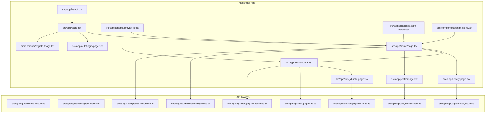

**Diagram sources**
- [layout.tsx](file://apps/passenger/src/app/layout.tsx)
- [page.tsx](file://apps/passenger/src/app/page.tsx)
- [home/page.tsx](file://apps/passenger/src/app/home/page.tsx)
- [trip/[id]/page.tsx](file://apps/passenger/src/app/trip/[id]/page.tsx)
- [trip/[id]/rate/page.tsx](file://apps/passenger/src/app/trip/[id]/rate/page.tsx)
- [history/page.tsx](file://apps/passenger/src/app/history/page.tsx)
- [profile/page.tsx](file://apps/passenger/src/app/profile/page.tsx)
- [auth/login/page.tsx](file://apps/passenger/src/app/auth/login/page.tsx)
- [auth/register/page.tsx](file://apps/passenger/src/app/auth/register/page.tsx)
- [api/auth/login/route.ts](file://apps/passenger/src/app/api/auth/login/route.ts)
- [api/auth/register/route.ts](file://apps/passenger/src/app/api/auth/register/route.ts)
- [api/drivers/nearby/route.ts](file://apps/passenger/src/app/api/drivers/nearby/route.ts)
- [api/trips/request/route.ts](file://apps/passenger/src/app/api/trips/request/route.ts)
- [api/trips/[id]/route.ts](file://apps/passenger/src/app/api/trips/[id]/route.ts)
- [api/trips/[id]/cancel/route.ts](file://apps/passenger/src/app/api/trips/[id]/cancel/route.ts)
- [api/trips/[id]/rate/route.ts](file://apps/passenger/src/app/api/trips/[id]/rate/route.ts)
- [api/trips/history/route.ts](file://apps/passenger/src/app/api/trips/history/route.ts)
- [api/payments/route.ts](file://apps/passenger/src/app/api/payments/route.ts)

**Section sources**
- [layout.tsx](file://apps/passenger/src/app/layout.tsx)
- [page.tsx](file://apps/passenger/src/app/page.tsx)
- [home/page.tsx](file://apps/passenger/src/app/home/page.tsx)
- [trip/[id]/page.tsx](file://apps/passenger/src/app/trip/[id]/page.tsx)
- [trip/[id]/rate/page.tsx](file://apps/passenger/src/app/trip/[id]/rate/page.tsx)
- [history/page.tsx](file://apps/passenger/src/app/history/page.tsx)
- [profile/page.tsx](file://apps/passenger/src/app/profile/page.tsx)
- [auth/login/page.tsx](file://apps/passenger/src/app/auth/login/page.tsx)
- [auth/register/page.tsx](file://apps/passenger/src/app/auth/register/page.tsx)
- [api/auth/login/route.ts](file://apps/passenger/src/app/api/auth/login/route.ts)
- [api/auth/register/route.ts](file://apps/passenger/src/app/api/auth/register/route.ts)
- [api/drivers/nearby/route.ts](file://apps/passenger/src/app/api/drivers/nearby/route.ts)
- [api/trips/request/route.ts](file://apps/passenger/src/app/api/trips/request/route.ts)
- [api/trips/[id]/route.ts](file://apps/passenger/src/app/api/trips/[id]/route.ts)
- [api/trips/[id]/cancel/route.ts](file://apps/passenger/src/app/api/trips/[id]/cancel/route.ts)
- [api/trips/[id]/rate/route.ts](file://apps/passenger/src/app/api/trips/[id]/rate/route.ts)
- [api/trips/history/route.ts](file://apps/passenger/src/app/api/trips/history/route.ts)
- [api/payments/route.ts](file://apps/passenger/src/app/api/payments/route.ts)

## Core Components
- Providers: Centralized context providers for application-wide state and client configuration.
- Landing Toolbar: Navigation and quick actions for authenticated users.
- Animations: Reusable animation utilities to enhance UX during transitions and loading states.
- Error Boundary: Global error handling component to catch rendering errors and display fallback UI.

Key responsibilities:
- Provide consistent layout and global state across pages.
- Offer navigation helpers and common UI elements.
- Ensure graceful degradation on errors.

**Section sources**
- [providers.tsx](file://apps/passenger/src/components/providers.tsx)
- [landing-toolbar.tsx](file://apps/passenger/src/components/landing-toolbar.tsx)
- [animations.tsx](file://apps/passenger/src/components/animations.tsx)
- [error.tsx](file://apps/passenger/src/app/error.tsx)

## Architecture Overview
The Passenger Application follows a client-server architecture using Next.js App Router:
- Client-side pages manage user interactions, local state, and real-time updates via Supabase.
- Server-side API routes handle authentication, business logic, database operations (Prisma), and external integrations (payments).
- Real-time features leverage Supabase subscriptions for live location tracking and trip status updates.

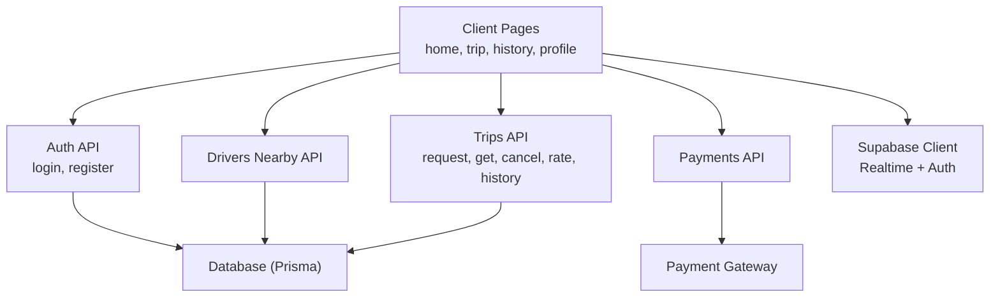

**Diagram sources**
- [home/page.tsx](file://apps/passenger/src/app/home/page.tsx)
- [trip/[id]/page.tsx](file://apps/passenger/src/app/trip/[id]/page.tsx)
- [history/page.tsx](file://apps/passenger/src/app/history/page.tsx)
- [profile/page.tsx](file://apps/passenger/src/app/profile/page.tsx)
- [api/auth/login/route.ts](file://apps/passenger/src/app/api/auth/login/route.ts)
- [api/auth/register/route.ts](file://apps/passenger/src/app/api/auth/register/route.ts)
- [api/drivers/nearby/route.ts](file://apps/passenger/src/app/api/drivers/nearby/route.ts)
- [api/trips/request/route.ts](file://apps/passenger/src/app/api/trips/request/route.ts)
- [api/trips/[id]/route.ts](file://apps/passenger/src/app/api/trips/[id]/route.ts)
- [api/trips/[id]/cancel/route.ts](file://apps/passenger/src/app/api/trips/[id]/cancel/route.ts)
- [api/trips/[id]/rate/route.ts](file://apps/passenger/src/app/api/trips/[id]/rate/route.ts)
- [api/trips/history/route.ts](file://apps/passenger/src/app/api/trips/history/route.ts)
- [api/payments/route.ts](file://apps/passenger/src/app/api/payments/route.ts)
- [lib/supabase.ts](file://apps/passenger/src/lib/supabase.ts)
- [lib/prisma.ts](file://apps/passenger/src/lib/prisma.ts)

## Detailed Component Analysis

### Authentication Flow
- Login and Register pages submit credentials to corresponding API routes.
- API routes validate inputs, interact with Supabase Auth, and return session tokens or errors.
- Protected routes check session validity before rendering sensitive content.

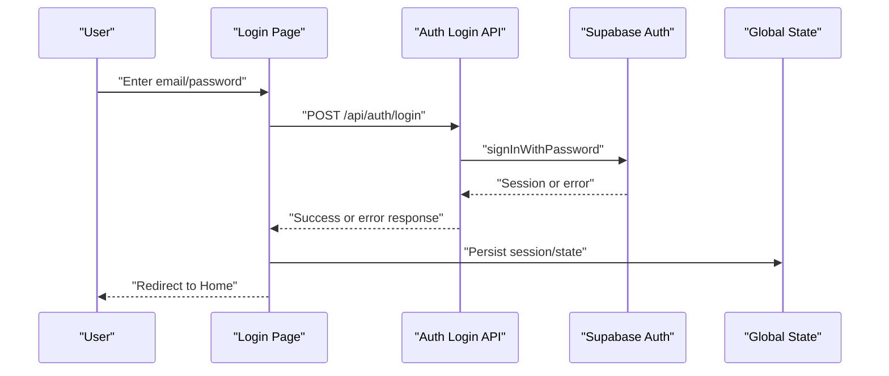

**Diagram sources**
- [auth/login/page.tsx](file://apps/passenger/src/app/auth/login/page.tsx)
- [api/auth/login/route.ts](file://apps/passenger/src/app/api/auth/login/route.ts)
- [lib/supabase.ts](file://apps/passenger/src/lib/supabase.ts)
- [providers.tsx](file://apps/passenger/src/components/providers.tsx)

**Section sources**
- [auth/login/page.tsx](file://apps/passenger/src/app/auth/login/page.tsx)
- [auth/register/page.tsx](file://apps/passenger/src/app/auth/register/page.tsx)
- [api/auth/login/route.ts](file://apps/passenger/src/app/api/auth/login/route.ts)
- [api/auth/register/route.ts](file://apps/passenger/src/app/api/auth/register/route.ts)
- [lib/supabase.ts](file://apps/passenger/src/lib/supabase.ts)
- [providers.tsx](file://apps/passenger/src/components/providers.tsx)

### Route Protection
- Layout and page-level guards verify authentication state before allowing access.
- Redirect unauthenticated users to login when accessing protected routes like Home, History, Profile, and active trips.

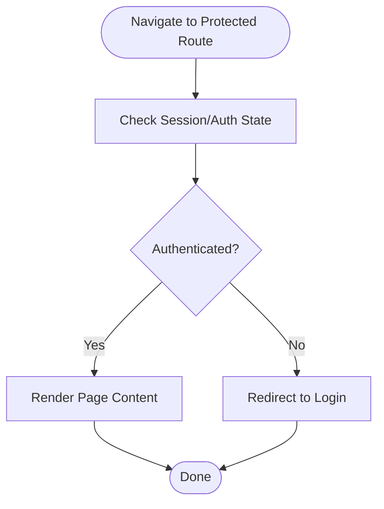

[No sources needed since this diagram shows conceptual workflow, not actual code structure]

### Home Page Functionality
- Displays pickup and dropoff inputs, fare estimation, and nearby drivers list.
- Initiates trip requests and manages real-time updates for driver matching and arrival.
- Uses animations for smooth transitions and loading indicators.

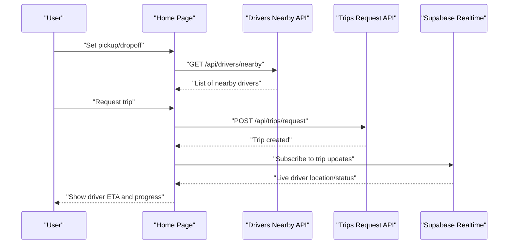

**Diagram sources**
- [home/page.tsx](file://apps/passenger/src/app/home/page.tsx)
- [api/drivers/nearby/route.ts](file://apps/passenger/src/app/api/drivers/nearby/route.ts)
- [api/trips/request/route.ts](file://apps/passenger/src/app/api/trips/request/route.ts)
- [lib/supabase.ts](file://apps/passenger/src/lib/supabase.ts)
- [animations.tsx](file://apps/passenger/src/components/animations.tsx)

**Section sources**
- [home/page.tsx](file://apps/passenger/src/app/home/page.tsx)
- [home/loading.tsx](file://apps/passenger/src/app/home/loading.tsx)
- [api/drivers/nearby/route.ts](file://apps/passenger/src/app/api/drivers/nearby/route.ts)
- [api/trips/request/route.ts](file://apps/passenger/src/app/api/trips/request/route.ts)
- [lib/supabase.ts](file://apps/passenger/src/lib/supabase.ts)
- [animations.tsx](file://apps/passenger/src/components/animations.tsx)

### Nearby Driver Search Algorithm
- The nearby drivers endpoint computes distance between passenger coordinates and available drivers.
- Filters drivers within a radius threshold and sorts by proximity.
- Returns minimal driver metadata for efficient client rendering.

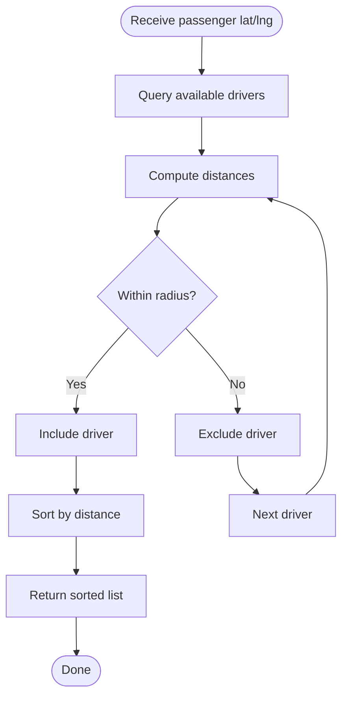

**Diagram sources**
- [api/drivers/nearby/route.ts](file://apps/passenger/src/app/api/drivers/nearby/route.ts)

**Section sources**
- [api/drivers/nearby/route.ts](file://apps/passenger/src/app/api/drivers/nearby/route.ts)

### Trip Request Handling
- Validates pickup and dropoff locations, calculates estimated fare, and creates a trip record.
- Notifies drivers and subscribes to real-time updates for status changes.
- Handles cancellation and completion flows through dedicated API endpoints.

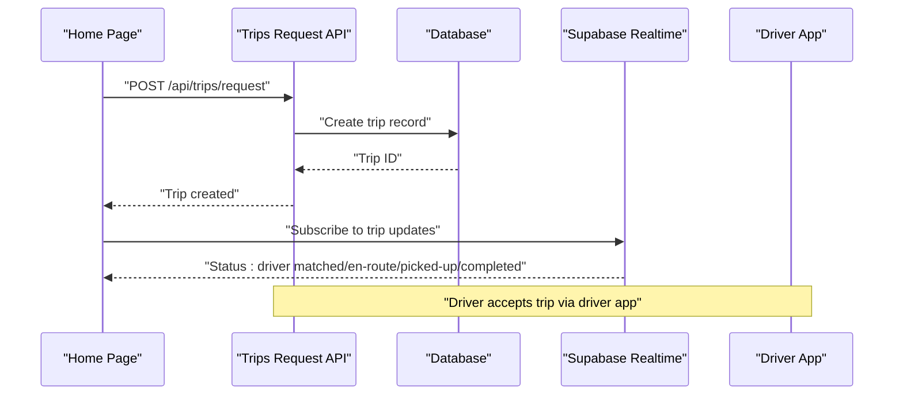

**Diagram sources**
- [api/trips/request/route.ts](file://apps/passenger/src/app/api/trips/request/route.ts)
- [api/trips/[id]/route.ts](file://apps/passenger/src/app/api/trips/[id]/route.ts)
- [lib/supabase.ts](file://apps/passenger/src/lib/supabase.ts)

**Section sources**
- [api/trips/request/route.ts](file://apps/passenger/src/app/api/trips/request/route.ts)
- [api/trips/[id]/route.ts](file://apps/passenger/src/app/api/trips/[id]/route.ts)
- [lib/supabase.ts](file://apps/passenger/src/lib/supabase.ts)

### Live Location Tracking
- Subscribes to driver location updates via Supabase Realtime channels.
- Updates map markers and ETA calculations on the client side.
- Debounces frequent updates to optimize performance.

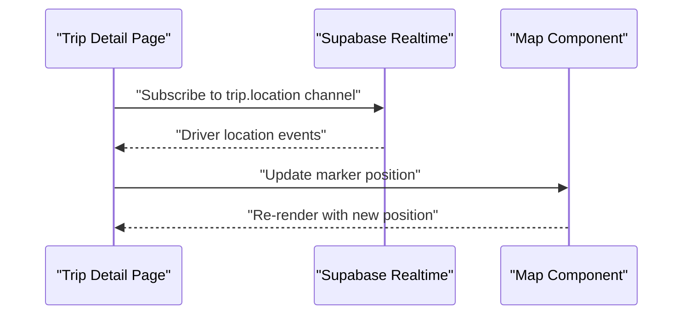

**Diagram sources**
- [trip/[id]/page.tsx](file://apps/passenger/src/app/trip/[id]/page.tsx)
- [lib/supabase.ts](file://apps/passenger/src/lib/supabase.ts)

**Section sources**
- [trip/[id]/page.tsx](file://apps/passenger/src/app/trip/[id]/page.tsx)
- [trip/[id]/loading.tsx](file://apps/passenger/src/app/trip/[id]/loading.tsx)
- [lib/supabase.ts](file://apps/passenger/src/lib/supabase.ts)

### Rating System
- After trip completion, passengers can rate their driver via the rating page.
- Submission calls the rate endpoint, which persists the rating and updates trip metadata.

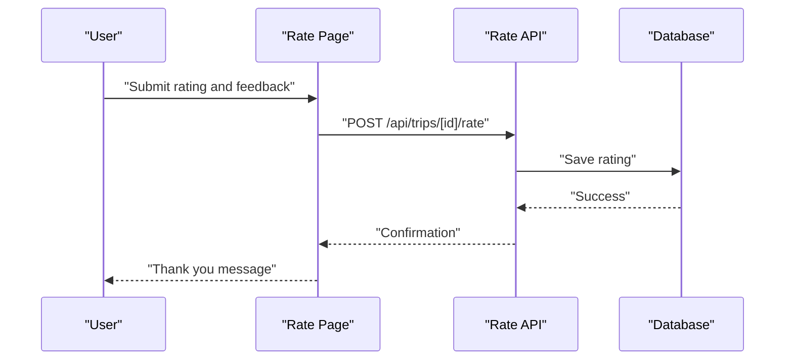

**Diagram sources**
- [trip/[id]/rate/page.tsx](file://apps/passenger/src/app/trip/[id]/rate/page.tsx)
- [api/trips/[id]/rate/route.ts](file://apps/passenger/src/app/api/trips/[id]/rate/route.ts)

**Section sources**
- [trip/[id]/rate/page.tsx](file://apps/passenger/src/app/trip/[id]/rate/page.tsx)
- [api/trips/[id]/rate/route.ts](file://apps/passenger/src/app/api/trips/[id]/rate/route.ts)

### Payment Processing Integration
- Payments endpoint orchestrates charge creation, confirmation, and receipt generation.
- Integrates with an external payment gateway and stores transaction records.
- Provides idempotency keys to prevent duplicate charges.

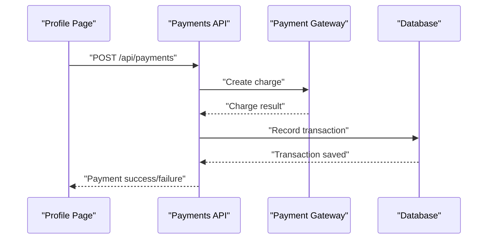

**Diagram sources**
- [api/payments/route.ts](file://apps/passenger/src/app/api/payments/route.ts)

**Section sources**
- [api/payments/route.ts](file://apps/passenger/src/app/api/payments/route.ts)

### Cancel and History Flows
- Cancellation endpoint updates trip status and triggers refunds if applicable.
- History endpoint retrieves past trips for the authenticated passenger.

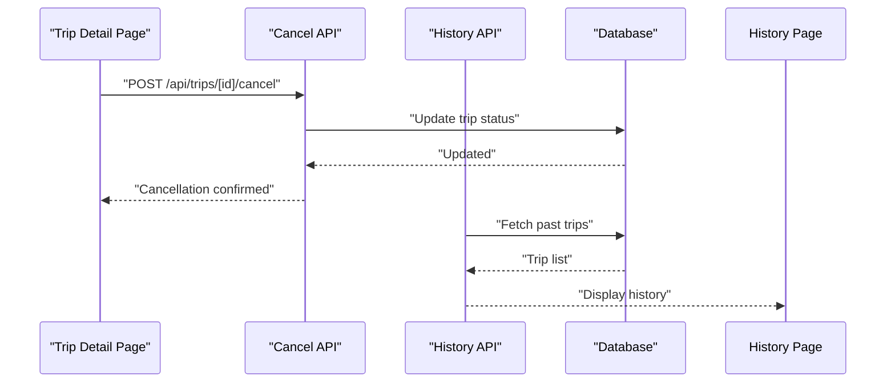

**Diagram sources**
- [api/trips/[id]/cancel/route.ts](file://apps/passenger/src/app/api/trips/[id]/cancel/route.ts)
- [api/trips/history/route.ts](file://apps/passenger/src/app/api/trips/history/route.ts)

**Section sources**
- [api/trips/[id]/cancel/route.ts](file://apps/passenger/src/app/api/trips/[id]/cancel/route.ts)
- [api/trips/history/route.ts](file://apps/passenger/src/app/api/trips/history/route.ts)
- [history/page.tsx](file://apps/passenger/src/app/history/page.tsx)

### State Management Patterns
- Global state provider centralizes user session, trip state, and UI flags.
- Local component state handles form inputs and transient UI behavior.
- Real-time subscriptions update state reactively without polling.

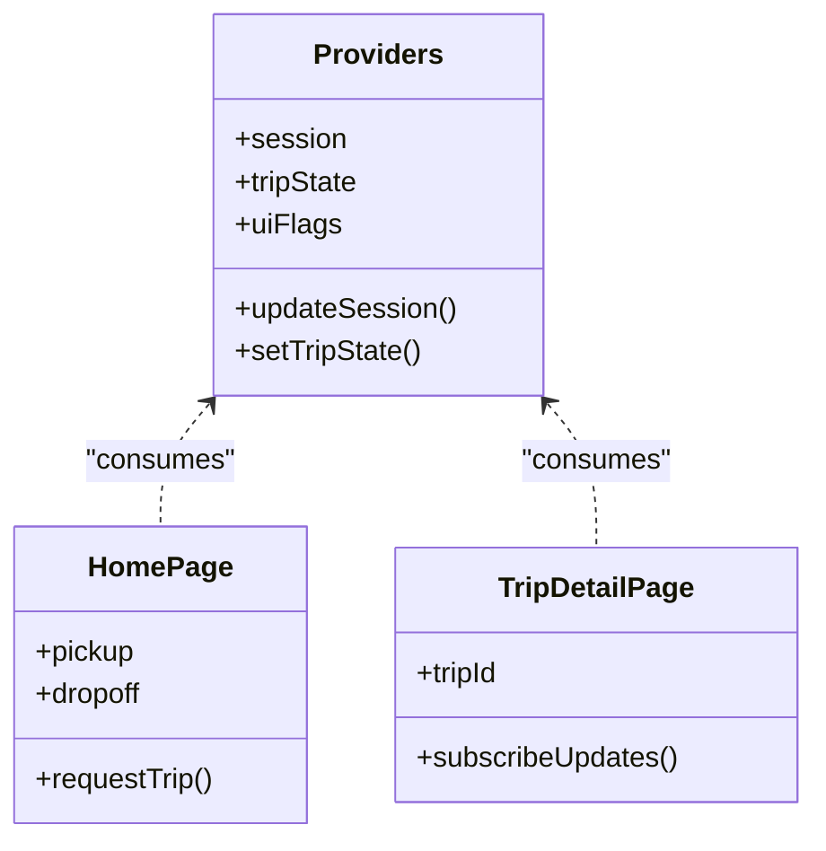

**Diagram sources**
- [providers.tsx](file://apps/passenger/src/components/providers.tsx)
- [home/page.tsx](file://apps/passenger/src/app/home/page.tsx)
- [trip/[id]/page.tsx](file://apps/passenger/src/app/trip/[id]/page.tsx)

**Section sources**
- [providers.tsx](file://apps/passenger/src/components/providers.tsx)
- [home/page.tsx](file://apps/passenger/src/app/home/page.tsx)
- [trip/[id]/page.tsx](file://apps/passenger/src/app/trip/[id]/page.tsx)

## Dependency Analysis
The Passenger Application depends on:
- Supabase for authentication and real-time capabilities.
- Prisma for database schema and queries.
- External payment gateway for transactions.

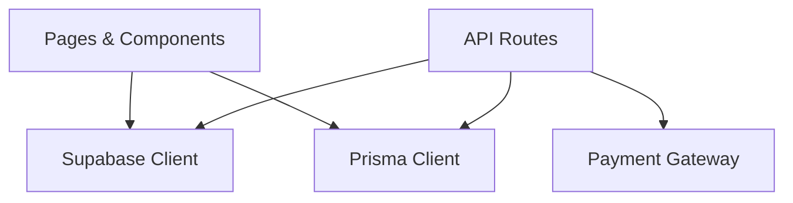

**Diagram sources**
- [lib/supabase.ts](file://apps/passenger/src/lib/supabase.ts)
- [lib/supabase-server.ts](file://apps/passenger/src/lib/supabase-server.ts)
- [lib/prisma.ts](file://apps/passenger/src/lib/prisma.ts)
- [api/payments/route.ts](file://apps/passenger/src/app/api/payments/route.ts)

**Section sources**
- [lib/supabase.ts](file://apps/passenger/src/lib/supabase.ts)
- [lib/supabase-server.ts](file://apps/passenger/src/lib/supabase-server.ts)
- [lib/prisma.ts](file://apps/passenger/src/lib/prisma.ts)
- [api/payments/route.ts](file://apps/passenger/src/app/api/payments/route.ts)

## Performance Considerations
- Debounce real-time location updates to reduce re-renders.
- Use pagination for trip history and large datasets.
- Optimize images and assets; leverage Next.js image optimization.
- Minimize network requests by batching API calls where possible.
- Implement optimistic UI updates for better perceived performance.

[No sources needed since this section provides general guidance]

## Troubleshooting Guide
Common issues and strategies:
- Authentication failures: Verify credentials and session persistence; check API responses for detailed errors.
- Real-time connection drops: Implement reconnection logic and fallback to polling temporarily.
- Payment errors: Inspect gateway responses, ensure idempotency keys are used, and log transaction IDs.
- Route protection bypass: Ensure guards run on both client and server sides.

**Section sources**
- [error.tsx](file://apps/passenger/src/app/error.tsx)
- [api/auth/login/route.ts](file://apps/passenger/src/app/api/auth/login/route.ts)
- [api/payments/route.ts](file://apps/passenger/src/app/api/payments/route.ts)
- [lib/supabase.ts](file://apps/passenger/src/lib/supabase.ts)

## Conclusion
The Passenger Application provides a robust, real-time booking experience with clear separation between client and server concerns. Authentication, driver discovery, trip management, ratings, and payments are implemented via well-defined API routes and integrated with Supabase and Prisma. By following the patterns outlined here—state management, real-time subscriptions, and resilient error handling—the application delivers a responsive and reliable user experience.