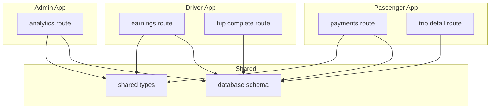
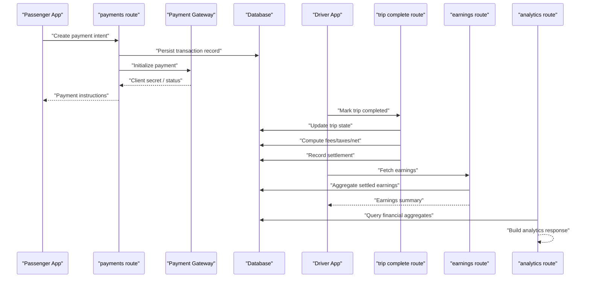
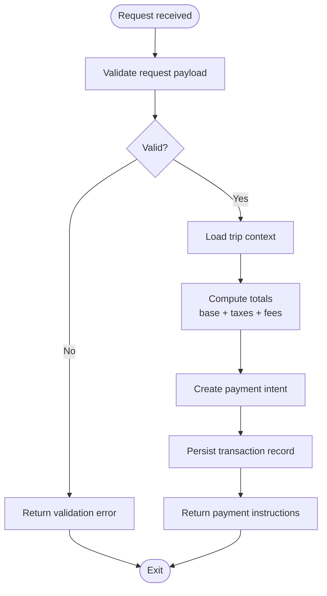
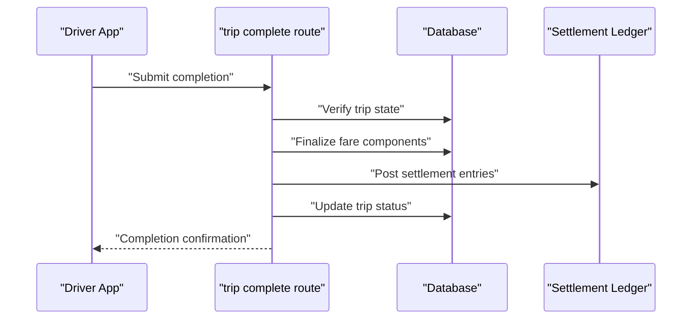
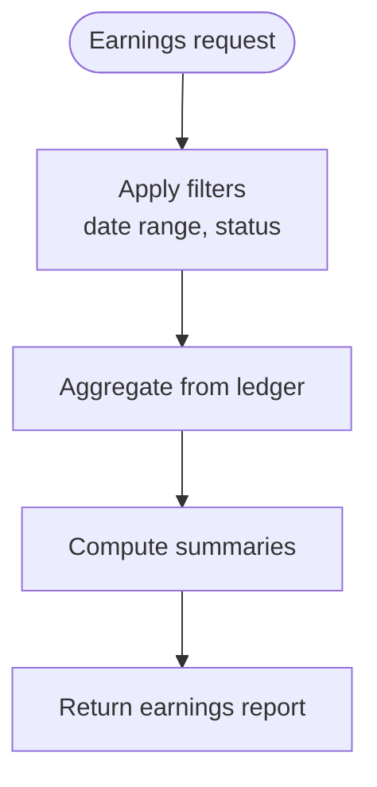
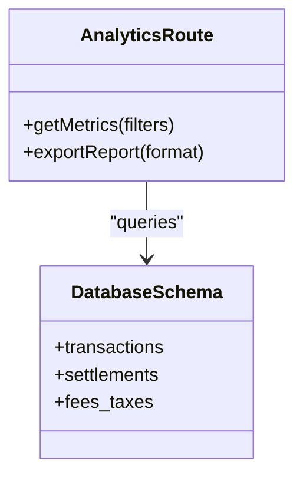
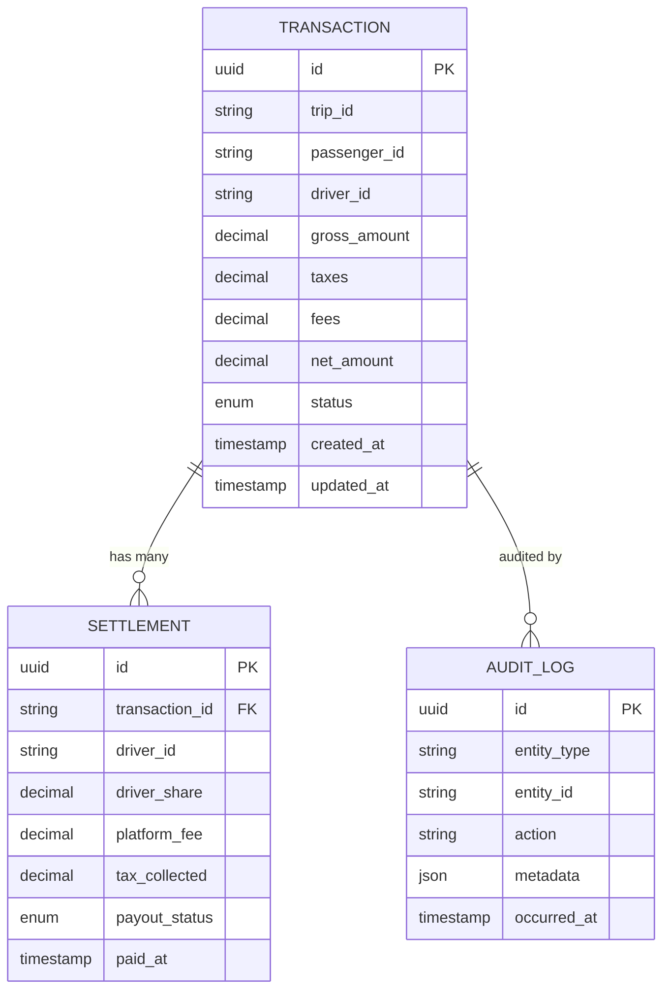
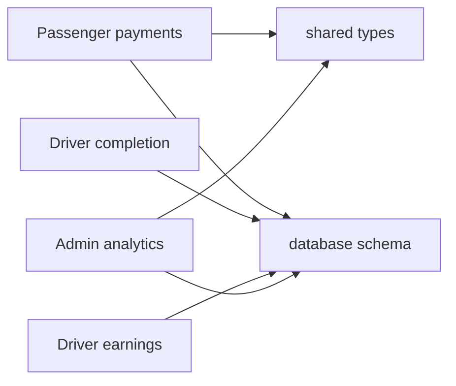

# Payment System

<cite>
**Referenced Files in This Document**
- [apps/passenger/src/app/api/payments/route.ts](file://apps/passenger/src/app/api/payments/route.ts)
- [apps/driver/src/app/api/earnings/route.ts](file://apps/driver/src/app/api/earnings/route.ts)
- [apps/admin/src/app/api/analytics/route.ts](file://apps/admin/src/app/api/analytics/route.ts)
- [apps/passenger/src/app/api/trips/[id]/route.ts](file://apps/passenger/src/app/api/trips/[id]/route.ts)
- [apps/driver/src/app/api/trips/[id]/complete/route.ts](file://apps/driver/src/app/api/trips/[id]/complete/route.ts)
- [packages/shared-types/src/index.ts](file://packages/shared-types/src/index.ts)
- [packages/prisma/schema.prisma](file://packages/prisma/schema.prisma)
</cite>

## Table of Contents
1. [Introduction](#introduction)
2. [Project Structure](#project-structure)
3. [Core Components](#core-components)
4. [Architecture Overview](#architecture-overview)
5. [Detailed Component Analysis](#detailed-component-analysis)
6. [Dependency Analysis](#dependency-analysis)
7. [Performance Considerations](#performance-considerations)
8. [Troubleshooting Guide](#troubleshooting-guide)
9. [Conclusion](#conclusion)
10. [Appendices](#appendices)

## Introduction
This document describes the payment processing system for transactions, earnings distribution, and financial reporting across the passenger, driver, and admin applications. It covers payment gateway integration points, transaction lifecycle management, refund handling, earnings calculation logic, payment method and currency support, tax and fee structures, security and compliance considerations, auditing, reconciliation, failure handling and retries, dispute resolution workflows, and reporting/export capabilities. The goal is to provide a comprehensive, accessible guide for both technical and non-technical stakeholders.

## Project Structure
The payment-related functionality is implemented as Next.js API routes within each app:
- Passenger app exposes payment initiation endpoints and trip details.
- Driver app exposes earnings retrieval endpoints and trip completion flows that trigger payouts.
- Admin app exposes analytics endpoints for financial reporting.

**Diagram sources**
- [apps/passenger/src/app/api/payments/route.ts](file://apps/passenger/src/app/api/payments/route.ts)
- [apps/passenger/src/app/api/trips/[id]/route.ts](file://apps/passenger/src/app/api/trips/[id]/route.ts)
- [apps/driver/src/app/api/earnings/route.ts](file://apps/driver/src/app/api/earnings/route.ts)
- [apps/driver/src/app/api/trips/[id]/complete/route.ts](file://apps/driver/src/app/api/trips/[id]/complete/route.ts)
- [apps/admin/src/app/api/analytics/route.ts](file://apps/admin/src/app/api/analytics/route.ts)
- [packages/shared-types/src/index.ts](file://packages/shared-types/src/index.ts)
- [packages/prisma/schema.prisma](file://packages/prisma/schema.prisma)

**Section sources**
- [apps/passenger/src/app/api/payments/route.ts](file://apps/passenger/src/app/api/payments/route.ts)
- [apps/driver/src/app/api/earnings/route.ts](file://apps/driver/src/app/api/earnings/route.ts)
- [apps/admin/src/app/api/analytics/route.ts](file://apps/admin/src/app/api/analytics/route.ts)
- [packages/shared-types/src/index.ts](file://packages/shared-types/src/index.ts)
- [packages/prisma/schema.prisma](file://packages/prisma/schema.prisma)

## Core Components
- Payment Initiation (Passenger): Creates or retrieves a payment intent, validates trip context, and returns client-side payment instructions.
- Trip Completion and Settlement (Driver): Marks trips as completed and triggers settlement calculations for driver earnings.
- Earnings Retrieval (Driver): Aggregates settled earnings for drivers with filters and summaries.
- Financial Analytics (Admin): Provides aggregated metrics for revenue, fees, taxes, and payouts.

Key responsibilities:
- Validate inputs and enforce business rules.
- Persist transaction records and audit logs.
- Compute fees, taxes, and net amounts.
- Integrate with external payment gateways via secure server calls.
- Expose reporting endpoints for dashboards and exports.

**Section sources**
- [apps/passenger/src/app/api/payments/route.ts](file://apps/passenger/src/app/api/payments/route.ts)
- [apps/driver/src/app/api/trips/[id]/complete/route.ts](file://apps/driver/src/app/api/trips/[id]/complete/route.ts)
- [apps/driver/src/app/api/earnings/route.ts](file://apps/driver/src/app/api/earnings/route.ts)
- [apps/admin/src/app/api/analytics/route.ts](file://apps/admin/src/app/api/analytics/route.ts)

## Architecture Overview
The system follows a service-oriented approach using Next.js API routes. Shared types ensure consistent contracts between apps, while the database schema centralizes financial records.

**Diagram sources**
- [apps/passenger/src/app/api/payments/route.ts](file://apps/passenger/src/app/api/payments/route.ts)
- [apps/driver/src/app/api/trips/[id]/complete/route.ts](file://apps/driver/src/app/api/trips/[id]/complete/route.ts)
- [apps/driver/src/app/api/earnings/route.ts](file://apps/driver/src/app/api/earnings/route.ts)
- [apps/admin/src/app/api/analytics/route.ts](file://apps/admin/src/app/api/analytics/route.ts)
- [packages/prisma/schema.prisma](file://packages/prisma/schema.prisma)

## Detailed Component Analysis

### Payment Initiation Flow (Passenger)
Responsibilities:
- Validate trip ID and passenger identity.
- Create or fetch a payment intent.
- Calculate initial totals including base fare, estimated taxes, and platform fees.
- Return client-side payment parameters.

**Diagram sources**
- [apps/passenger/src/app/api/payments/route.ts](file://apps/passenger/src/app/api/payments/route.ts)
- [packages/prisma/schema.prisma](file://packages/prisma/schema.prisma)

**Section sources**
- [apps/passenger/src/app/api/payments/route.ts](file://apps/passenger/src/app/api/payments/route.ts)

### Trip Completion and Settlement (Driver)
Responsibilities:
- Confirm trip completion eligibility.
- Finalize fare components (distance/time adjustments).
- Apply taxes and fees; compute driver share.
- Record settlement entries and update trip state.

**Diagram sources**
- [apps/driver/src/app/api/trips/[id]/complete/route.ts](file://apps/driver/src/app/api/trips/[id]/complete/route.ts)
- [packages/prisma/schema.prisma](file://packages/prisma/schema.prisma)

**Section sources**
- [apps/driver/src/app/api/trips/[id]/complete/route.ts](file://apps/driver/src/app/api/trips/[id]/complete/route.ts)

### Earnings Retrieval (Driver)
Responsibilities:
- Aggregate settled earnings by period, trip, or payout batch.
- Summarize gross, taxes, fees, and net amounts.
- Provide pagination and filtering.

**Diagram sources**
- [apps/driver/src/app/api/earnings/route.ts](file://apps/driver/src/app/api/earnings/route.ts)
- [packages/prisma/schema.prisma](file://packages/prisma/schema.prisma)

**Section sources**
- [apps/driver/src/app/api/earnings/route.ts](file://apps/driver/src/app/api/earnings/route.ts)

### Financial Analytics (Admin)
Responsibilities:
- Provide KPIs: total revenue, fees collected, taxes collected, payouts.
- Support time-based aggregations and breakdowns by region or payment method.
- Enable export-ready datasets for downstream systems.

**Diagram sources**
- [apps/admin/src/app/api/analytics/route.ts](file://apps/admin/src/app/api/analytics/route.ts)
- [packages/prisma/schema.prisma](file://packages/prisma/schema.prisma)

**Section sources**
- [apps/admin/src/app/api/analytics/route.ts](file://apps/admin/src/app/api/analytics/route.ts)

### Data Models and Contracts
Shared types define consistent payloads across apps. The database schema centralizes entities such as transactions, settlements, fees, taxes, and audit logs.

**Diagram sources**
- [packages/prisma/schema.prisma](file://packages/prisma/schema.prisma)
- [packages/shared-types/src/index.ts](file://packages/shared-types/src/index.ts)

**Section sources**
- [packages/prisma/schema.prisma](file://packages/prisma/schema.prisma)
- [packages/shared-types/src/index.ts](file://packages/shared-types/src/index.ts)

## Dependency Analysis
- Passenger payments depend on shared types and database schema for consistency.
- Driver earnings and completion rely on settlement records and trip states.
- Admin analytics aggregate data from transactions and settlements.

**Diagram sources**
- [apps/passenger/src/app/api/payments/route.ts](file://apps/passenger/src/app/api/payments/route.ts)
- [apps/driver/src/app/api/trips/[id]/complete/route.ts](file://apps/driver/src/app/api/trips/[id]/complete/route.ts)
- [apps/driver/src/app/api/earnings/route.ts](file://apps/driver/src/app/api/earnings/route.ts)
- [apps/admin/src/app/api/analytics/route.ts](file://apps/admin/src/app/api/analytics/route.ts)
- [packages/shared-types/src/index.ts](file://packages/shared-types/src/index.ts)
- [packages/prisma/schema.prisma](file://packages/prisma/schema.prisma)

**Section sources**
- [packages/shared-types/src/index.ts](file://packages/shared-types/src/index.ts)
- [packages/prisma/schema.prisma](file://packages/prisma/schema.prisma)

## Performance Considerations
- Use indexed queries on frequently filtered fields (e.g., timestamps, statuses, IDs).
- Paginate large reports and avoid loading entire datasets into memory.
- Cache read-heavy analytics where appropriate with invalidation strategies tied to write events.
- Batch settlement computations to reduce lock contention during peak periods.
- Keep payment gateway calls asynchronous when possible and implement idempotency keys to prevent duplicate charges.

[No sources needed since this section provides general guidance]

## Troubleshooting Guide
Common issues and resolutions:
- Payment failures: Inspect gateway responses and retry with exponential backoff; log idempotency keys to avoid duplicates.
- Settlement mismatches: Reconcile transaction totals against gateway settlement files; verify tax and fee application rules.
- Missing audit trails: Ensure every state transition writes an audit entry with contextual metadata.
- Disputes: Link disputes to original transactions and settlements; track outcomes and adjust ledgers accordingly.

Operational checks:
- Verify environment configuration for gateway credentials and currencies.
- Validate input constraints and business rule enforcement at API boundaries.
- Monitor error rates and latency for payment and settlement endpoints.

**Section sources**
- [apps/passenger/src/app/api/payments/route.ts](file://apps/passenger/src/app/api/payments/route.ts)
- [apps/driver/src/app/api/trips/[id]/complete/route.ts](file://apps/driver/src/app/api/trips/[id]/complete/route.ts)
- [apps/driver/src/app/api/earnings/route.ts](file://apps/driver/src/app/api/earnings/route.ts)
- [apps/admin/src/app/api/analytics/route.ts](file://apps/admin/src/app/api/analytics/route.ts)

## Conclusion
The payment system integrates passenger-initiated payments, driver settlement, and admin analytics through well-defined API routes and shared data models. By enforcing robust validation, clear audit trails, and structured reporting, it supports reliable transaction processing, accurate earnings distribution, and comprehensive financial oversight. Future enhancements should focus on advanced retry and dispute workflows, expanded export formats, and deeper analytics dashboards.

[No sources needed since this section summarizes without analyzing specific files]

## Appendices

### Security and Compliance Notes
- PCI scope minimization: Avoid storing raw card data; use tokenized references provided by the payment gateway.
- Secure secrets management: Store gateway credentials in environment variables or secret managers.
- Input validation and authorization: Enforce role-based access for sensitive endpoints.
- Audit logging: Capture immutable records for all financial operations.

[No sources needed since this section provides general guidance]

### Reporting and Export Capabilities
- Supported dimensions: date ranges, regions, payment methods, trip categories.
- Formats: CSV and JSON for downstream processing.
- Scheduling: Periodic generation for daily/weekly/monthly reports.

[No sources needed since this section provides general guidance]