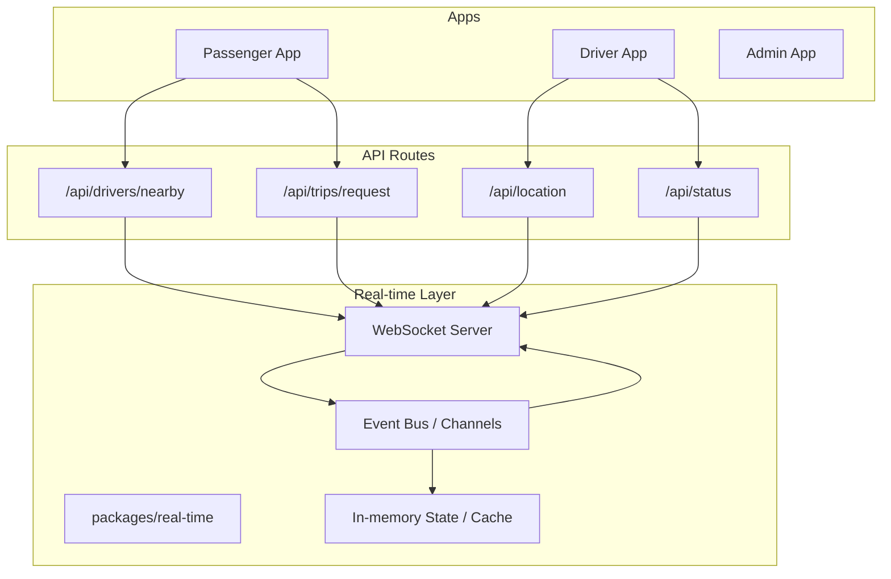
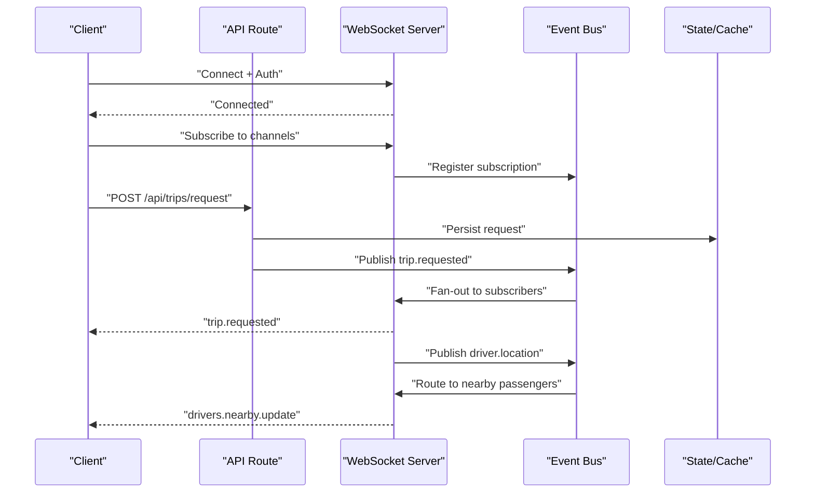
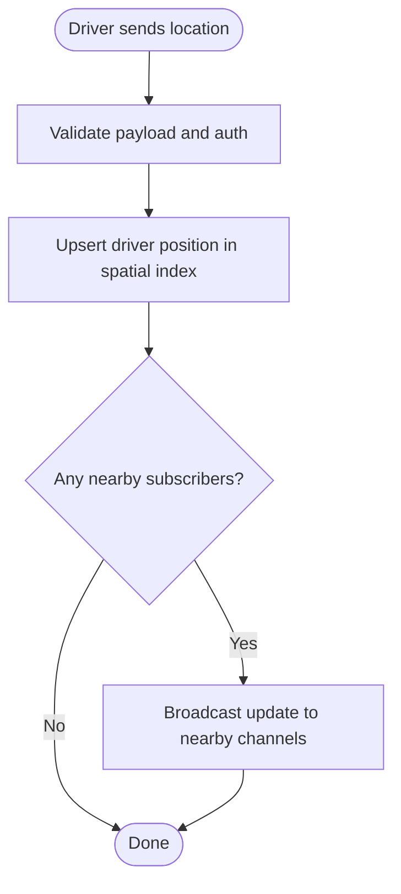
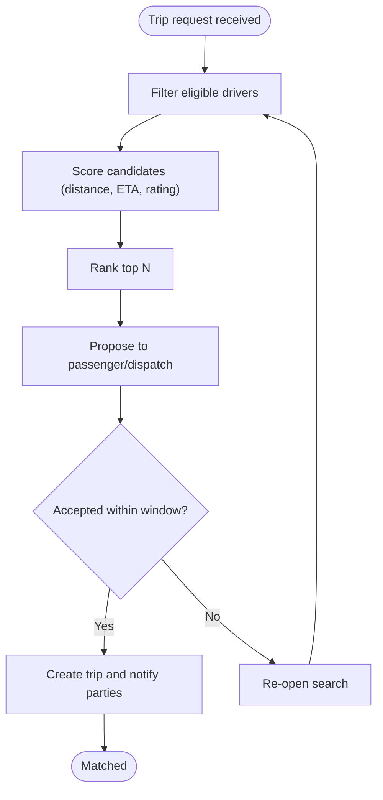
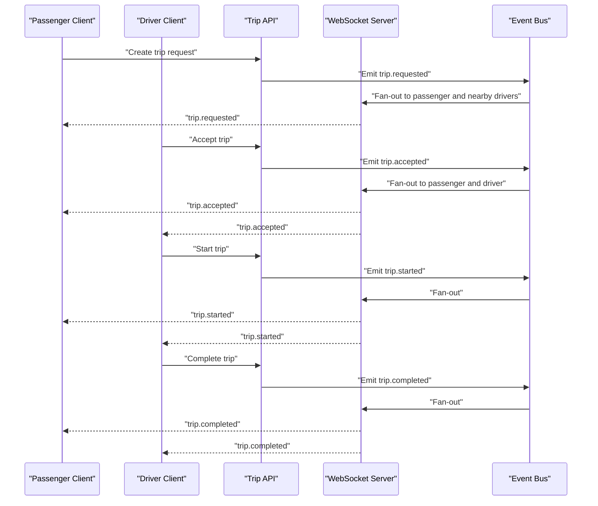
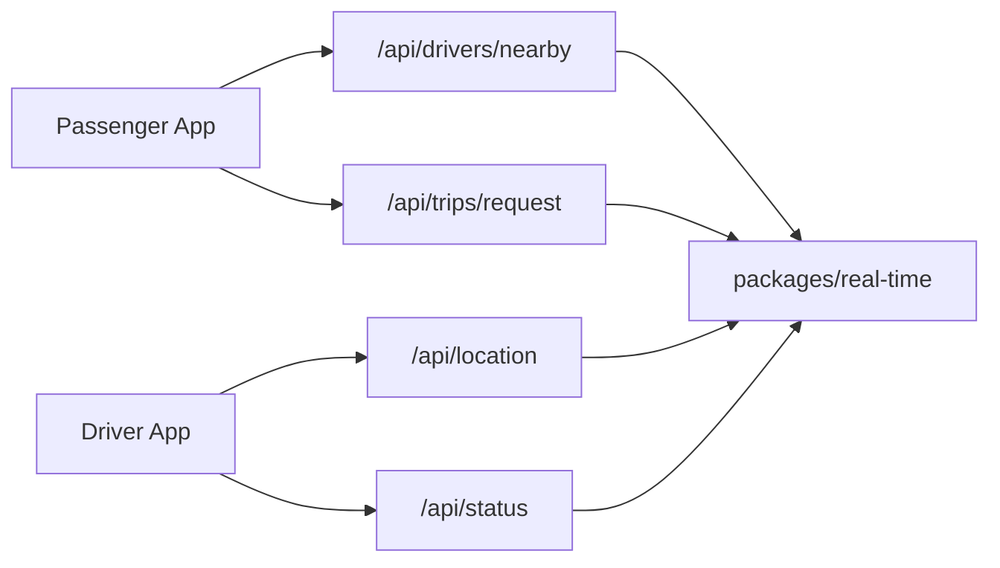

# Real-time Features

<cite>
**Referenced Files in This Document**
- [package.json](file://package.json)
- [apps/passenger/src/app/api/drivers/nearby/route.ts](file://apps/passenger/src/app/api/drivers/nearby/route.ts)
- [apps/driver/src/app/api/location/route.ts](file://apps/driver/src/app/api/location/route.ts)
- [apps/driver/src/app/api/status/route.ts](file://apps/driver/src/app/api/status/route.ts)
- [apps/passenger/src/app/api/trips/request/route.ts](file://apps/passenger/src/app/api/trips/request/route.ts)
- [packages/real-time/package.json](file://packages/real-time/package.json)
</cite>

## Table of Contents
1. [Introduction](#introduction)
2. [Project Structure](#project-structure)
3. [Core Components](#core-components)
4. [Architecture Overview](#architecture-overview)
5. [Detailed Component Analysis](#detailed-component-analysis)
6. [Dependency Analysis](#dependency-analysis)
7. [Performance Considerations](#performance-considerations)
8. [Troubleshooting Guide](#troubleshooting-guide)
9. [Conclusion](#conclusion)

## Introduction
This document describes the real-time communication system that powers live location tracking, trip status updates, and instant notifications across the platform. It covers WebSocket implementation, event handling, connection management, data synchronization, location broadcasting, driver-passenger matching, trip status propagation, error handling, reconnection strategies, performance optimization, scalability, load balancing, and monitoring approaches.

## Project Structure
The repository is organized as a multi-app Next.js workspace with three client-facing apps (admin, driver, passenger) and shared packages. The real-time layer is encapsulated under packages/real-time and integrates with API routes in each app to coordinate events and state changes.

**Diagram sources**
- [apps/passenger/src/app/api/drivers/nearby/route.ts](file://apps/passenger/src/app/api/drivers/nearby/route.ts)
- [apps/driver/src/app/api/location/route.ts](file://apps/driver/src/app/api/location/route.ts)
- [apps/driver/src/app/api/status/route.ts](file://apps/driver/src/app/api/status/route.ts)
- [apps/passenger/src/app/api/trips/request/route.ts](file://apps/passenger/src/app/api/trips/request/route.ts)
- [packages/real-time/package.json](file://packages/real-time/package.json)

**Section sources**
- [package.json](file://package.json)

## Core Components
- WebSocket server: Accepts connections from clients, authenticates sessions, and manages channels for topics such as drivers, trips, and notifications.
- Event bus/channels: Publishes and subscribes to typed events (e.g., location updates, trip lifecycle events).
- Connection manager: Tracks active connections, maps users to rooms/topics, handles heartbeats, and enforces limits.
- Location broadcaster: Aggregates driver positions and fans out to nearby passengers or dispatchers.
- Trip orchestrator: Coordinates trip lifecycle events (request, match, start, complete, cancel) and persists durable state via APIs.
- Matching engine: Selects optimal drivers for requests using heuristics (distance, ETA, availability, ratings).
- Notification service: Emits push-style notifications over WebSocket for status changes and alerts.

Key responsibilities and interactions are reflected by the API route endpoints exposed by each app and the real-time package.

**Section sources**
- [apps/passenger/src/app/api/drivers/nearby/route.ts](file://apps/passenger/src/app/api/drivers/nearby/route.ts)
- [apps/driver/src/app/api/location/route.ts](file://apps/driver/src/app/api/location/route.ts)
- [apps/driver/src/app/api/status/route.ts](file://apps/driver/src/app/api/status/route.ts)
- [apps/passenger/src/app/api/trips/request/route.ts](file://apps/passenger/src/app/api/trips/request/route.ts)
- [packages/real-time/package.json](file://packages/real-time/package.json)

## Architecture Overview
The real-time architecture uses a hub-and-spoke model where API routes act as gateways into the WebSocket server. Clients connect to the WebSocket server, subscribe to relevant channels, and receive events. The server maintains ephemeral state for active connections and coordinates with APIs for persistence.

**Diagram sources**
- [apps/passenger/src/app/api/trips/request/route.ts](file://apps/passenger/src/app/api/trips/request/route.ts)
- [apps/driver/src/app/api/location/route.ts](file://apps/driver/src/app/api/location/route.ts)
- [apps/passenger/src/app/api/drivers/nearby/route.ts](file://apps/passenger/src/app/api/drivers/nearby/route.ts)

## Detailed Component Analysis

### WebSocket Implementation and Connection Management
- Authentication and session binding: On connect, validate tokens and bind user identity to the socket.
- Channel subscriptions: Support room-based subscriptions (e.g., per-trip, per-driver, per-region).
- Heartbeat and liveness: Ping/pong intervals to detect dead connections and trigger cleanup.
- Backpressure and rate limiting: Throttle high-frequency messages (e.g., location pings) and drop stale frames.
- Graceful shutdown: Drain pending messages and close connections cleanly during deployments.

Operational considerations:
- Use sticky sessions when behind a reverse proxy to ensure all messages for a connection reach the same process.
- Maintain a connection registry keyed by user ID and device/session for targeted messaging.

**Section sources**
- [packages/real-time/package.json](file://packages/real-time/package.json)

### Real-time Event Handling and Data Synchronization
- Event schema: Define strict types for events (e.g., trip.status_changed, driver.location_update, notification.push).
- Ordering guarantees: For per-entity streams (e.g., trip), sequence events by timestamp or version to avoid races.
- Idempotency: Ensure clients can safely retry without duplicating effects; use event IDs or versions.
- Delta updates: Send only changed fields to reduce payload size.

Synchronization patterns:
- Last-write-wins for non-critical UI state.
- Optimistic updates with conflict resolution for critical actions (e.g., accept/reject trip).

**Section sources**
- [apps/driver/src/app/api/status/route.ts](file://apps/driver/src/app/api/status/route.ts)
- [apps/passenger/src/app/api/trips/request/route.ts](file://apps/passenger/src/app/api/trips/request/route.ts)

### Location Broadcasting System
- Ingestion: Drivers publish periodic location updates via an API or directly over WebSocket.
- Indexing: Maintain a spatial index (e.g., grid or geohash) mapping regions to active drivers.
- Fan-out: When a passenger queries nearby drivers or when new drivers appear near a region, broadcast updated lists.
- Filtering: Apply filters for driver status, vehicle type, and rating thresholds.

**Diagram sources**
- [apps/driver/src/app/api/location/route.ts](file://apps/driver/src/app/api/location/route.ts)
- [apps/passenger/src/app/api/drivers/nearby/route.ts](file://apps/passenger/src/app/api/drivers/nearby/route.ts)

**Section sources**
- [apps/driver/src/app/api/location/route.ts](file://apps/driver/src/app/api/location/route.ts)
- [apps/passenger/src/app/api/drivers/nearby/route.ts](file://apps/passenger/src/app/api/drivers/nearby/route.ts)

### Driver-Passenger Matching Algorithms
Matching considers multiple signals to propose the best driver(s):
- Distance and ETA estimation
- Driver availability and acceptance history
- Ratings and reliability metrics
- Surge pricing or incentives (if applicable)

Algorithm outline:
- Candidate selection: Filter drivers within a radius and eligible status.
- Scoring: Compute a composite score from distance, ETA, rating, and historical acceptance.
- Ranking and proposal: Return top N candidates to the passenger or dispatch logic.
- Expiration: Expire proposals after a time window to keep results fresh.

**Diagram sources**
- [apps/passenger/src/app/api/trips/request/route.ts](file://apps/passenger/src/app/api/trips/request/route.ts)

**Section sources**
- [apps/passenger/src/app/api/trips/request/route.ts](file://apps/passenger/src/app/api/trips/request/route.ts)

### Real-time Trip Status Propagation
Trip lifecycle events flow through the event bus to keep both parties synchronized:
- Requested -> Assigned -> En-route -> Started -> Completed/Canceled
- Each transition emits a typed event with minimal payload and references to the trip ID.

**Diagram sources**
- [apps/driver/src/app/api/status/route.ts](file://apps/driver/src/app/api/status/route.ts)
- [apps/passenger/src/app/api/trips/request/route.ts](file://apps/passenger/src/app/api/trips/request/route.ts)

**Section sources**
- [apps/driver/src/app/api/status/route.ts](file://apps/driver/src/app/api/status/route.ts)
- [apps/passenger/src/app/api/trips/request/route.ts](file://apps/passenger/src/app/api/trips/request/route.ts)

### Error Handling and Reconnection Strategies
Error handling principles:
- Classify errors: transient (network, server busy) vs. permanent (auth failure, invalid payload).
- Retry policy: Exponential backoff with jitter for transient failures; cap retries and surface errors to UI.
- Circuit breaker: Temporarily stop sending if downstream services are failing.
- Dead-letter queue: Persist failed events for replay and debugging.

Reconnection strategy:
- Detect disconnects via heartbeat timeouts.
- Attempt reconnect with exponential backoff and jitter.
- Resume subscriptions and resync state using last known event IDs or snapshots.
- Fallback to polling for critical paths until WebSocket is stable.

**Section sources**
- [packages/real-time/package.json](file://packages/real-time/package.json)

### Performance Optimization
- Message batching: Aggregate frequent updates (e.g., location) before broadcasting.
- Payload minimization: Send deltas and compress payloads.
- Spatial partitioning: Limit fan-out to relevant regions to reduce overhead.
- Connection pooling: Reuse long-lived connections per client and limit concurrent connections per process.
- CPU-bound offloading: Move heavy computations (matching) to background workers.

[No sources needed since this section provides general guidance]

### Scalability, Load Balancing, and Monitoring
Scalability:
- Horizontal scaling: Run multiple WebSocket processes behind a load balancer with sticky sessions or a shared pub/sub backbone.
- Sharding: Partition channels by region or tenant to distribute load.
- Stateless workers: Keep matching and processing stateless; persist durable state via APIs.

Load balancing:
- Use TCP-level LB with sticky sessions for WebSocket.
- Alternatively, use a shared message bus to decouple processes and enable cross-process fan-out.

Monitoring:
- Metrics: Active connections, message throughput, latency percentiles, error rates, reconnection counts.
- Tracing: Correlate events across API, WS, and worker layers using trace IDs.
- Alerts: Thresholds for connection drops, high latency, and mismatch rates.

[No sources needed since this section provides general guidance]

## Dependency Analysis
The real-time features depend on:
- API routes for persistence and orchestration
- A real-time package providing WebSocket and event primitives
- Shared types and utilities for consistent schemas

**Diagram sources**
- [apps/passenger/src/app/api/drivers/nearby/route.ts](file://apps/passenger/src/app/api/drivers/nearby/route.ts)
- [apps/driver/src/app/api/location/route.ts](file://apps/driver/src/app/api/location/route.ts)
- [apps/driver/src/app/api/status/route.ts](file://apps/driver/src/app/api/status/route.ts)
- [apps/passenger/src/app/api/trips/request/route.ts](file://apps/passenger/src/app/api/trips/request/route.ts)
- [packages/real-time/package.json](file://packages/real-time/package.json)

**Section sources**
- [apps/passenger/src/app/api/drivers/nearby/route.ts](file://apps/passenger/src/app/api/drivers/nearby/route.ts)
- [apps/driver/src/app/api/location/route.ts](file://apps/driver/src/app/api/location/route.ts)
- [apps/driver/src/app/api/status/route.ts](file://apps/driver/src/app/api/status/route.ts)
- [apps/passenger/src/app/api/trips/request/route.ts](file://apps/passenger/src/app/api/trips/request/route.ts)
- [packages/real-time/package.json](file://packages/real-time/package.json)

## Performance Considerations
- Tune heartbeat intervals to balance responsiveness and resource usage.
- Cap maximum message sizes and enforce per-client rate limits.
- Use efficient serialization formats and avoid unnecessary JSON nesting.
- Precompute and cache frequently accessed data (e.g., driver eligibility) to reduce API calls.

[No sources needed since this section provides general guidance]

## Troubleshooting Guide
Common issues and resolutions:
- Frequent disconnects: Check network stability, server-side heartbeat configuration, and proxy timeout settings.
- Stale locations: Verify driver location ingestion frequency and ensure spatial index updates are idempotent.
- Missed trip events: Confirm event ordering and that clients resume subscriptions with correct offsets.
- High memory usage: Inspect connection registry growth, channel fan-out scope, and unbounded queues.

Diagnostic steps:
- Inspect connection logs and error codes.
- Replay events from durable storage to reproduce issues.
- Measure end-to-end latency between API and client.

[No sources needed since this section provides general guidance]

## Conclusion
The real-time system combines a robust WebSocket layer with well-defined event contracts and scalable integration points via API routes. By applying careful connection management, efficient broadcasting, and resilient reconnection strategies, the platform delivers low-latency location updates, reliable trip status propagation, and responsive notifications at scale.