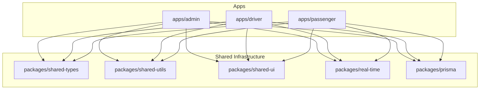
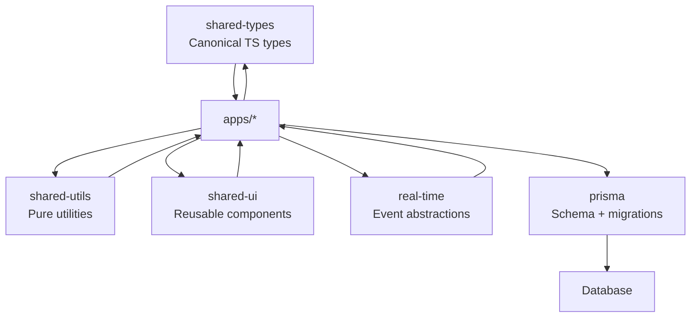
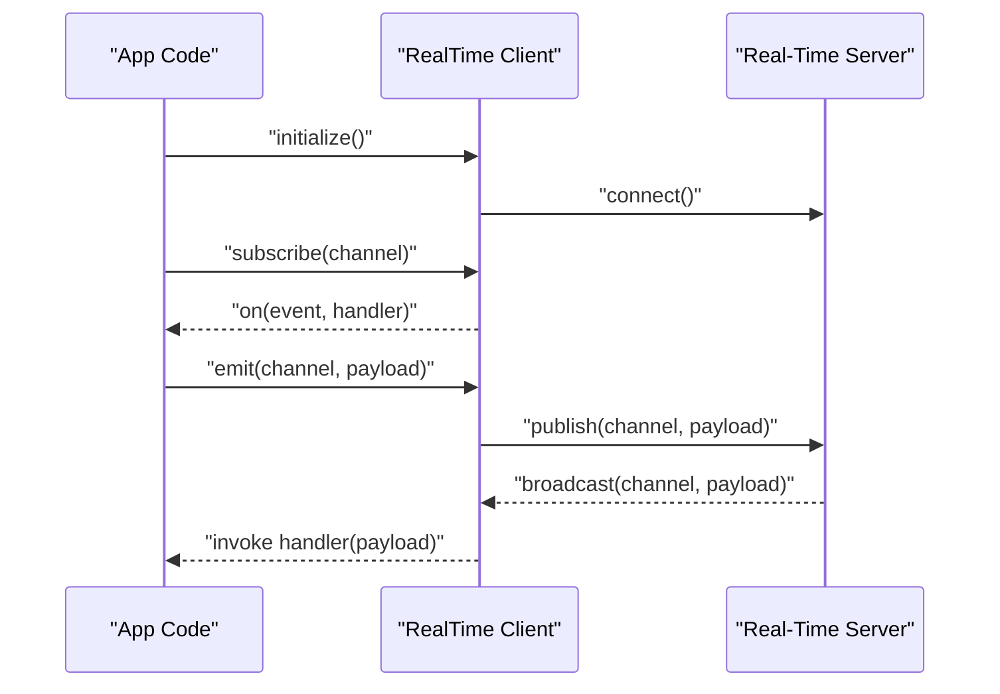
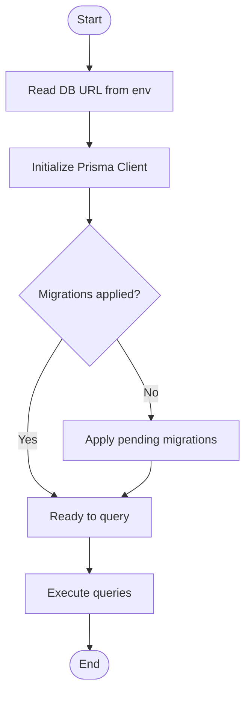
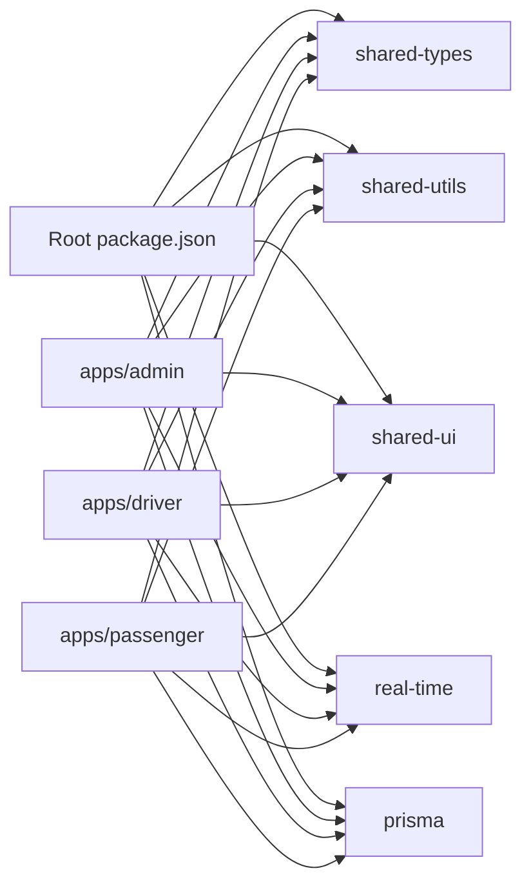

# Shared Infrastructure

<cite>
**Referenced Files in This Document**
- [package.json](file://package.json)
- [tsconfig.json](file://tsconfig.json)
- [packages/shared-types/package.json](file://packages/shared-types/package.json)
- [packages/shared-ui/package.json](file://packages/shared-ui/package.json)
- [packages/shared-utils/package.json](file://packages/shared-utils/package.json)
- [packages/real-time/package.json](file://packages/real-time/package.json)
- [packages/prisma/package.json](file://packages/prisma/package.json)
- [apps/admin/src/lib/prisma.ts](file://apps/admin/src/lib/prisma.ts)
- [apps/driver/src/lib/prisma.ts](file://apps/driver/src/lib/prisma.ts)
- [apps/passenger/src/lib/prisma.ts](file://apps/passenger/src/lib/prisma.ts)
</cite>

## Table of Contents
1. [Introduction](#introduction)
2. [Project Structure](#project-structure)
3. [Core Components](#core-components)
4. [Architecture Overview](#architecture-overview)
5. [Detailed Component Analysis](#detailed-component-analysis)
6. [Dependency Analysis](#dependency-analysis)
7. [Performance Considerations](#performance-considerations)
8. [Troubleshooting Guide](#troubleshooting-guide)
9. [Conclusion](#conclusion)
10. [Appendices](#appendices)

## Introduction
This document describes the Shared Infrastructure layer that powers common functionality across all Ubar applications (admin, driver, passenger). It covers:
- Shared TypeScript types and interfaces
- Reusable UI components library
- Utility functions and helpers
- Real-time communication services
- Centralized database schema management with Prisma
- Package architecture, dependency management, build processes, and distribution strategies
- Versioning, backward compatibility, and contribution guidelines

The goal is to provide a single source of truth for cross-app contracts, UI primitives, utilities, real-time event handling, and database schema organization, enabling consistent behavior and faster iteration across apps.

## Project Structure
At the root level, the repository organizes application code under apps and shared packages under packages. The Shared Infrastructure resides in packages and is consumed by each app.

**Diagram sources**
- [package.json](file://package.json)
- [packages/shared-types/package.json](file://packages/shared-types/package.json)
- [packages/shared-ui/package.json](file://packages/shared-ui/package.json)
- [packages/shared-utils/package.json](file://packages/shared-utils/package.json)
- [packages/real-time/package.json](file://packages/real-time/package.json)
- [packages/prisma/package.json](file://packages/prisma/package.json)

**Section sources**
- [package.json](file://package.json)
- [tsconfig.json](file://tsconfig.json)

## Core Components
The Shared Infrastructure consists of five core packages:
- shared-types: Canonical TypeScript types and interfaces used across apps and services
- shared-ui: Reusable UI components and design tokens
- shared-utils: Pure utility functions and helpers
- real-time: Real-time communication services and event abstractions
- prisma: Centralized Prisma schema and client configuration

Each package exposes a focused API surface and is versioned independently. Apps consume these packages via workspace dependencies.

**Section sources**
- [packages/shared-types/package.json](file://packages/shared-types/package.json)
- [packages/shared-ui/package.json](file://packages/shared-ui/package.json)
- [packages/shared-utils/package.json](file://packages/shared-utils/package.json)
- [packages/real-time/package.json](file://packages/real-time/package.json)
- [packages/prisma/package.json](file://packages/prisma/package.json)

## Architecture Overview
The Shared Infrastructure provides a layered contract between apps and shared concerns:
- Types define the canonical data model and API contracts
- Utils encapsulate pure logic (validation, formatting, hashing, etc.)
- UI components standardize user interactions and visual consistency
- Real-time service abstracts transport and event handling
- Prisma centralizes schema and migration strategy

[No sources needed since this diagram shows conceptual workflow, not actual code structure]

## Detailed Component Analysis

### Shared Types (packages/shared-types)
Purpose:
- Provide canonical TypeScript types for entities, API payloads, and events
- Ensure type safety across apps and server routes

Key responsibilities:
- Entity models (e.g., users, trips, drivers, passengers)
- Request/response DTOs for API routes
- Event shapes for real-time channels
- Enumerations for statuses and roles

Usage patterns:
- Import types directly into app pages and route handlers
- Use discriminated unions for polymorphic payloads
- Prefer strict null checks and readonly where appropriate

Versioning guidance:
- Add new fields as optional to maintain backward compatibility
- Introduce new variants via union types or new enums
- Avoid breaking changes to existing field names and types

**Section sources**
- [packages/shared-types/package.json](file://packages/shared-types/package.json)

### Shared UI (packages/shared-ui)
Purpose:
- Deliver consistent UI primitives and higher-level components
- Enforce design system tokens and accessibility standards

Key responsibilities:
- Base components (buttons, inputs, modals, tables)
- Layout primitives (cards, grids, containers)
- Domain-specific components (trip cards, driver profiles)
- Theme and token exports

API considerations:
- Stable prop interfaces with sensible defaults
- Controlled and uncontrolled component patterns where applicable
- Keyboard navigation and screen reader support

Integration:
- Apps import components from the package entry points
- Theme providers are configured at app bootstrap

**Section sources**
- [packages/shared-ui/package.json](file://packages/shared-ui/package.json)

### Shared Utils (packages/shared-utils)
Purpose:
- Encapsulate pure, side-effect-free helper functions
- Reduce duplication across apps and server routes

Common categories:
- Validation and sanitization
- Formatting (dates, currency, distances)
- Cryptographic helpers (hashing, signing)
- Data transformation and normalization

Design principles:
- Deterministic outputs for given inputs
- No direct I/O or network calls
- Comprehensive tests for edge cases

**Section sources**
- [packages/shared-utils/package.json](file://packages/shared-utils/package.json)

### Real-Time Services (packages/real-time)
Purpose:
- Abstract real-time transport and event handling
- Provide typed event emitters/listeners for cross-app consistency

Responsibilities:
- Connection lifecycle management (connect, reconnect, disconnect)
- Channel/topic abstraction
- Typed event schemas aligned with shared-types
- Error handling and backoff strategies

Typical flow:
- App initializes the real-time client
- Subscribes to channels (e.g., trip updates, driver status)
- Emits events (e.g., accept trip, update location)
- Receives and dispatches events to UI state

**Diagram sources**
- [packages/real-time/package.json](file://packages/real-time/package.json)

**Section sources**
- [packages/real-time/package.json](file://packages/real-time/package.json)

### Prisma Schema Management (packages/prisma)
Purpose:
- Centralize database schema, migrations, and client configuration
- Ensure consistent data access patterns across apps

Responsibilities:
- Single source of truth for Prisma schema
- Migration scripts and rollback strategy
- Generated client usage patterns
- Seeders for development and testing

App integration:
- Each app imports a shared Prisma client instance
- Database connection is configured via environment variables
- Migrations are run centrally before deployment

**Diagram sources**
- [packages/prisma/package.json](file://packages/prisma/package.json)
- [apps/admin/src/lib/prisma.ts](file://apps/admin/src/lib/prisma.ts)
- [apps/driver/src/lib/prisma.ts](file://apps/driver/src/lib/prisma.ts)
- [apps/passenger/src/lib/prisma.ts](file://apps/passenger/src/lib/prisma.ts)

**Section sources**
- [packages/prisma/package.json](file://packages/prisma/package.json)
- [apps/admin/src/lib/prisma.ts](file://apps/admin/src/lib/prisma.ts)
- [apps/driver/src/lib/prisma.ts](file://apps/driver/src/lib/prisma.ts)
- [apps/passenger/src/lib/prisma.ts](file://apps/passenger/src/lib/prisma.ts)

## Dependency Analysis
Workspace-level dependency management ensures consistent versions and reduces duplication.

**Diagram sources**
- [package.json](file://package.json)
- [packages/shared-types/package.json](file://packages/shared-types/package.json)
- [packages/shared-ui/package.json](file://packages/shared-ui/package.json)
- [packages/shared-utils/package.json](file://packages/shared-utils/package.json)
- [packages/real-time/package.json](file://packages/real-time/package.json)
- [packages/prisma/package.json](file://packages/prisma/package.json)

**Section sources**
- [package.json](file://package.json)

## Performance Considerations
- Keep shared packages small and tree-shakeable; prefer modular exports
- Avoid heavy runtime dependencies in shared-types and shared-utils
- Lazy-load real-time clients until needed
- Cache frequently used computations in shared-utils when safe
- Minimize bundle size by exporting only necessary UI components

[No sources needed since this section provides general guidance]

## Troubleshooting Guide
Common issues and resolutions:
- Type mismatches across apps: ensure shared-types are updated and re-generated; check for optional vs required fields
- UI inconsistencies: verify theme tokens and component props; confirm correct import paths
- Real-time connectivity failures: inspect connection lifecycle, channel names, and error handlers; implement exponential backoff
- Prisma migration conflicts: run migrations centrally; validate schema changes against generated client

Operational tips:
- Enable strict TypeScript settings across packages
- Add unit tests for shared-utils and real-time event handlers
- Use lint rules to enforce import conventions and naming

**Section sources**
- [packages/shared-types/package.json](file://packages/shared-types/package.json)
- [packages/shared-ui/package.json](file://packages/shared-ui/package.json)
- [packages/shared-utils/package.json](file://packages/shared-utils/package.json)
- [packages/real-time/package.json](file://packages/real-time/package.json)
- [packages/prisma/package.json](file://packages/prisma/package.json)

## Conclusion
The Shared Infrastructure layer establishes a cohesive foundation for Ubar’s apps through well-defined types, reusable UI, robust utilities, standardized real-time communication, and centralized database schema management. By adhering to versioning and compatibility practices, teams can evolve the platform safely and efficiently.

[No sources needed since this section summarizes without analyzing specific files]

## Appendices

### Build and Distribution Strategy
- Workspace builds: use a top-level script to build all packages in dependency order
- Publish workflow: bump versions, generate changelogs, publish to registry, and update app dependencies
- CI checks: lint, type-check, test, and build for each package

### Versioning and Backward Compatibility
- Semantic versioning for each package
- Backward-compatible changes: add optional fields, introduce new variants, deprecate old APIs gradually
- Breaking changes: major version bumps with migration guides

### Contribution Guidelines
- Create feature branches per package
- Follow coding standards and include tests
- Update documentation and types when changing APIs
- Run full build and test suites before submitting PRs

[No sources needed since this section provides general guidance]