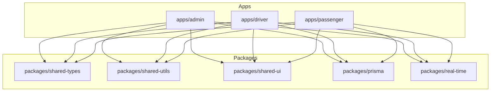
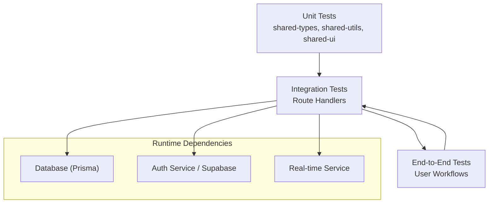
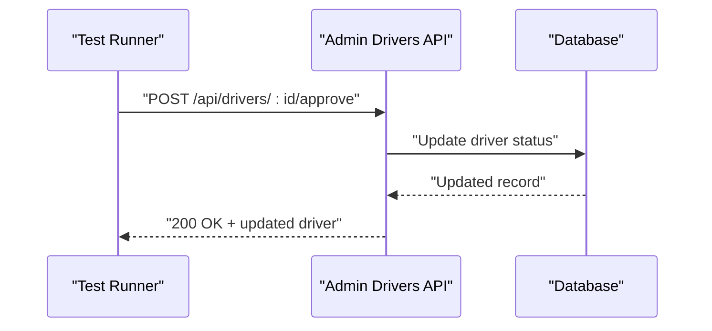
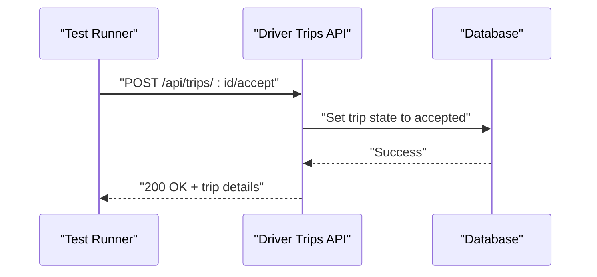
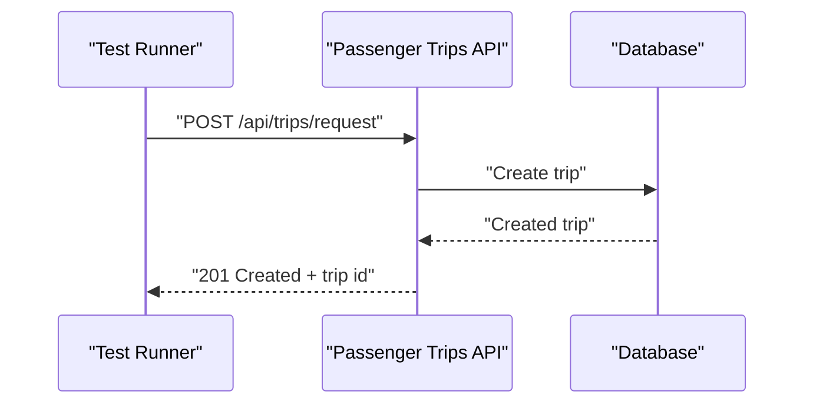
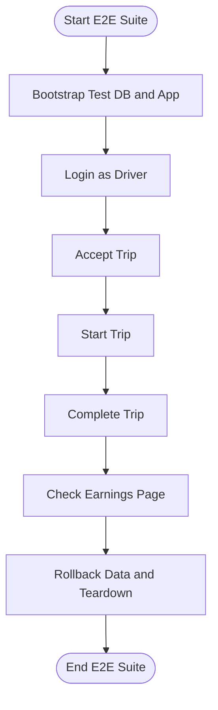
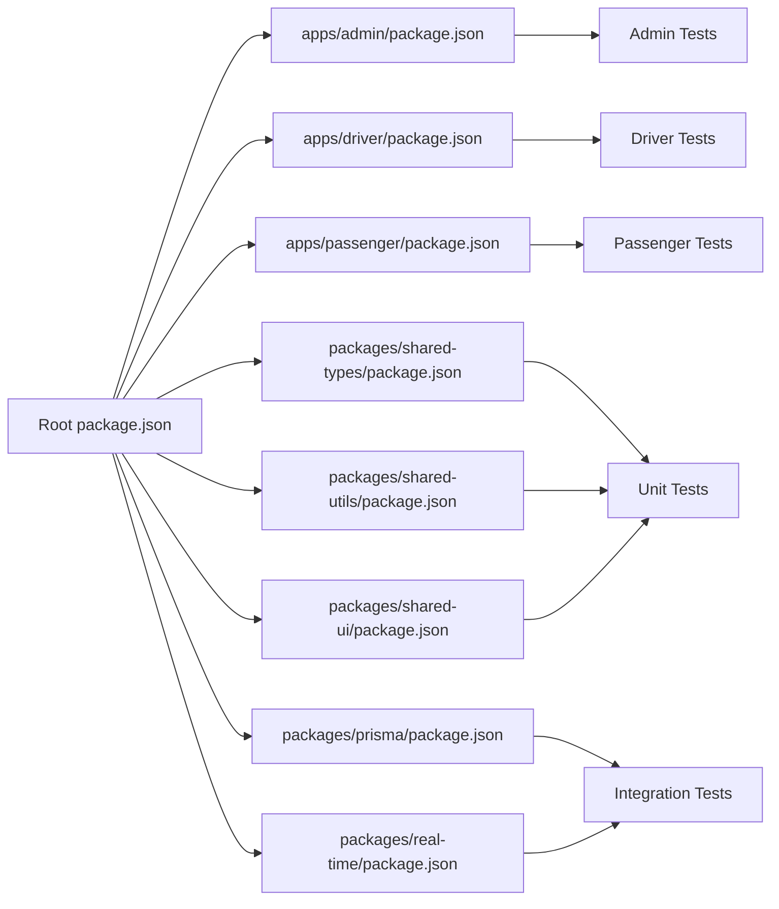

# Testing Strategy

<cite>
**Referenced Files in This Document**
- [package.json](file://package.json)
- [apps/admin/package.json](file://apps/admin/package.json)
- [apps/driver/package.json](file://apps/driver/package.json)
- [apps/passenger/package.json](file://apps/passenger/package.json)
- [packages/shared-types/package.json](file://packages/shared-types/package.json)
- [packages/shared-utils/package.json](file://packages/shared-utils/package.json)
- [packages/prisma/package.json](file://packages/prisma/package.json)
- [packages/real-time/package.json](file://packages/real-time/package.json)
- [packages/shared-ui/package.json](file://packages/shared-ui/package.json)
- [apps/admin/src/app/api/drivers/[id]/approve/route.ts](file://apps/admin/src/app/api/drivers/[id]/approve/route.ts)
- [apps/admin/src/app/api/drivers/[id]/block/route.ts](file://apps/admin/src/app/api/drivers/[id]/block/route.ts)
- [apps/admin/src/app/api/drivers/[id]/reject/route.ts](file://apps/admin/src/app/api/drivers/[id]/reject/route.ts)
- [apps/admin/src/app/api/drivers/route.ts](file://apps/admin/src/app/api/drivers/route.ts)
- [apps/admin/src/app/api/trips/route.ts](file://apps/admin/src/app/api/trips/route.ts)
- [apps/admin/src/app/api/settings/route.ts](file://apps/admin/src/app/api/settings/route.ts)
- [apps/admin/src/app/api/analytics/route.ts](file://apps/admin/src/app/api/analytics/route.ts)
- [apps/admin/src/app/api/passengers/route.ts](file://apps/admin/src/app/api/passengers/route.ts)
- [apps/driver/src/app/api/auth/login/route.ts](file://apps/driver/src/app/api/auth/login/route.ts)
- [apps/driver/src/app/api/auth/register/route.ts](file://apps/driver/src/app/api/auth/register/route.ts)
- [apps/driver/src/app/api/trips/[id]/accept/route.ts](file://apps/driver/src/app/api/trips/[id]/accept/route.ts)
- [apps/driver/src/app/api/trips/[id]/start/route.ts](file://apps/driver/src/app/api/trips/[id]/start/route.ts)
- [apps/driver/src/app/api/trips/[id]/complete/route.ts](file://apps/driver/src/app/api/trips/[id]/complete/route.ts)
- [apps/driver/src/app/api/trips/history/route.ts](file://apps/driver/src/app/api/trips/history/route.ts)
- [apps/driver/src/app/api/earnings/route.ts](file://apps/driver/src/app/api/earnings/route.ts)
- [apps/driver/src/app/api/location/route.ts](file://apps/driver/src/app/api/location/route.ts)
- [apps/driver/src/app/api/status/route.ts](file://apps/driver/src/app/api/status/route.ts)
- [apps/driver/src/app/api/profile/route.ts](file://apps/driver/src/app/api/profile/route.ts)
- [apps/passenger/src/app/api/auth/login/route.ts](file://apps/passenger/src/app/api/auth/login/route.ts)
- [apps/passenger/src/app/api/auth/register/route.ts](file://apps/passenger/src/app/api/auth/register/route.ts)
- [apps/passenger/src/app/api/trips/request/route.ts](file://apps/passenger/src/app/api/trips/request/route.ts)
- [apps/passenger/src/app/api/trips/[id]/cancel/route.ts](file://apps/passenger/src/app/api/trips/[id]/cancel/route.ts)
- [apps/passenger/src/app/api/trips/[id]/rate/route.ts](file://apps/passenger/src/app/api/trips/[id]/rate/route.ts)
- [apps/passenger/src/app/api/trips/history/route.ts](file://apps/passenger/src/app/api/trips/history/route.ts)
- [apps/passenger/src/app/api/drivers/nearby/route.ts](file://apps/passenger/src/app/api/drivers/nearby/route.ts)
- [apps/passenger/src/app/api/payments/route.ts](file://apps/passenger/src/app/api/payments/route.ts)
- [apps/admin/src/lib/prisma.ts](file://apps/admin/src/lib/prisma.ts)
- [apps/driver/src/lib/prisma.ts](file://apps/driver/src/lib/prisma.ts)
- [apps/passenger/src/lib/prisma.ts](file://apps/passenger/src/lib/prisma.ts)
</cite>

## Table of Contents
1. [Introduction](#introduction)
2. [Project Structure](#project-structure)
3. [Core Components](#core-components)
4. [Architecture Overview](#architecture-overview)
5. [Detailed Component Analysis](#detailed-component-analysis)
6. [Dependency Analysis](#dependency-analysis)
7. [Performance Considerations](#performance-considerations)
8. [Troubleshooting Guide](#troubleshooting-guide)
9. [Conclusion](#conclusion)
10. [Appendices](#appendices)

## Introduction
This document defines the testing strategy and implementation for the Ubar monorepo, covering unit tests for shared packages, integration tests for API endpoints, and end-to-end tests for user workflows. It explains frameworks, test organization, mocking strategies, continuous integration setup, test data management, environment configuration, performance testing, best practices, coverage requirements, debugging techniques, and reusable utilities.

## Project Structure
The repository is a Next.js-based monorepo with three applications (admin, driver, passenger) and several shared packages. Each app exposes Route Handlers under src/app/api for server-side logic. Shared packages include types, UI components, utilities, Prisma client initialization, and real-time features.

[No sources needed since this diagram shows conceptual structure]

## Core Components
- Unit testing scope:
  - Shared packages: types, utilities, UI components, real-time helpers.
  - Focus on pure functions, validation, formatting, and component rendering.
- Integration testing scope:
  - API Route Handlers across admin, driver, and passenger apps.
  - Validate request/response contracts, authorization checks, and database interactions via Prisma.
- End-to-end testing scope:
  - User journeys such as driver login, trip acceptance, completion, earnings retrieval; passenger trip request, cancellation, rating, history; admin driver approval/block/reject and analytics queries.

Testing frameworks and tooling are configured per package and app. The root and each app define scripts and dependencies that drive test execution.

**Section sources**
- [package.json](file://package.json)
- [apps/admin/package.json](file://apps/admin/package.json)
- [apps/driver/package.json](file://apps/driver/package.json)
- [apps/passenger/package.json](file://apps/passenger/package.json)
- [packages/shared-types/package.json](file://packages/shared-types/package.json)
- [packages/shared-utils/package.json](file://packages/shared-utils/package.json)
- [packages/shared-ui/package.json](file://packages/shared-ui/package.json)
- [packages/prisma/package.json](file://packages/prisma/package.json)
- [packages/real-time/package.json](file://packages/real-time/package.json)

## Architecture Overview
The testing architecture spans three layers:

- Unit Tests:
  - Target shared packages and isolated modules.
  - Use lightweight assertions and minimal external dependencies.
- Integration Tests:
  - Exercise Route Handlers with HTTP-like requests.
  - Mock or spin up test databases and external services.
- E2E Tests:
  - Drive full application flows through browser automation or HTTP clients against a running instance.

[No sources needed since this diagram shows conceptual architecture]

## Detailed Component Analysis

### Unit Testing Strategy for Shared Packages
- Objectives:
  - Ensure correctness of utility functions, type guards, and UI components.
  - Maintain fast feedback loops and deterministic outcomes.
- Organization:
  - colocate tests next to source files or group by feature within each package.
  - use descriptive test suites mirroring module boundaries.
- Frameworks and Assertions:
  - Select a framework aligned with package.json scripts and dependencies.
  - Prefer snapshot testing for UI components where appropriate.
- Mocking:
  - Isolate external calls (network, filesystem, crypto).
  - Replace time-dependent behavior with controlled clocks.
- Coverage:
  - Enforce minimum thresholds per package.
  - Track branch and function coverage alongside line coverage.

Best practices:
- Keep tests small and focused on single responsibilities.
- Avoid flakiness by controlling randomness and timing.
- Use fixtures for complex inputs and expected outputs.

[No sources needed since this section provides general guidance]

### Integration Testing for API Endpoints
Scope:
- Admin APIs: drivers CRUD and lifecycle actions (approve, block, reject), trips, settings, analytics, passengers.
- Driver APIs: auth (login, register), trips (accept, start, complete, history), earnings, location, status, profile.
- Passenger APIs: auth (login, register), trips (request, cancel, rate, history), nearby drivers, payments.

Approach:
- Use an HTTP client to call Route Handlers directly or via a local server.
- Prepare test data using Prisma seeders or transactional rollback.
- Assert response status codes, headers, and JSON bodies.
- Verify side effects in the database after operations.

Example flows:

Mocking strategies:
- Database: use a dedicated test database or in-memory provider; wrap Prisma client to swap implementations.
- External services: mock authentication responses and payment gateways.
- Real-time: stub event emissions and subscriptions.

Data management:
- Seed baseline entities once per suite.
- Wrap each test in transactions to roll back changes automatically.
- Use factories to generate realistic records deterministically.

Environment configuration:
- Provide separate .env.test files with isolated credentials and endpoints.
- Initialize Prisma client with test-specific connection strings.

**Section sources**
- [apps/admin/src/app/api/drivers/[id]/approve/route.ts](file://apps/admin/src/app/api/drivers/[id]/approve/route.ts)
- [apps/admin/src/app/api/drivers/[id]/block/route.ts](file://apps/admin/src/app/api/drivers/[id]/block/route.ts)
- [apps/admin/src/app/api/drivers/[id]/reject/route.ts](file://apps/admin/src/app/api/drivers/[id]/reject/route.ts)
- [apps/admin/src/app/api/drivers/route.ts](file://apps/admin/src/app/api/drivers/route.ts)
- [apps/admin/src/app/api/trips/route.ts](file://apps/admin/src/app/api/trips/route.ts)
- [apps/admin/src/app/api/settings/route.ts](file://apps/admin/src/app/api/settings/route.ts)
- [apps/admin/src/app/api/analytics/route.ts](file://apps/admin/src/app/api/analytics/route.ts)
- [apps/admin/src/app/api/passengers/route.ts](file://apps/admin/src/app/api/passengers/route.ts)
- [apps/driver/src/app/api/auth/login/route.ts](file://apps/driver/src/app/api/auth/login/route.ts)
- [apps/driver/src/app/api/auth/register/route.ts](file://apps/driver/src/app/api/auth/register/route.ts)
- [apps/driver/src/app/api/trips/[id]/accept/route.ts](file://apps/driver/src/app/api/trips/[id]/accept/route.ts)
- [apps/driver/src/app/api/trips/[id]/start/route.ts](file://apps/driver/src/app/api/trips/[id]/start/route.ts)
- [apps/driver/src/app/api/trips/[id]/complete/route.ts](file://apps/driver/src/app/api/trips/[id]/complete/route.ts)
- [apps/driver/src/app/api/trips/history/route.ts](file://apps/driver/src/app/api/trips/history/route.ts)
- [apps/driver/src/app/api/earnings/route.ts](file://apps/driver/src/app/api/earnings/route.ts)
- [apps/driver/src/app/api/location/route.ts](file://apps/driver/src/app/api/location/route.ts)
- [apps/driver/src/app/api/status/route.ts](file://apps/driver/src/app/api/status/route.ts)
- [apps/driver/src/app/api/profile/route.ts](file://apps/driver/src/app/api/profile/route.ts)
- [apps/passenger/src/app/api/auth/login/route.ts](file://apps/passenger/src/app/api/auth/login/route.ts)
- [apps/passenger/src/app/api/auth/register/route.ts](file://apps/passenger/src/app/api/auth/register/route.ts)
- [apps/passenger/src/app/api/trips/request/route.ts](file://apps/passenger/src/app/api/trips/request/route.ts)
- [apps/passenger/src/app/api/trips/[id]/cancel/route.ts](file://apps/passenger/src/app/api/trips/[id]/cancel/route.ts)
- [apps/passenger/src/app/api/trips/[id]/rate/route.ts](file://apps/passenger/src/app/api/trips/[id]/rate/route.ts)
- [apps/passenger/src/app/api/trips/history/route.ts](file://apps/passenger/src/app/api/trips/history/route.ts)
- [apps/passenger/src/app/api/drivers/nearby/route.ts](file://apps/passenger/src/app/api/drivers/nearby/route.ts)
- [apps/passenger/src/app/api/payments/route.ts](file://apps/passenger/src/app/api/payments/route.ts)

### End-to-End Testing for User Workflows
Objectives:
- Validate critical paths across apps from a user perspective.
- Confirm UI states, navigation, and data persistence.

Recommended approach:
- Spin up a test instance of the apps with a test database.
- Use a browser automation tool to simulate user actions.
- For headless runs, configure CI-friendly options.

Key scenarios:
- Driver: login, accept a trip, start, complete, view earnings and history.
- Passenger: login, request a trip, cancel, rate, view history, find nearby drivers.
- Admin: approve/block/reject drivers, review trips and analytics.

[No sources needed since this diagram shows conceptual workflow]

## Dependency Analysis
Testing dependencies are declared at the root and per-app/package levels. Scripts orchestrate test runs across the monorepo.

**Diagram sources**
- [package.json](file://package.json)
- [apps/admin/package.json](file://apps/admin/package.json)
- [apps/driver/package.json](file://apps/driver/package.json)
- [apps/passenger/package.json](file://apps/passenger/package.json)
- [packages/shared-types/package.json](file://packages/shared-types/package.json)
- [packages/shared-utils/package.json](file://packages/shared-utils/package.json)
- [packages/shared-ui/package.json](file://packages/shared-ui/package.json)
- [packages/prisma/package.json](file://packages/prisma/package.json)
- [packages/real-time/package.json](file://packages/real-time/package.json)

**Section sources**
- [package.json](file://package.json)
- [apps/admin/package.json](file://apps/admin/package.json)
- [apps/driver/package.json](file://apps/driver/package.json)
- [apps/passenger/package.json](file://apps/passenger/package.json)
- [packages/shared-types/package.json](file://packages/shared-types/package.json)
- [packages/shared-utils/package.json](file://packages/shared-utils/package.json)
- [packages/shared-ui/package.json](file://packages/shared-ui/package.json)
- [packages/prisma/package.json](file://packages/prisma/package.json)
- [packages/real-time/package.json](file://packages/real-time/package.json)

## Performance Considerations
- Unit tests should be extremely fast; avoid I/O and network calls.
- Integration tests should reuse a single test database and minimize re-seeding.
- Parallelize independent suites; limit concurrency to prevent resource contention.
- Profile slow tests and refactor to reduce setup overhead.
- For E2E, run critical paths only in CI and keep non-critical suites local-only.

[No sources needed since this section provides general guidance]

## Troubleshooting Guide
Common issues and remedies:
- Flaky tests:
  - Stabilize timing with explicit waits and avoid sleeps.
  - Use deterministic seeds and unique identifiers.
- Database connectivity:
  - Verify test connection strings and schema migrations applied before tests.
  - Ensure Prisma client is initialized with the correct environment.
- Authentication mocks:
  - Ensure tokens and session cookies match expectations in route handlers.
- Real-time events:
  - Stub event emitters and assert emitted payloads without relying on live sockets.

Debugging techniques:
- Run individual test files with verbose logging.
- Capture request/response logs in integration tests.
- Use snapshots for UI diffs and inspect failing diffs carefully.
- Add structured logs around critical branches in route handlers.

**Section sources**
- [apps/admin/src/lib/prisma.ts](file://apps/admin/src/lib/prisma.ts)
- [apps/driver/src/lib/prisma.ts](file://apps/driver/src/lib/prisma.ts)
- [apps/passenger/src/lib/prisma.ts](file://apps/passenger/src/lib/prisma.ts)

## Conclusion
A robust testing strategy for Ubar combines fast unit tests for shared code, comprehensive integration tests for API endpoints, and targeted E2E tests for core user workflows. By isolating dependencies, managing test data carefully, and enforcing coverage thresholds, the team can maintain reliability and velocity across the monorepo.

[No sources needed since this section summarizes without analyzing specific files]

## Appendices

### Continuous Integration Setup
- Define jobs for unit, integration, and E2E tests.
- Cache dependencies and database images to speed up pipelines.
- Publish coverage reports and fail builds below thresholds.
- Run E2E suites against a provisioned environment with seeded data.

[No sources needed since this section provides general guidance]

### Test Utilities and Reusable Components
- Create shared test helpers for:
  - Request builders for Route Handlers.
  - Database seeding and factory functions.
  - Authentication context creation for route handler tests.
  - Time control and random value generators.
- Centralize environment variable loaders for test configurations.

[No sources needed since this section provides general guidance]