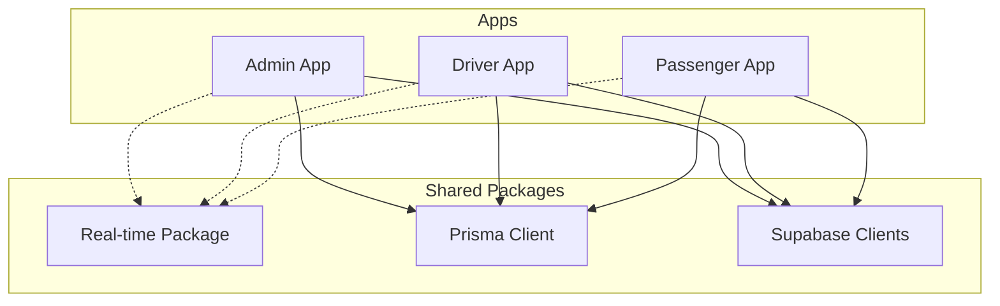
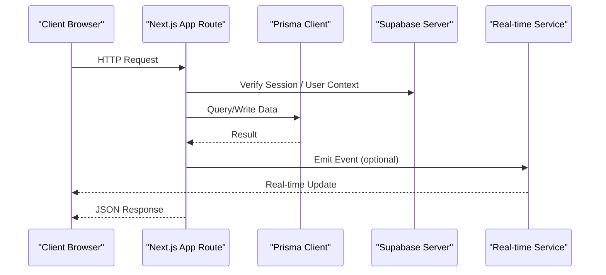
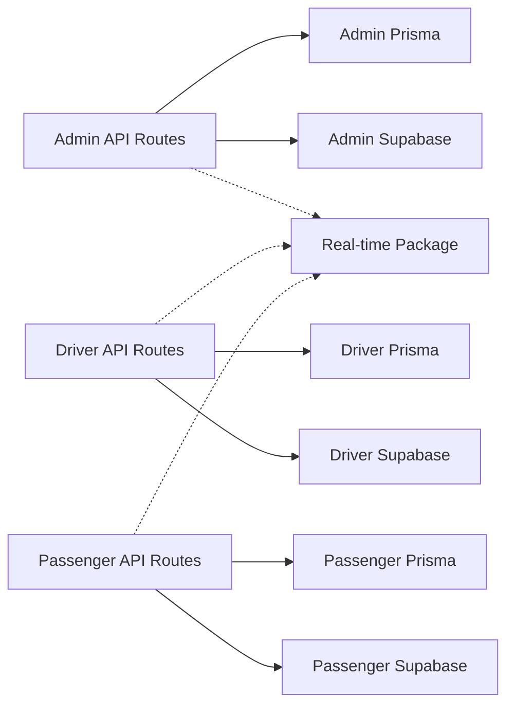

# Troubleshooting & FAQ

<cite>
**Referenced Files in This Document**
- [apps/admin/src/lib/prisma.ts](file://apps/admin/src/lib/prisma.ts)
- [apps/admin/src/lib/supabase-server.ts](file://apps/admin/src/lib/supabase-server.ts)
- [apps/admin/src/lib/supabase.ts](file://apps/admin/src/lib/supabase.ts)
- [apps/driver/src/lib/prisma.ts](file://apps/driver/src/lib/prisma.ts)
- [apps/driver/src/lib/supabase-server.ts](file://apps/driver/src/lib/supabase-server.ts)
- [apps/driver/src/lib/supabase.ts](file://apps/driver/src/lib/supabase.ts)
- [apps/passenger/src/lib/prisma.ts](file://apps/passenger/src/lib/prisma.ts)
- [apps/passenger/src/lib/supabase-server.ts](file://apps/passenger/src/lib/supabase-server.ts)
- [apps/passenger/src/lib/supabase.ts](file://apps/passenger/src/lib/supabase.ts)
- [apps/admin/src/app/api/drivers/route.ts](file://apps/admin/src/app/api/drivers/route.ts)
- [apps/admin/src/app/api/trips/route.ts](file://apps/admin/src/app/api/trips/route.ts)
- [apps/driver/src/app/api/auth/login/route.ts](file://apps/driver/src/app/api/auth/login/route.ts)
- [apps/driver/src/app/api/auth/register/route.ts](file://apps/driver/src/app/api/auth/register/route.ts)
- [apps/driver/src/app/api/status/route.ts](file://apps/driver/src/app/api/status/route.ts)
- [apps/driver/src/app/api/location/route.ts](file://apps/driver/src/app/api/location/route.ts)
- [apps/driver/src/app/api/earnings/route.ts](file://apps/driver/src/app/api/earnings/route.ts)
- [apps/driver/src/app/api/trips/[id]/accept/route.ts](file://apps/driver/src/app/api/trips/[id]/accept/route.ts)
- [apps/driver/src/app/api/trips/[id]/start/route.ts](file://apps/driver/src/app/api/trips/[id]/start/route.ts)
- [apps/driver/src/app/api/trips/[id]/complete/route.ts](file://apps/driver/src/app/api/trips/[id]/complete/route.ts)
- [apps/passenger/src/app/api/auth/login/route.ts](file://apps/passenger/src/app/api/auth/login/route.ts)
- [apps/passenger/src/app/api/auth/register/route.ts](file://apps/passenger/src/app/api/auth/register/route.ts)
- [apps/passenger/src/app/api/payments/route.ts](file://apps/passenger/src/app/api/payments/route.ts)
- [apps/passenger/src/app/api/drivers/nearby/route.ts](file://apps/passenger/src/app/api/drivers/nearby/route.ts)
- [apps/passenger/src/app/api/trips/request/route.ts](file://apps/passenger/src/app/api/trips/request/route.ts)
- [apps/passenger/src/app/api/trips/[id]/cancel/route.ts](file://apps/passenger/src/app/api/trips/[id]/cancel/route.ts)
- [apps/passenger/src/app/api/trips/[id]/rate/route.ts](file://apps/passenger/src/app/api/trips/[id]/rate/route.ts)
- [packages/real-time/package.json](file://packages/real-time/package.json)
</cite>

## Table of Contents
1. [Introduction](#introduction)
2. [Project Structure](#project-structure)
3. [Core Components](#core-components)
4. [Architecture Overview](#architecture-overview)
5. [Detailed Component Analysis](#detailed-component-analysis)
6. [Dependency Analysis](#dependency-analysis)
7. [Performance Considerations](#performance-considerations)
8. [Troubleshooting Guide](#troubleshooting-guide)
9. [Conclusion](#conclusion)
10. [Appendices](#appendices)

## Introduction
This document provides comprehensive troubleshooting guidance and frequently asked questions for the Ubar platform. It focuses on diagnosing and resolving common issues across applications (admin, driver, passenger), including authentication failures, real-time connection problems, payment processing errors, database connectivity issues, and deployment concerns. It also covers monitoring and logging strategies, diagnostic tools, and step-by-step procedures for critical components and integration points.

## Project Structure
Ubar is a multi-app Next.js monorepo with shared packages:
- apps/admin: Admin dashboard and management APIs
- apps/driver: Driver-facing app and trip lifecycle APIs
- apps/passenger: Passenger-facing app, payments, and trip request APIs
- packages/real-time: Real-time services and utilities
- Shared libraries: prisma client, Supabase clients, shared types/UI/utils

[No sources needed since this diagram shows conceptual structure]

## Core Components
- Database access via Prisma client per app
- Authentication and session handling via Supabase server/client modules
- API routes implementing business logic for each app
- Real-time package used by apps for live updates

Key responsibilities:
- Data persistence and queries through Prisma
- Auth flows and user sessions via Supabase
- API endpoints for CRUD and domain operations
- Real-time event streaming and presence

**Section sources**
- [apps/admin/src/lib/prisma.ts](file://apps/admin/src/lib/prisma.ts)
- [apps/admin/src/lib/supabase-server.ts](file://apps/admin/src/lib/supabase-server.ts)
- [apps/admin/src/lib/supabase.ts](file://apps/admin/src/lib/supabase.ts)
- [apps/driver/src/lib/prisma.ts](file://apps/driver/src/lib/prisma.ts)
- [apps/driver/src/lib/supabase-server.ts](file://apps/driver/src/lib/supabase-server.ts)
- [apps/driver/src/lib/supabase.ts](file://apps/driver/src/lib/supabase.ts)
- [apps/passenger/src/lib/prisma.ts](file://apps/passenger/src/lib/prisma.ts)
- [apps/passenger/src/lib/supabase-server.ts](file://apps/passenger/src/lib/supabase-server.ts)
- [apps/passenger/src/lib/supabase.ts](file://apps/passenger/src/lib/supabase.ts)
- [packages/real-time/package.json](file://packages/real-time/package.json)

## Architecture Overview
The system follows a Next.js App Router pattern with server-side API routes. Each app uses its own Prisma client and Supabase configuration. Real-time features are provided by a dedicated package consumed by apps.

[No sources needed since this diagram shows conceptual flow]

## Detailed Component Analysis

### Authentication Failures
Common symptoms:
- Login/register returns unauthorized or invalid credentials
- Sessions not persisting across requests
- Missing or incorrect environment variables for Supabase

Diagnostic steps:
- Validate Supabase URL and keys in environment configuration
- Confirm route handlers initialize Supabase server context correctly
- Check that login/register endpoints return appropriate status codes and messages
- Inspect browser cookies and local storage for tokens if applicable

Resolution checklist:
- Ensure correct Supabase project URL and anon/service keys
- Verify CORS settings if calling from different origins
- Confirm user schema and constraints match expected fields
- Review error logs around auth endpoints for stack traces

**Section sources**
- [apps/driver/src/app/api/auth/login/route.ts](file://apps/driver/src/app/api/auth/login/route.ts)
- [apps/driver/src/app/api/auth/register/route.ts](file://apps/driver/src/app/api/auth/register/route.ts)
- [apps/passenger/src/app/api/auth/login/route.ts](file://apps/passenger/src/app/api/auth/login/route.ts)
- [apps/passenger/src/app/api/auth/register/route.ts](file://apps/passenger/src/app/api/auth/register/route.ts)
- [apps/driver/src/lib/supabase-server.ts](file://apps/driver/src/lib/supabase-server.ts)
- [apps/passenger/src/lib/supabase-server.ts](file://apps/passenger/src/lib/supabase-server.ts)

### Real-time Connection Problems
Common symptoms:
- Live updates do not appear
- Frequent disconnects or reconnection loops
- Presence events not firing

Diagnostic steps:
- Verify real-time package dependencies and versions
- Check WebSocket connections and network logs for errors
- Confirm server-side event emission and channel subscriptions
- Inspect firewall/proxy configurations blocking WebSocket traffic

Resolution checklist:
- Ensure real-time service is running and reachable
- Validate channel names and event payloads
- Implement exponential backoff and heartbeat checks
- Add retry logic and fallback to polling when necessary

**Section sources**
- [packages/real-time/package.json](file://packages/real-time/package.json)

### Payment Processing Errors
Common symptoms:
- Payment creation fails or times out
- Webhook events not received or processed
- Inconsistent transaction states

Diagnostic steps:
- Inspect payment route handler for error responses and status codes
- Validate webhook signatures and payload integrity
- Check external provider logs and correlation IDs
- Ensure idempotency keys are used to prevent duplicate charges

Resolution checklist:
- Configure retries with idempotency for payment calls
- Log detailed error contexts and upstream response bodies
- Monitor timeout thresholds and circuit breaker patterns
- Reconcile payment state using scheduled jobs

**Section sources**
- [apps/passenger/src/app/api/payments/route.ts](file://apps/passenger/src/app/api/payments/route.ts)

### Database Connectivity Issues
Common symptoms:
- Prisma queries fail with connection refused or pool exhausted
- Slow queries or timeouts under load
- Schema mismatch errors after migrations

Diagnostic steps:
- Verify database connection string and credentials
- Check Prisma client initialization and connection pooling settings
- Review query performance and add indexes where needed
- Ensure migrations are applied before starting the app

Resolution checklist:
- Increase connection pool size if needed
- Use read replicas for heavy read workloads
- Enable query logging during development
- Validate schema against migration history

**Section sources**
- [apps/admin/src/lib/prisma.ts](file://apps/admin/src/lib/prisma.ts)
- [apps/driver/src/lib/prisma.ts](file://apps/driver/src/lib/prisma.ts)
- [apps/passenger/src/lib/prisma.ts](file://apps/passenger/src/lib/prisma.ts)

### Trip Lifecycle and Status Updates
Common symptoms:
- Driver cannot accept/start/complete trips
- Passenger cannot cancel or rate trips
- Status inconsistencies between apps

Diagnostic steps:
- Inspect trip-related route handlers for validation and state transitions
- Confirm authorization checks and role-based access
- Verify event emissions for real-time updates
- Check database constraints preventing illegal transitions

Resolution checklist:
- Enforce strict state machine transitions
- Add robust error handling and rollback on partial failures
- Emit consistent events for all state changes
- Provide clear error messages to clients

**Section sources**
- [apps/driver/src/app/api/trips/[id]/accept/route.ts](file://apps/driver/src/app/api/trips/[id]/accept/route.ts)
- [apps/driver/src/app/api/trips/[id]/start/route.ts](file://apps/driver/src/app/api/trips/[id]/start/route.ts)
- [apps/driver/src/app/api/trips/[id]/complete/route.ts](file://apps/driver/src/app/api/trips/[id]/complete/route.ts)
- [apps/passenger/src/app/api/trips/[id]/cancel/route.ts](file://apps/passenger/src/app/api/trips/[id]/cancel/route.ts)
- [apps/passenger/src/app/api/trips/[id]/rate/route.ts](file://apps/passenger/src/app/api/trips/[id]/rate/route.ts)
- [apps/driver/src/app/api/status/route.ts](file://apps/driver/src/app/api/status/route.ts)

### Location Tracking and Nearby Drivers
Common symptoms:
- Driver location not updating
- No nearby drivers returned for passengers

Diagnostic steps:
- Check location update endpoint frequency and payload format
- Validate spatial queries and indexing
- Ensure real-time broadcasts of location changes
- Confirm filtering logic for proximity calculations

Resolution checklist:
- Throttle location updates to reduce load
- Use efficient geospatial queries and indexes
- Cache frequent queries where appropriate
- Monitor latency and adjust thresholds

**Section sources**
- [apps/driver/src/app/api/location/route.ts](file://apps/driver/src/app/api/location/route.ts)
- [apps/passenger/src/app/api/drivers/nearby/route.ts](file://apps/passenger/src/app/api/drivers/nearby/route.ts)

### Earnings and Analytics
Common symptoms:
- Earnings data missing or delayed
- Analytics metrics inconsistent

Diagnostic steps:
- Inspect earnings route for aggregation logic and caching
- Verify analytics pipeline ingestion and transformations
- Check time zone and currency conversions
- Ensure idempotent writes for financial records

Resolution checklist:
- Implement background jobs for heavy aggregations
- Add reconciliation checks and alerts
- Normalize timestamps and currencies consistently
- Provide audit trails for financial changes

**Section sources**
- [apps/driver/src/app/api/earnings/route.ts](file://apps/driver/src/app/api/earnings/route.ts)

### Admin Operations
Common symptoms:
- Driver approval/block/reject actions fail
- Trip management endpoints return errors

Diagnostic steps:
- Validate admin permissions and middleware
- Check driver and trip route handlers for proper updates
- Ensure audit logging for administrative actions
- Confirm notifications sent to affected users

Resolution checklist:
- Enforce least privilege for admin roles
- Add confirmation prompts and rollback mechanisms
- Log all admin actions with context
- Provide feedback UI for success/failure states

**Section sources**
- [apps/admin/src/app/api/drivers/route.ts](file://apps/admin/src/app/api/drivers/route.ts)
- [apps/admin/src/app/api/trips/route.ts](file://apps/admin/src/app/api/trips/route.ts)

## Dependency Analysis
Inter-app and package dependencies:
- Each app depends on its own Prisma client and Supabase configuration
- Real-time package is shared across apps for live features
- API routes depend on auth and database layers

**Section sources**
- [apps/admin/src/lib/prisma.ts](file://apps/admin/src/lib/prisma.ts)
- [apps/driver/src/lib/prisma.ts](file://apps/driver/src/lib/prisma.ts)
- [apps/passenger/src/lib/prisma.ts](file://apps/passenger/src/lib/prisma.ts)
- [packages/real-time/package.json](file://packages/real-time/package.json)

## Performance Considerations
- Optimize database queries and add indexes for frequent filters
- Use pagination and cursors for large datasets
- Cache static or semi-static data at the edge or CDN
- Implement request throttling and rate limiting
- Monitor slow queries and enable profiling in development
- Tune connection pools based on workload characteristics

[No sources needed since this section provides general guidance]

## Troubleshooting Guide

### Step-by-Step Procedures

#### Authentication Failure
1. Verify environment variables for Supabase URL and keys
2. Check Supabase server initialization in route handlers
3. Inspect login/register endpoints for error responses
4. Review browser dev tools for token and cookie issues
5. Test with a minimal client to isolate frontend vs backend

**Section sources**
- [apps/driver/src/app/api/auth/login/route.ts](file://apps/driver/src/app/api/auth/login/route.ts)
- [apps/driver/src/app/api/auth/register/route.ts](file://apps/driver/src/app/api/auth/register/route.ts)
- [apps/passenger/src/app/api/auth/login/route.ts](file://apps/passenger/src/app/api/auth/login/route.ts)
- [apps/passenger/src/app/api/auth/register/route.ts](file://apps/passenger/src/app/api/auth/register/route.ts)
- [apps/driver/src/lib/supabase-server.ts](file://apps/driver/src/lib/supabase-server.ts)
- [apps/passenger/src/lib/supabase-server.ts](file://apps/passenger/src/lib/supabase-server.ts)

#### Real-time Disconnections
1. Confirm real-time service availability and health
2. Inspect WebSocket handshake and upgrade logs
3. Validate channel names and event payloads
4. Add heartbeat and reconnect logic with backoff
5. Fallback to polling if WebSocket is blocked

**Section sources**
- [packages/real-time/package.json](file://packages/real-time/package.json)

#### Payment Error
1. Capture request ID and upstream response details
2. Validate webhook signature and payload
3. Ensure idempotency keys are present
4. Retry failed calls with exponential backoff
5. Reconcile state using scheduled jobs

**Section sources**
- [apps/passenger/src/app/api/payments/route.ts](file://apps/passenger/src/app/api/payments/route.ts)

#### Database Connectivity
1. Validate connection string and credentials
2. Check Prisma client initialization and pool settings
3. Run migrations and verify schema consistency
4. Enable query logging and analyze slow queries
5. Scale read replicas if needed

**Section sources**
- [apps/admin/src/lib/prisma.ts](file://apps/admin/src/lib/prisma.ts)
- [apps/driver/src/lib/prisma.ts](file://apps/driver/src/lib/prisma.ts)
- [apps/passenger/src/lib/prisma.ts](file://apps/passenger/src/lib/prisma.ts)

#### Trip State Mismatch
1. Inspect accept/start/complete/cancel/rate endpoints
2. Validate state transitions and constraints
3. Emit consistent real-time events
4. Add rollback and compensation logic
5. Provide clear error messages to clients

**Section sources**
- [apps/driver/src/app/api/trips/[id]/accept/route.ts](file://apps/driver/src/app/api/trips/[id]/accept/route.ts)
- [apps/driver/src/app/api/trips/[id]/start/route.ts](file://apps/driver/src/app/api/trips/[id]/start/route.ts)
- [apps/driver/src/app/api/trips/[id]/complete/route.ts](file://apps/driver/src/app/api/trips/[id]/complete/route.ts)
- [apps/passenger/src/app/api/trips/[id]/cancel/route.ts](file://apps/passenger/src/app/api/trips/[id]/cancel/route.ts)
- [apps/passenger/src/app/api/trips/[id]/rate/route.ts](file://apps/passenger/src/app/api/trips/[id]/rate/route.ts)

#### Location and Nearby Drivers
1. Check location update frequency and payload shape
2. Validate geospatial queries and indexes
3. Ensure real-time broadcasts of position changes
4. Adjust proximity thresholds and caching

**Section sources**
- [apps/driver/src/app/api/location/route.ts](file://apps/driver/src/app/api/location/route.ts)
- [apps/passenger/src/app/api/drivers/nearby/route.ts](file://apps/passenger/src/app/api/drivers/nearby/route.ts)

#### Admin Actions
1. Verify admin role and permissions
2. Inspect driver/trip management endpoints
3. Audit log administrative changes
4. Notify affected users about status changes

**Section sources**
- [apps/admin/src/app/api/drivers/route.ts](file://apps/admin/src/app/api/drivers/route.ts)
- [apps/admin/src/app/api/trips/route.ts](file://apps/admin/src/app/api/trips/route.ts)

### Monitoring and Logging Strategies
- Centralize structured logs with correlation IDs
- Instrument key endpoints with timing and error rates
- Use distributed tracing across services
- Set up alerts for critical failures and latency spikes
- Retain logs with retention policies and searchability

[No sources needed since this section provides general guidance]

### Diagnostic Tools
- Network inspector for HTTP/WebSocket traffic
- Database query analyzers and explain plans
- Application performance monitors (APM)
- Log aggregation and visualization platforms
- Health check endpoints for services

[No sources needed since this section provides general guidance]

## Conclusion
This guide consolidates common issues and resolutions across Ubar’s apps and integrations. By following the step-by-step procedures, leveraging monitoring and logging, and applying performance best practices, teams can quickly diagnose and resolve problems while maintaining reliability and scalability.

## Appendices

### Frequently Asked Questions
- Why do payments sometimes fail intermittently?
  - Check upstream provider stability, implement retries with idempotency, and monitor timeouts.
- How can I speed up nearby driver queries?
  - Add geospatial indexes, paginate results, and cache frequent queries.
- What should I do if real-time events stop arriving?
  - Verify service health, inspect WebSocket upgrades, and implement fallback polling.
- How do I validate my database schema after migrations?
  - Compare current schema with migration history and run introspection tools.

[No sources needed since this section summarizes without analyzing specific files]